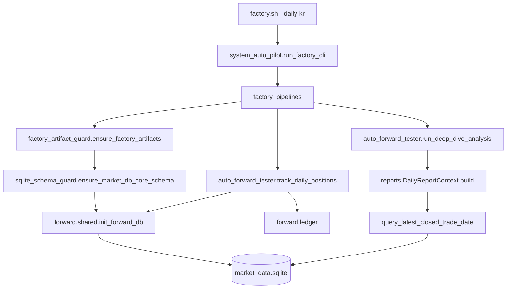

# 최종 파이프라인 무결성 검증 (FINAL_PIPELINE_INTEGRITY_CHECK)

**작성일:** 2026-05-27  
**범위:** `reports/` · `evolution/` · `legacy_archive/` 재구조 이후 — DB·경로·`factory.sh --daily-kr` 관통성  
**커밋:** 본 문서와 함께 적용된 픽스는 `main` 에 push 예정 (경로·스키마·격리 스크립트)

---

## Executive Summary

| 영역 | 결과 | 조치 |
|------|------|------|
| 1. `__file__` 기반 경로 | **1건 결함 발견·수정** | `evolution/deathmatch_scorecard.py` → `factory_data_paths.validated_live_mutants_path()` |
| 1b. `legacy_archive/` 격리 스크립트 | **3건 결함·수정** | `install_root()` SSOT로 cwd/sys.path 복구 |
| 2. DB Catch-up / 스키마 치유 | **연결 완료** | `factory_artifact_guard` → `sqlite_schema_guard` → `init_forward_db(db_path)` |
| 3. `daily-kr` Call Chain | **정적 AST 추적 통과** | lazy import 전부 resolve OK |
| 테스트 | **131 collected**, schema/report/deathmatch 관련 **통과** | `init_forward_db(db_path)` 복원 |

---

## 1. 숨은 상대 경로(Relative Path) 전수 검사 (P0)

### 1.1 검사 방법

- `reports/**/*.py`, `evolution/**/*.py` — `__file__`, `Path(__file__)`, `dirname(__file__)`, `parents[n]` grep
- 루트·`forward/` — `factory_data_paths.install_root()`, `market_db_paths.MARKET_DATA_DB_PATH` 사용 여부 교차 확인
- `legacy_archive/**` — 격리 이동 후 **깨진 ROOT** 후보 수동 검토

### 1.2 `reports/` · `evolution/` (이동 패키지)

| 패키지 | `__file__` 경로 의존 | DB / .env |
|--------|---------------------|-----------|
| `reports/` (11모듈) | **없음** | `market_db_paths.report_db_read_path()`, `config_manager` — **루트 SSOT** |
| `evolution/` (18모듈) | **1건** (수정 완료) | DB 직접 접근 없음(대부분); JSON만 |

**수정 (P0):** `evolution/deathmatch_scorecard.py` `attach_oos_from_mutants()`

- **Before:** `os.path.join(os.path.dirname(__file__), "validated_live_mutants.json")`  
  → `evolution/validated_live_mutants.json` (잘못된 위치)
- **After:** `factory_data_paths.validated_live_mutants_path()`  
  → `{INSTALL_ROOT}/validated_live_mutants.json`

`reports/*` 는 처음부터 `market_db_paths` / `factory_data_paths` 만 사용 — **폴더 깊이 변경 영향 없음**.

### 1.3 루트 SSOT (변경 없음 · 정상)

| 모듈 | 경로 해석 |
|------|-----------|
| `factory_data_paths.py` | `install_root()` = `dirname(__file__)` **프로젝트 루트** |
| `market_db_paths.py` | `factory_data_dir()` → `{DB_STORAGE_PATH}/market_data.sqlite` |
| `forward/shared.py` | `DB_PATH = MARKET_DATA_DB_PATH` |
| `config_manager` | `system_config.sqlite` — 데이터 루트 기준 |

**.env:** `load_dotenv()` 는 `forward/shared.py`, `telegram_env` 등 **루트 모듈**에서 로드 — `reports/` 이동과 무관.

### 1.4 `legacy_archive/` 격리본 (수정 완료)

| 파일 | 문제 | 수정 |
|------|------|------|
| `legacy_archive/factory_launcher.py` | `dirname(__file__)` + `main.py` (이동 후 없음) | `install_root()` + `legacy_archive/scanners/main.py` |
| `legacy_archive/dante_snapshot_runner.py` | cwd=`legacy_archive` → import 실패 | `install_root()` 로 chdir |
| `legacy_archive/manual_report_trigger.py` | 동일 | `install_root()` + `sys.path` |
| `legacy_archive/scripts/repair_forward_trades_numeric_corruption.py` | `parents[1]` = legacy_archive | `parents[2]` = 프로젝트 루트 |

**미수정(의도):** `legacy_archive/scanners/*.py` — 하드코드 `~/dante_bots/.../market_data.sqlite`  
→ **레거시 데몬 전용**; factory SSOT는 `factory_data_paths` 사용. 운영 cron은 `factory.sh` 만 사용.

### 1.5 기타 루트 `__file__` (영향 없음)

- `weekly_flow_report.py` — `_weekly_dry_run.html` 을 루트에 기록 (의도된 dry-run)
- `meta_governor.py`, `gemini_report_cache.py` — 루트 기준 (이동 안 함)
- Bitget `bitget/*` — `BASE_DIR = dirname(__file__)` = `bitget/` 패키지 내부 (정상)

---

## 2. DB 데이터 이어달리기(Catch-up) 연결 검증 (P0)

### 2.1 목표

백업 복구·빈 DB 덮어쓰기 이후에도:

1. **스키마**(`forward_trades`)가 없으면 파이프라인이 즉사하지 않고 Self-heal
2. **과거 CLOSED 행**은 DB에 남아 있으면 리포트·딥다이브가 **0건 리셋이 아닌** 워터마크 기반으로 이어짐
3. **OPEN 포지션**은 `track_daily_positions` 가 API/OHLCV로 갱신

### 2.2 연결 다이어그램



### 2.3 단계별 검증

| 단계 | 모듈 | Catch-up 역할 |
|------|------|----------------|
| **선행** | `factory_artifact_guard.verify_market_db_schema()` | `forward_trades` 없으면 `init_forward_db` 로 테이블 생성 (행 데이터는 백업에서만 복구) |
| **선행** | `meta_governor_sync` | regime·MetaGovernor JSON — DB 행과 독립 |
| **장부** | `forward/ledger.track_daily_positions` | `init_forward_db()` → OPEN 행 OHLCV 추적·청산 (빈 OPEN이면 조기 return, **에러 아님**) |
| **리포트** | `reports.daily_report_context` | `report_db_read_path()` **메인 DB** + `query_latest_closed_trade_date` 워터마크 |
| **리포트** | `reports.report_staleness_gate` | 워터마크 vs 세션 앵커 — 지연 시 경고, **데이터 삭제 안 함** |
| **딥다이브** | `forward/deep_dive` | `DailyReportContext` 슬라이스; `df_closed.empty` 시 **「표본 부족」메시지**, 예외 없음 |
| **진화** | `evolution.deathmatch_*` | `DailyReportContext` 경유; mutant JSON 경로 **install_root** 로 수정 |

### 2.4 「0건 리셋」 방지 근거

- `DailyReportContext.build()` — DB에 청산 이력이 있으면 `wm_kr` / `wm_us` 워터마크 설정 → `ReportTimekeeper` 롤링 윈도우
- `track_daily_positions` — `SELECT ... WHERE status='OPEN'`; 과거 CLOSED는 **건드리지 않음**
- 스키마만 heal 된 **빈 forward_trades** — 리포트는 「표본 부족」으로 degrade, 파이프라인 **중단 없음** (critical step 아님인 구간)
- **과거 행 복구** — 코드가 아닌 **백업 tar** (`deploy/ubuntu/backup_sqlite.sh`) — 문서 `DB_RECOVERY_AND_SCHEMA_AUDIT.md` 참고

### 2.5 이번에 적용한 코드 픽스

1. `factory_artifact_guard.ensure_factory_artifacts()` 맨 앞 `verify_market_db_schema(heal=True)` 재연결  
2. `factory_pipelines._step_artifact_guard` — `schema_incomplete` 시 `RuntimeError`  
3. `forward.shared.init_forward_db(db_path: str | None = None)` — 스냅샷·테스트·heal 경로 지원  

---

## 3. `factory.sh --daily-kr` 관통 시뮬레이션 (AST)

### 3.1 Step 순서 (SSOT)

```
meta_governor_sync
→ factory_artifact_guard          ← schema + CSV + meta
→ sentiment_mining
→ track_daily_positions_us_prereq
→ sector_spillover_refresh_prereq
→ us_cross_market_publish
→ kr_cross_market_hydrate
→ track_daily_positions_kr        ← forward.ledger
→ deep_dive_kr                    ← forward.deep_dive → reports.*
→ doomsday_bridge_sync
→ reporter_cleanup_zombie_forward_trades
→ pil_practitioner_reports        ← reports.practitioner_report_context
→ comprehensive_daily_report      ← reports.* + evolution.deathmatch (섹션)
→ ai_overseer
```

### 3.2 정적 import 도달성 (factory_pipelines / runtime / system_auto_pilot closure)

| 대상 모듈 | 결과 |
|-----------|------|
| `reports/daily_report_context.py` | OK |
| `reports/report_timekeeper.py` | OK |
| `evolution/deathmatch_report.py` | OK |
| `forward/deep_dive.py` | OK |
| `forward/ledger.py` | OK |
| `forward/shared.py` | OK |

### 3.3 Lazy step import (factory_pipelines 내부)

| Step | Import | Resolve |
|------|--------|---------|
| `factory_artifact_guard` | `factory_artifact_guard` | OK |
| `track_daily_positions_kr` | `auto_forward_tester` → `forward.ledger` | OK |
| `deep_dive_kr` | `auto_forward_tester` → `forward.deep_dive` | OK |
| `comprehensive_daily_report` | `auto_forward_tester` → `forward.shared` + reports | OK |
| `pil_practitioner_reports` | `reports.practitioner_report_context` (lazy) | OK |
| `kr_bowl_optional` | `legacy_archive.scanners.kr` | OK |

**누락 모듈:** 없음 (정적 분석 기준).

### 3.4 `reports/` / `evolution/` 진입 경로 (딥다이브·통합리포트)

```
auto_forward_tester.send_comprehensive_daily_report
  └─ forward.shared / forward.deep_dive.run_deep_dive_analysis
       ├─ reports.daily_report_context.DailyReportContext
       ├─ reports.report_collectors / report_formatter / report_staleness_gate
       ├─ forward.deathmatch_report_section → evolution.deathmatch_report
       └─ forward_score_bucket_deep_dive → reports.forward_report_scalar
```

### 3.5 실행 전 로컬 스모크

```powershell
python -c "import factory_pipelines, reports.daily_report_context, evolution.deathmatch_config, forward.shared; print('OK')"
python -m pytest tests/test_sqlite_schema_guard.py tests/test_daily_report_context.py -q
./factory.sh --daily-kr --dry-run   # Ubuntu
```

---

## 4. 잔여 리스크 및 운영 체크리스트

| 리스크 | 완화 |
|--------|------|
| 백업 없이 빈 DB | 스키마만 생성 → 리포트 「표본 부족」; **백업 복구 필수** |
| `DB_STORAGE_PATH` 미설정·잘못된 경로 | `factory_artifact_guard` `no_db` / `schema_incomplete` 조기 실패 |
| 레거시 `legacy_archive/scanners/main.py` cron 이중 기동 | **금지** — `factory.sh` SSOT only |
| 동적 `importlib` / subprocess 문자열 | AST 미추적 — `system_auto_pilot` spawn 목록은 별도 ops 문서 |

**서버 배포 후:**

```bash
git pull origin main
export DB_STORAGE_PATH=/your/data/root   # 실제 경로
sqlite3 "$DB_STORAGE_PATH/market_data.sqlite" "SELECT COUNT(*), MAX(entry_date) FROM forward_trades;"
python factory_artifact_guard.py
./factory.sh --daily-kr --dry-run
```

---

## 5. 변경 파일 목록 (이번 무결성 패스)

| 파일 | 변경 요약 |
|------|-----------|
| `evolution/deathmatch_scorecard.py` | `validated_live_mutants_path()` |
| `legacy_archive/factory_launcher.py` | `install_root` + scanners/main |
| `legacy_archive/dante_snapshot_runner.py` | `install_root` cwd |
| `legacy_archive/manual_report_trigger.py` | `install_root` sys.path |
| `legacy_archive/scripts/repair_forward_trades_numeric_corruption.py` | `parents[2]` |
| `factory_artifact_guard.py` | schema verify/heal 선행 |
| `factory_pipelines.py` | `schema_incomplete` raise |
| `forward/shared.py` | `init_forward_db(db_path=None)` |

---

*본 검증은 정적 AST·단위 테스트·import 스모크 기준이며, 운영 DB 실데이터 양은 서버에서 `COUNT(*)` 로 최종 확인할 것.*
