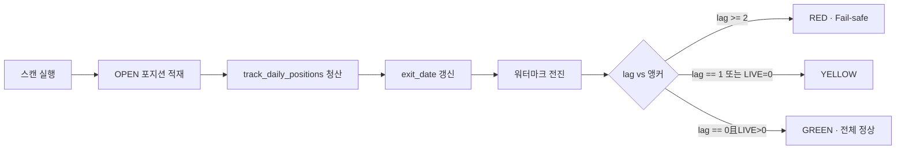

# 일일 리포트 RED·Fail-safe·표본 0건 — 상태 분석 보고서

**작성 목적:** 텔레그램 일일 리포트에 다수 출력되는 경고 메시지가 **코드 버그**인지, **13일간 시스템 정지로 인한 데이터 공백**에 대한 **의도적 방어 로직**인지 팩트 체크.

**결론 (요약):** 현재 관측되는 현상은 **버그가 아닙니다.** DB 청산 워터마크가 `2026-05-26`에 고착된 **운영 공백(True Zero)** 과, 그 상태에서 오래된 데이터를 “오늘 실전”처럼 보여주지 않도록 설계된 **Staleness Gate + Fail-safe** 가 **정상적으로 작동**한 결과입니다.

---

## 1. 현상 요약

| 텔레그램 메시지 | 의미 (한 줄) |
|----------------|-------------|
| `[KR · 데이터 정체 RED] DB청산 워터마크 2026-05-26 · 영업일 지연 13일` | DB 최신 청산일이 리포트 앵커보다 **2영업일 이상** 뒤처짐 |
| `[KR · Fail-safe · RED] 최우수 성적표 요약 생략` | RED 등급 시 **신뢰할 수 없는 구간의 챔피언 요약 차단** |
| `당일 실전: 청산 0건` / `DNA 대조: 당일 실전 표본 없음` | **세션 앵커일**에 청산된 LIVE 건이 0건 |
| 스필오버 `[06-04] ~ [06-12]` 구간 `'데이터 없음'` | 해당 KST·ET 정렬일에 **진입(entry_date) 행이 DB에 없음** |

이 네 가지는 **서로 다른 모듈**에서 나오지만, **근본 원인은 동일**합니다: **약 13영업일 동안 `track_daily_positions`·스캔·일일 파이프라인이 돌지 않아 `forward_trades`에 5/26 이후 청산·진입이 적재되지 않음.**

---

## 2. 근본 원인 — 13일 시스템 다운과의 연관

### 2.1 DB 청산 워터마크란?

워터마크는 `forward_trades`에서 **CLOSED** 상태 행의 최대 거래일입니다.

```132:148:forward_dual_track_queries.py
def query_latest_closed_trade_date(
    conn: sqlite3.Connection, market: str
) -> Optional[str]:
    ...
    SELECT MAX({td_expr}) FROM forward_trades
    WHERE market=? AND status LIKE 'CLOSED%'
```

딥 다이브·9분할 리포트·Staleness Gate는 모두 이 값을 `ReportTimekeeper.db_watermark_exit`에 넣고, **세션 앵커**(`session_anchor`, 오늘 기준 KR 영업일)와 비교합니다.

- **관측값:** 워터마크 `2026-05-26`, 앵커 `2026-06-12` 전후 → **영업일 지연 13일**
- **의미:** 마지막으로 DB에 기록된 청산은 5월 26일이고, 그 이후 장이 열려도 **포지션 추적·청산 기록이 쌓이지 않았음**

### 2.2 워터마크를 갱신하는 주체

일일 파이프라인에서 **`track_daily_positions`** 가 OPEN 포지션을 검사하고 청산 시 `exit_date`를 기록합니다.

```417:421:forward/ledger.py
UPDATE forward_trades 
SET status=?, exit_date=?, exit_reason=?, flow_tags=?, final_ret=?, ...
WHERE id=?
```

`factory.sh --daily` 파이프라인 순서(요지):

1. 메타/센티먼트/스캔 등 선행
2. **`track_daily_positions` (KR/US)** ← 워터마크 전진의 핵심
3. **`deep_dive`** ← Staleness·Fail-safe·스필오버 블록 생성
4. **`send_comprehensive_daily_report`** ← 9분할 리포트

**13일간 데몬·cron·factory 파이프라인이 중단**되면:

- 스캔 미실행 → 신규 `entry_date` 없음
- track 미실행 → `exit_date`·CLOSED 미갱신
- 워터마크 **5/26에서 정지** (코드 결함이 아니라 **입력 데이터 공백**)

### 2.3 “당일 실전 0건”이 동시에 뜨는 이유

LIVE 트랙은 **세션 앵커일에 청산된 건만** 집계합니다.

```151:166:forward_dual_track_queries.py
def fetch_live_today_closed(conn, market, anchor_day):
    ...
    exit_date (또는 trade_date) = anchor_day
    AND status LIKE 'CLOSED%'
```

앵커가 `2026-06-12`인데 DB 최신 청산이 `2026-05-26`이면:

- `dual_meta.live_row_count == 0` (당연)
- Micro-DNA: `- 🟢 당일 실전: 청산 0건`
- Drift: `당일 실전 표본 없음 — DNA Drift 판정 보류.` (`forward_score_bucket_deep_dive.py` `_compute_drift_comment`)

HIST(과거 롤링) 구간에는 5/26까지 데이터가 있을 수 있어 **“과거 기준(Sim)” 줄은 숫자가 나올 수 있음** — 이는 **과거 vs 오늘을 분리**하는 Dual-Track 설계가 의도대로 동작하는 모습입니다.

### 2.4 스필오버 `[06-04] ~ [06-12]` ‘데이터 없음’

V28 스필오버는 **최근 7 KR 영업일**을 앵커 기준으로 정렬 타임라인을 만들고, 각 날짜의 **진입(`entry_date`)** 행에서 주도 섹터를 뽑습니다.

```138:152:spillover_calendar.py
def dominant_sector_label_for_days(...):
    sub = df_raw.loc[df_raw["norm_day"].isin(days)]
    if sub.empty:
        return "데이터 없음"
```

6월 4일~12일 구간에 `forward_trades` **진입 행이 없으면** 매 칸이 `'데이터 없음'` — **쿼리 실패나 필터 버그가 아니라 표본 부재**입니다. (전체 `us_raw`·`kr_raw`가 비어 있으면 상단에 “진입 표본 없음” 한 줄이 추가됩니다.)

---

## 3. Fail-safe·데이터 정체 로직 — 정상 작동 증명

### 3.1 Staleness Gate (3단계)

구현: `reports/report_staleness_gate.py` · `evaluate_staleness()`

| 등급 | 조건 | 리포트 동작 |
|------|------|-------------|
| **RED** | `business_lag_days(워터마크, 앵커) >= 2` | RED 배너 + Fail-safe 카드, **`allow_tier_champion = False`** |
| **YELLOW** | lag == 1 **또는** LIVE 청산 0건 | 경고 배너, 챔피언 요약 **허용** |
| **GREEN** | lag == 0 **且** LIVE > 0 | 배너 없음, 전 기능 허용 |

```35:64:reports/report_staleness_gate.py
if lag >= 2:
    grade = "RED"
    reasons.append(f"DB청산 워터마크 ... 영업일 지연 {lag}일")
...
allow_tier_champion=False   # RED 시
```

**13일 지연 → lag ≥ 2 → RED** 는 코드가 **의도한 분기**입니다. 단위 테스트도 동일 시나리오를 검증합니다 (`tests/test_report_timekeeper.py`: 워터마크 5/17·앵커 5/26 → RED).

### 3.2 Fail-safe 카드 — “최우수 성적표 요약 생략”

RED일 때 `_fail_safe_card()`가 텔레그램에 삽입되고, 딥 다이브는 챔피언 HTML을 **건너뜁니다.**

```909:921:forward/deep_dive.py
if staleness.allow_tier_champion:
    report_msg += format_dual_track_tier_champion_summary_html(...)
```

**목적:** 워터마크가 멈춘 DB로 “최우수 성적표”를 내 보면, **과거 롤링 통계를 최신 실전처럼 오인**할 수 있음 → **요약만 차단**, Micro-DNA·Universal DNA 등은 `allow_micro_dna=True`로 **과거 구간 분석은 계속** (RED에서도).

### 3.3 Flow 태그·기타 Fail-safe

`forward_flow_tag_deep_dive.py`도 RED 시 flow 태그 집계를 생략하고 안내 문구를 붙입니다. 메시지에 `track_daily_positions` 확인을 권하는 것은 **복구 액션 힌트**이지, 런타임 예외가 아닙니다.

### 3.4 9분할 리포트의 “표본 0”

`reports/daily_report_context.py`의 `load_market_slice()`는 윈도우 `[rolling_cutoff, session_anchor]` 안의 CLOSED를 집계합니다. 워터마크가 앵커보다 13일 뒤처지면 **윈도우 안 최신 청산도 부족**해 `[2/9]` 등에서 `표본 0 · lag 13` 메시지가 나옵니다 — **필터 로직 오류가 아니라 입력 DB 상태 반영**입니다.

### 3.5 버그 vs 방어 로직 판정

| 검증 항목 | 판정 |
|-----------|------|
| AttributeError·Traceback으로 리포트 **중단** | 해당 없음 (경고는 **정상 완료된 리포트 본문**) |
| 워터마크·lag 계산 | `business_lag_days()` + `query_latest_closed_trade_date()` 일관 사용 |
| RED → 챔피언 생략 | `allow_tier_champion` 플래그로 **명시적 분기** |
| LIVE 0 → Drift 보류 | `_compute_drift_comment()` **문서화된 분기** |
| 스필오버 ‘데이터 없음’ | `dominant_sector_label_for_days()` **빈 sub DataFrame** 시 고정 문자열 |

→ **코드 버그가 아니라, 비정상적 데이터 공백(13일 정지)에서 설계된 방어 로직의 정상 출력**으로 판단합니다.

---

## 4. 향후 자동 정상화 시나리오

전제: **평일 장이 열리고** `factory.sh --scan-*` · `track_daily_positions` · `--daily-*` 파이프라인이 **매 영업일 1회 이상** 정상 실행됨.

### 4.1 단계별 복구 타임라인



| 단계 | 시스템에서 일어나는 일 | 텔레그램 변화 |
|------|------------------------|---------------|
| **T+0 (첫 정상 장)** | 스캔 → 진입 행 생성; track이 일부 OPEN 청산 → `exit_date` = 당일 | 스필오버 타임라인 **당일 칸**부터 섹터 라벨 등장 가능 |
| **워터마크가 앵커-1영업일까지 따라잡음** | lag = 1 | **YELLOW** (`갱신 지연 YELLOW`), Fail-safe **해제**, 챔피언 요약 **복구** |
| **워터마크 = 앵커 & 당일 LIVE 청산 ≥ 1** | lag = 0, `live_row_count > 0` | **RED 배너·Fail-safe 사라짐** → **GREEN** |
| **연속 영업일 반복** | 7일치 `entry_date` 누적 | 스필오버 `[06-xx]` 줄 **‘데이터 없음’ → 섹터명**으로 채워짐 |
| **9분할 리포트** | 윈도우 내 CLOSED·OPEN 증가 | `실거래/청산/유효OPEN` **0 → 양수**, `[2/9]` 리더보드 복구 |

### 4.2 등급 전환 조건 (코드 기준)

- **RED → YELLOW:** `business_lag_days`가 **1**이 되는 시점 (워터마크가 앵커 직전 영업일까지 따라잡음). 이때부터 `allow_tier_champion=True`.
- **YELLOW → GREEN:** lag **0** **且** `fetch_live_today_closed` 결과 **≥ 1건**.
- **스필오버 ‘데이터 없음’ 해소:** 각 `kst_label` 날짜에 `entry_date`가 일치하는 행이 생길 때마다 **해당 칸만** 자동 채움 (일괄 패치 불필요).

### 4.3 운영자가 확인할 체크포인트 (복구 가속)

코드 수정 없이 Ubuntu에서 확인:

```bash
cd /home/ubuntu/dante_bots/Dual-Screener-Bot
source venv/bin/activate
source .env

# 1) 워터마크
python -c "
import sqlite3
from market_db_paths import MARKET_DATA_DB_PATH
from forward_dual_track_queries import query_latest_closed_trade_date
c=sqlite3.connect(MARKET_DATA_DB_PATH)
for m in ('KR','US'):
    print(m, query_latest_closed_trade_date(c,m))
c.close()
"

# 2) 서비스·cron
systemctl is-active dante-factory dante-async
grep FACTORY /etc/cron.d/dual-screener-factory

# 3) 수동 1회 파이프라인 (장외 스캔 시)
# ./factory.sh --daily-kr
```

**13일 공백을 한 번에 메우려면** 과거 `exit_date` 백필·`force_data_sync.sh` 등 **데이터 동기화 스크립트**로 워터마크를 앵커 근처까지 끌어올린 뒤, 이후 **일일 track이 유지**되어야 RED가 재발하지 않습니다. 백필 없이도 **영업일마다 track이 돌면** lag는 **하루에 최대 1영업일씩** 줄어듭니다.

### 4.4 정상화 후 기대되는 텔레그램 모습

- `⛔ [KR · 데이터 정체 RED]` / `⛔ [KR · Fail-safe · RED]` **미출력**
- 딥 다이브 헤더: `Staleness GREEN`, `🟢 LIVE n` (n ≥ 1)
- Micro-DNA: `당일 실전` 승률·PF 숫자 표기, Drift **정합/주의** 등 판정 문구
- 스필오버: `🇺🇸 … ➔ 🇰🇷 …` 줄에 **섹터명** (전부 ‘데이터 없음’ 아님)
- 9분할: `표본 실거래 · 청산 · 유효OPEN` **양수**

---

## 5. 사용자 우려에 대한 한 줄 답변

> “시스템 오류·데이터 누락 **버그**인가?”

**아니요.** 리포트 엔진은 정상적으로 돌았고, **DB에 5/26 이후 청산·진입이 없는 운영 공백**을 감지해 **RED·Fail-safe·표본 0 안내**를 **의도적으로** 냈습니다. 해결은 **코드 패치가 아니라 파이프라인 재가동 + (필요 시) 과거 구간 데이터 동기화**입니다.

---

## 6. 관련 코드·문서 인덱스

| 파일 | 역할 |
|------|------|
| `reports/report_staleness_gate.py` | RED/YELLOW/GREEN · Fail-safe |
| `reports/report_timekeeper.py` | session_anchor · rolling_cutoff · lag |
| `forward_dual_track_queries.py` | 워터마크 · LIVE/HIST 쿼리 |
| `forward/deep_dive.py` | 딥 다이브 · Staleness 삽입 · 챔피언 게이트 |
| `forward_score_bucket_deep_dive.py` | 당일 실전 0 · DNA Drift 보류 |
| `spillover_v28_report.py` / `spillover_calendar.py` | 스필오버 타임라인 · ‘데이터 없음’ |
| `reports/daily_report_context.py` | 9분할 윈도우·lag 헤더 |
| `forward/ledger.py` | `track_daily_positions` · `exit_date` 기록 |
| `factory_pipelines.py` | daily 파이프라인 순서 |
| `STANDARD_UPDATE_RESTART_MANUAL.md` | 배포·재시작 |
| `UBUNTU_FACTORY_FULL_RESTORE.md` | 장애 복구 절차 |
