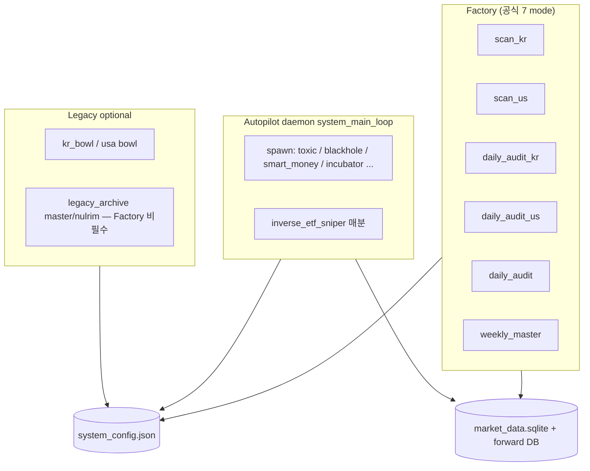

# 10회 대조 — KR/US 구조·시너지·좀비·미실현 감사

**일자:** 2026-05-28 (2차 확장: 워크스페이스 **전체** KR/US·환경·배포·파일 인벤토리 대조)  
**범위:** Dual-Screener-Bot 저장소 전역 — 루트 모듈·`deploy/`·`legacy_archive/`·`reports/`·`evolution/`·`bitget/` (코드 **수정 없음**)  
**기준선:** 기존 뼈대(`factory.sh` → `system_auto_pilot --mode` → `factory_pipelines.py`) + 최근 수술(`SYNERGY_EXECUTION_REPORT.md`, `GLOBAL_ALIGNMENT_FIX_REPORT.md`, `UNREALIZED_POTENTIAL_FULL_AUDIT.md`)

---

## 0. 한 줄 결론

**완전한 단일 유기체는 아니다.** Factory SSOT 위에 슈퍼노바·가상매매·일일 감사는 맞물리지만, (1) **Autopilot 위성 산출물**이 없으면 조용히 빈 config로 진행하고, (2) **KR/US 스캔 prelude 비대칭**·(3) **ACE·매크로·스필로버의 조건부 활성**·(4) **잔존 침묵 예외**·(5) **리포트/LLM 전용 모듈** 때문에 “코드는 있는데 실현되지 않는” 구간이 남아 있다.

---

## 1. 10회 대조 방법

| Pass | 대조 축 | 질문 |
|------|---------|------|
| **1** | 런타임 SSOT | 무엇이 실제로 cron/데몬에서 돌아가는가? |
| **2** | Factory KR vs US | 동일 mode에서 단계·선행조건이 대칭인가? |
| **3** | 한미 교차 시너지 타이밍 | US 테마·스필로버가 KR **스캔 시점**에 신선한가? |
| **4** | Config 키 소비 | 기본값·배포 JSON·실제 분기 일치? |
| **5** | 최근 수술 반영도 | `scanner_synergy_engine` 등 **호출 그래프** 검증 |
| **6** | ACE 진화 E2E | refresh → playbook → entry/exit |
| **7** | 침묵 예외·Factory 관측 | `pipeline_error_util`·step 실패 가시성 |
| **8** | 데이터·Orphan | Sector/Industry·DB·리포트만 쓰는 산출물 |
| **9** | PIL·좀비·리포트 고스트 | 실무자·zombie cleanup·skip 조건 |
| **10** | 통합 점수표 | P0 잔여·운영 체크리스트 |

각 Pass는 **이전 감사 항목 ID**와 **수술 후 상태(✅완화 / ⚠️부분 / ❌미실현)** 를 함께 표기한다.

---

## Pass 1 — 런타임 SSOT (3축)



| 항목 | KR | US | 시너지 | 상태 |
|------|----|----|--------|------|
| 장중 스캔 SSOT | `scan_kr` | `scan_us` | supernova 동일 함수 `execute_supernova_live_scan` | ✅ |
| 일일 감사 | `daily_audit_kr` | `daily_audit_us` | KR은 US track 선행 prelude | ✅ (의도) |
| 위성 ML/독성/스마트머니 | Autopilot만 | Autopilot만 | Factory **0스텝** | ❌ CM-위성 |
| `system_main_loop` | cron과 **병행 시 이중 스케줄** 위험 | 동일 | `legacy main`은 factory SSOT 권장 | ⚠️ |
| `limit_up_forensics` / `forensics_pioneer` | spawn만 | spawn만 | supernova·try_add **무 import** | ❌ 좀비 C |

**미실현:** Factory만 정상이어도 **08:30 blackhole, 16:10 smart_money, 19:00 toxic KR** 등이 실패하면 스캐너는 `TOXIC_ML_*`·`SMART_MONEY_RADAR` 없이 돌아가며 **로그만** 남는 경로가 많다.

---

## Pass 2 — Factory `scan_kr` vs `scan_us` 단계 대칭

출처: `factory_pipelines.py` `_with_scan_kr_prelude` / `_with_scan_us_prelude`

| 단계 | scan_us | scan_kr | 대칭 |
|------|---------|---------|------|
| meta_governor_sync | ✅ | ✅ | ✅ |
| us_health_gate / repair | ✅ | ❌ | 의도적(US DB) |
| us_data_incremental | ✅ | ❌ | 의도적 |
| sync_us_toxic_ml_ssot | ✅ | ❌ | US 편 |
| kr_cross_market_hydrate | ❌ | ✅ | KR 편 |
| supernova_scan | ✅ | ✅ | ✅ |
| kr_bowl / us_bowl (optional) | usa | kr | ⚠️ legacy, supernova와 **별도** |
| us_cross_market_publish | ✅ (scan_us tail) | ❌ | ⚠️ |
| **cross_market_theme_snapshot** | ✅ (prelude 끝) | ❌ | ❌ **KR-02** |
| doomsday_bridge | ✅ | ✅ | ✅ |

### ❌ KR-02 (P1) — KR 장중 스캔은 US 테마 스냅샷 없음

- US `scan_us` 종료 직전: `cross_market_theme_snapshot` (spillover + `publish_us_market_snapshot` + hydrate).
- KR `scan_kr`: 스캔 **전** `hydrate_kr_runtime_from_ssot` 만 — **당일 US 스캔이 없으면** KR 10/13/15시 스캐너 시너지는 **전일 SSOT**에 의존.
- `scanner_synergy_engine.per_ticker_scan_adjustments` 의 KR 스필로버는 `kr_stock_matches_spillover` → **config KV 신선도**에 민감.

**실현 조건:** 평일 KR 오전 스캔 전에 `scan_us`(전일 밤) 또는 `daily_audit_kr` 의 US 선행 track이 성공했는지 운영으로 확인 필요.

---

## Pass 3 — 한미 교차 시너지 (타이밍·소비처)

### 3.1 모듈 연결 (수술 후 갱신)

| 모듈 | Factory | supernova 스캔 | try_add 진입 | 청산 track |
|------|---------|----------------|--------------|------------|
| `cross_market_ssot` | ✅ publish/hydrate/theme | 간접(config) | ✅ `kr_stock_matches_spillover` | ❌ |
| `scanner_synergy_engine` | ❌ | ✅ `process_live_ticker` | ❌ (스캔 점수만) | ❌ |
| `sector_spillover_refresh` | ✅ prelude/tail | 간접 | 간접 | ❌ |
| `macro_context_snapshot` | ❌ | ✅ 배치 macro mult | ✅ Kelly·score | ❌ |
| `macro finalize_macro_synergy_on_dbg` | ❌ | ❌ | ❌ | ❌ |
| `build_kr_spillover_prompt_block` | ❌ | ❌ | ❌ | ❌ |

### 3.2 CM 항목 대조 (이전 감사 → 현재)

| ID | 이전 | 10-Pass 판정 |
|----|------|----------------|
| CM-01 | 스캔 컷에 US 테마 미반영 | ⚠️ **부분** — `eff_cos_cutoff`/`eff_ml_cutoff`·가산점 있음; US장 스캔은 `spill_match`가 KR 전용 분기 |
| CM-02 | `build_kr_spillover_prompt_block` 호출 0 | ❌ **미실현** (grep: 정의만, 호출 없음) |
| CM-03 | MACRO_SYNERGY 기본 OFF | ✅ **완화** — `config_manager`·`macro_context_snapshot` 기본 True; **배포 JSON에 false 있으면 여전히 OFF** |
| CM-04 | synergy OFF 시 배수 1.0 | ⚠️ 키 OFF 시 동일 |
| CM-05 | V28 리포트 KR only | ⚠️ 의도 가능 |
| CM-06 | smart_money 16:10 vs KR scan 10시 | ❌ **미변** — 오전 스캔은 전일 RADAR |
| CM-07 | predicted_sector 축 | ⚠️ 대체로 정합 | |
| CM-08 | daily combined vs split | ⚠️ cron은 split 권장 | |

### 3.3 US 스캔 시 스필로버 시너지 공백

`scanner_synergy_engine.per_ticker_scan_adjustments`: `spill_match`는 **`market == "KR"`** 일 때만 `kr_stock_matches_spillover`.

- **US supernova** 종목은 US 주도 섹터와의 정렬 보너스가 **순환매(`PREDICTED_NEXT_SECTOR_US`)·매크로 배수** 위주.
- **KR 대비 비대칭** — “한미 교차”가 US 스캔 엔진에는 약함.

---

## Pass 4 — Config 키 진실표

| 키 | migrate 기본 (`config_manager`) | 코드 fallback | 실질 차단 조건 |
|----|----------------------------------|---------------|----------------|
| `ENABLE_MACRO_SYNERGY_WEIGHTING` | **True** | True (`macro_context_snapshot`, `scanner_synergy_engine`, `try_add`) | **system_config.json에 false** |
| `ENABLE_ACE_EVOLUTION_WEIGHTING` | True | refresh: **False** (`ace_evolution_refresh._observe_only_flag` L23) | 키 없으면 refresh는 observe |
| `ACE_EVOLUTION_FORCE_OBSERVE` | **False** | exit: False면 live; refresh: **get(..., True)** L25 | refresh 기본 인자가 True면 **신규 설치 누락 시 observe** |
| Playbook `observe_only` | — | clamp: playbook True면 **배수 1.0** | n_ace&lt;3 → 항상 observe playbook |

### ⚠️ ACE-01 (P0 운영) — “플래그는 켰는데 playbook이 관측 모드”

연쇄:

1. `refresh_ace_evolution_*` 는 **`deep_dive` → `_strategy_colosseum_brief`** 에서만 호출 (`forward/deep_dive.py` L153).
2. `synthesize_playbook_from_facts`: `n_ace < 3` → **항상 `observe_only=True` playbook** (`ace_evolution_synthesizer.py` L54–58).
3. `ace_entry_bridge` / `ace_exit_bridge` → `compute_ace_evolution_multiplier` 가 playbook `observe_only` 면 **live 비활성**.
4. 수술로 **진입 브릿지 코드는 존재**하나, playbook·표본 조건 미충족 시 **실현 0**과 동일.

**실현 조건:** `daily_audit_*` 성공 + colosseum 표본 + `n_ace≥3` + playbook `observe_only=false` + `logic_core` 매칭.

---

## Pass 5 — 최근 수술 모듈 “연결 검증” (grep 기준)

| 모듈 | 호출처 | 판정 |
|------|--------|------|
| `scanner_synergy_engine` | `supernova_hunter.execute_supernova_live_scan` 내부만 | ⚠️ Factory·legacy bowl·**미연결** |
| `scan_resilience` | `supernova_hunter.process_live_ticker` DNA 블록만 | ⚠️ 부분 (핫패스만) |
| `evolution/ace_entry_bridge` | `forward/shared.try_add` DTW 블록 (`len(hist)≥60`) | ⚠️ **데이터 60봉 미만이면 ACE 진입 미실행** |
| `pipeline_error_util` | `scan_resilience` **만** | ❌ Factory `run_step`·위성 **미연결** |
| `market_data_fetcher.fetch_us_ticker_sector_industry` | `us_list_survival.enrich_missing_us_sectors` | ⚠️ **상한 60–120종목/회** |

### CM-01 재평가

- **완화됨:** 스캔 단계 `eff_cos_cutoff` / `eff_ml_cutoff` / `final_score` 가산.
- **남음:** 시너지 로드 실패 시 `except` → 스캔은 **구 컷오프**로 진행 (로그 warning); 퍼널에 “시너지 적용” 단계 **없음** (`scanner_funnel` 주석만).

---

## Pass 6 — ACE 진화 E2E

```text
[표본 축적] forward_trades 청산
    → colosseum DB / deep_dive
        → _strategy_colosseum_brief
            → refresh_ace_evolution_from_colosseum_context  (일 1회 감사 축)
                → playbook JSON (observe_only 가능)
                    ├→ ace_exit_bridge (track_daily_positions / ledger)  ✅ 기존
                    └→ ace_entry_bridge (try_add, DTW≥60)                 ⚠️ 수술 추가
```

| 단계 | 실행 여부 | 좀비/미실현 |
|------|-----------|-------------|
| Playbook 갱신 | deep_dive 시에만 | ❌ **scan 중 갱신 없음** |
| Entry Kelly/SL | try_add 내부 | ⚠️ playbook·hist 조건부 |
| Exit MFE | ledger | ✅ |
| supernova 스캔 | — | ❌ ACE 미참조 |
| legacy master/nulrim | 별도 try_add | ❌ ACE·macro synergy **legacy만** `finalize_macro_synergy_on_dbg` |

### ❌ ACE-02 — Legacy 스캐너와 Factory SSOT 이원화

- Factory 경로: supernova → try_add (수술 반영).
- `legacy_archive/scanners/master.py`, `nulrim.py`: `finalize_macro_synergy_on_dbg` — **Factory supernova와 다른 매크로 경로**.
- `factory` optional `kr_bowl`/`usa` → `legacy_archive.scanners.kr/usa` — **supernova funnel·시너지와 무관한 텔레그램 관종 축**.

---

## Pass 7 — 침묵 예외·실행 가시성

### 7.1 잔존 밀도 (grep `except Exception:` 계열, 2026-05-28)

| 파일 | 대략 건수 | 수술 후 |
|------|-----------|---------|
| `supernova_hunter.py` | **~36** | worker 1곳 logging ✅, **나머지 다수 유지** |
| `forward/shared.py` | **~38** | ACE/매크로 일부 logging, hist `except:` bare 유지 |
| `factory_runtime.py` | ~7 | step 실패는 `logger.exception` ✅ |

### 7.2 ❌ EX-01 — Factory는 step 단위 관측, 위성·스레드 내부는 여전히 침묵

- `process_live_ticker` 외 fetch/벤치마크/텔레그램 `except: pass` (`supernova_hunter` L1881 등).
- `try_add` SQLite 실패 → broad `except` fallback API (L1683, L1700) **로그 없음**.
- `pipeline_error_util` 이 **Factory PARTIAL_FAIL 집계에 미사용** → 감사 문서 D등급 **여전히 유효**.

### 7.3 실행 “안 되는 것처럼 보이는” Factory 동작

| 현상 | 원인 |
|------|------|
| Factory OK인데 시너지 없음 | config false / SSOT stale / synergy load except |
| PARTIAL_FAIL 없이 스캔 빈약 | non-critical step 실패 + telegram OK 생략 (`notify_factory_run`) |
| 동일 mode lock skip | `factory_runtime` lock — **실행 스킵은 정상**이나 ops에서 “안 돌았다”로 오인 가능 |

---

## Pass 8 — 데이터 누수·Orphan (KR/US)

| ID | 구간 | KR | US | 수술 후 |
|----|------|----|----|---------|
| DL-01 | Listing Sector | `get_krx_list` Code,Name | `get_us_list` **Sector/Industry 유지** | US ⚠️ **부분** |
| DL-01b | sqlite tier3 fallback | — | `US_*` 테이블명만 → **Sector 없음** | ❌ |
| DL-01c | yfinance enrich | — | **max 60–120/tier** | ❌ 대형 유니버스 대부분 NaN |
| DL-02 | `_resolve_enroll_sector` | DB→listing→placeholder | 동일 | ⚠️ listing 품질 의존 |
| DL-06 | supernova worker except | DATA_FAIL funnel | 동일 | ⚠️ 로그 1곳만 강화 |
| OR-01 | colosseum rows | 리포트만 | 리포트만 | ❌ scan 미사용 |
| OR-02 | `build_kr_spillover_prompt_block` | — | — | ❌ LLM 미배선 |
| OR-03 | `SHADOW_PERFORMANCE` | gate 자율해제 | 동일 | B등급 |
| OR-04 | `short_data.sqlite` | blackhole | forward 약연결 | C등급 |

### US 섹터 로테이션 “실현” 조건

1. FDR live tier 성공 **또는** 캐시에 Sector 컬럼 존재.  
2. `enrich_missing_us_sectors` 가 해당 종목을 상한 내 처리.  
3. `_resolve_enroll_sector` 가 placeholder `"유망섹터 포착"` 이 아닌 값 반환.  
4. `sector_rotation_store` / `PREDICTED_NEXT_SECTOR_US` 갱신 (`sector_spillover_refresh` — Factory prelude).

**하나라도 실패하면** US 순환매·스필로버 가중은 **리포트·config에만** 남는다.

---

## Pass 9 — PIL·좀비·리포트 고스트

### 9.1 “좀비”의 두 의미

| 종류 | 메커니즘 | Factory | 실현 |
|------|-----------|---------|------|
| **Zombie OPEN** | `_reporter_cleanup_zombie_forward_trades` | `daily_audit_*` step | ✅ 의도적 정리 |
| **Practitioner zombie streak** | `practitioner_zombie_streak` → Kelly=0 / RETIRED | PIL step | ✅ **의도적 페널티** (버그 아님) |
| **좀비 모듈(C등급)** | spawn만, Factory 0스텝 | Autopilot 의존 | ❌ 미실행 시 무력 |

### 9.2 PIL / 리포트 고스트 (변경 없음)

| ID | 조건 | 결과 |
|----|------|------|
| PIL-01 | eligibility / DB 지연 | 그룹 0 → “안 나옴” |
| PIL-03 | `apply_pil_vitality_penalties` 실패 | brief만 전송 |
| RPT-01 | `deep_dive` `n_rolling < 10` | 분석 skip |
| RPT-02 | flow_tags RED + gate | empty snapshot |
| RPT-03 | comprehensive partial try/print | 일부 섹션 유령 |

**KR vs US:** `pil_practitioner_reports_kr` / `_us` 분리는 ✅; comprehensive는 여전히 **양시장 9분할** (PIL-05).

---

## Pass 10 — 통합 점수표 (KR / US / 공통)

| 영역 | KR | US | 공통 뼈대 | 등급 |
|------|----|----|-----------|------|
| Factory scan 실행 | ✅ | ✅ (+ health) | ✅ | A |
| Supernova → try_add | ✅ | ✅ | ✅ | A |
| 스캔 진입단 시너지 | ⚠️ hydrate 선행 | ⚠️ theme snapshot 후행 | ⚠️ | B |
| 진입단 시너지 | ✅ spillover·rotation·macro·ACE* | ⚠️ spillover 약함 | ⚠️ | B |
| 청산 ACE | ✅ | ✅ | ✅ | A |
| 위성 ML/독성/스마트머니 | Autopilot | Autopilot | ❌ Factory | C |
| Legacy bowl | optional | optional | ≠ supernova | C |
| 침묵 예외 | ⚠️ | ⚠️ | ⚠️ | C |
| LLM spillover block | — | — | ❌ | D |

\* ACE entry = playbook·hist·observe_only 조건부.

---

## 11. “아직 맞물리지 않는” 핵심 15건 (우선순위)

| # | P | 항목 | 증상 | 실현에 필요한 것 |
|---|-----|------|------|------------------|
| 1 | P0 | KR-02 | KR 장중 스캔이 당일 US theme snapshot 없이 hydrate만 | 전일 `scan_us` / audit US 선행 성공 |
| 2 | P0 | ACE-01 | ACE entry/exit 코드 있으나 playbook observe | deep_dive + n_ace≥3 + live playbook |
| 3 | P0 | 배포 config | `ENABLE_MACRO_SYNERGY_WEIGHTING: false` | JSON 키 제거 또는 true |
| 4 | P1 | CM-06 | 오전 KR scan + 전일 smart_money | 16:10 spawn 성공 또는 스캔 시각 조정 |
| 5 | P1 | US sector coverage | sqlite tier + enrich 상한 | live FDR 또는 sector 캐시 워밍 |
| 6 | P1 | US scan spillover | US supernova에 KR식 spill_match 없음 | US 테마 정렬 규칙 추가(미구현) |
| 7 | P1 | EX-01 | supernova/shared 잔존 silent except | 전면 logging (미구현) |
| 8 | P1 | pipeline_error_util | Factory step 미연동 | factory_runtime 래핑 (미구현) |
| 9 | P2 | CM-02 | `build_kr_spillover_prompt_block` | ACE fact pack / LLM 배선 |
| 10 | P2 | Legacy macro | master/nulrim만 `finalize_macro_synergy_on_dbg` | legacy 폐기 또는 SSOT 통합 |
| 11 | P2 | Factory 위성 0스텝 | toxic/smart_money 미실행 | Autopilot 생존 + JSON sync step |
| 12 | P2 | kr_bowl bridge | `kr_bowl_forward_bridge` 미사용 | legacy bowl ≠ forward bridge |
| 13 | P2 | ACE refresh 주기 | scan 중 playbook 갱신 없음 | audit 전 스캔만 하면 **전일 DNA** |
| 14 | P3 | time_machine_backtester | 토요 데모 3종목 | 운영 무관 |
| 15 | P3 | bitget/* | 별도 autopilot | 주식 Dual-Screener와 분리 |

---

## 12. 운영자 10분 점검 (코드 변경 없이)

1. 최근 `factory.scan_kr` / `factory.scan_us` ops heartbeat — **SKIPPED_LOCK** 여부.  
2. `system_config.json`: `ENABLE_MACRO_SYNERGY_WEIGHTING`, `ENABLE_ACE_EVOLUTION_WEIGHTING`, `ACE_EVOLUTION_FORCE_OBSERVE`, `US_SPILLOVER_SECTOR*`.  
3. `us_list_cache.csv` 헤더에 `Sector` 존재·비율.  
4. 슈퍼노바 로그: `scan synergy context skip` / `process_live_ticker failed` 빈도.  
5. `ace_evolution` store 최신 playbook `observe_only` / `logic_core`.  
6. Autopilot spawn 로그: toxic, smart_money, blackhole **당일 성공**.  
7. `daily_audit_kr` 후 KR deep_dive 텔레그램 + colosseum brief.  
8. forward `OPEN` sector에 `유망섹터` 비율 (DL-02).  
9. PIL: practitioner 그룹 수 0 vs penalty 적용 로그.  
10. `SYNERGY_EXECUTION_REPORT.md` 대비 본 문서 **KR-02·ACE-01·EX-01** 잔여 확인.

---

## 13. 수술 전후 대조 요약

| 감사 항목 | UNREALIZED 감사 | 수술 후 (10-Pass) |
|-----------|-----------------|-------------------|
| CM-01 스캔 컷 | ❌ | ⚠️ KR 위주 완화·가산 |
| CM-03 macro 기본 | ❌ OFF | ✅ migrate True (배포 override 주의) |
| CM-02 prompt block | ❌ | ❌ |
| ACE 진입 | ❌ | ⚠️ 코드 있음, playbook·hist 조건부 |
| US Sector listing | ❌ drop | ⚠️ 부분 enrich |
| pipeline_error_util | ❌ 0 caller | ❌ (scan_resilience만) |
| silent except | ❌ 다수 | ⚠️ 핫패스 일부만 |

---

## 15. 워크스페이스 전역 — KR/US 뼈대 지도

### 15.1 실행·배포 계층 (환경이 실제로 만드는 “뼈대”)

| 계층 | 경로·진입점 | KR/US 역할 |
|------|-------------|------------|
| **Cron SSOT** | `deploy/factory.crontab.example` | KR 10/13/15 scan, 16:35 audit · US 23:35/02:30/05:25 scan, 06:45 audit (KST) |
| **Shell 래퍼** | `factory.sh` | `--scan-kr` / `--scan-us` / `--daily-kr` / `--daily-us` / `--daily` / `--weekly` → `system_auto_pilot.py --mode` |
| **Factory 파이프라인** | `factory_pipelines.py` + `factory_runtime.py` | mode별 `StepSpec` 순차 실행·lock·PARTIAL_FAIL |
| **24h 데몬** | `deploy/entrypoints/run_factory_daemon.sh` → `system_auto_pilot.py --daemon` | 위성 spawn·인버스 ETF·(구) 인라인 스케줄 |
| **비동기 텔레그램** | `deploy/entrypoints/run_async_daemon.sh` | `DANTE_ASYNC_TELEGRAM_DAEMON` |
| **systemd 템플릿** | `deploy/systemd/dante-*.service.in` | factory / async / watchdog / backup / snapshot |
| **Ubuntu 설치** | `deploy/ubuntu/install.sh`, `factory_resource_limits.env.example` | `MAX_WORKERS`, 선택 `DB_STORAGE_PATH` |
| **로컬 env** | `.env` (gitignore 가능), `factory.sh` L12–16 | `TZ`, API 키, `DB_STORAGE_PATH` |

**미실현·좀비 (배포):**

| ID | 증상 |
|----|------|
| DEP-01 | Windows 개발 경로(`Desktop\quant\...`)와 cron 예시(`/home/ubuntu/Dual-Screener-Bot`) **불일치** — 문서·cron 그대로 복사 시 서버만 정상 |
| DEP-02 | `system_auto_pilot.py --daemon` + cron **동시** 가동 시 spawn·factory **이중 실행** 위험 (RUNBOOK·legacy main 주석은 factory SSOT 권장) |
| DEP-03 | `dante-factory.service` = **데몬**; 일회성 scan은 **cron + factory.sh** — 서비스만 켜고 cron 없으면 **장중 scan 미실행** |

### 15.2 데이터·설정 루트 (단일 SSOT vs 레거시 하드코딩)

**공식 SSOT** (`factory_data_paths.py`):

| 우선순위 | 소스 |
|----------|------|
| 1 | 환경변수 `DB_STORAGE_PATH` |
| 2 | `SYSTEM_CONFIG_PATH` 또는 `factory_data_dir()/system_config.json` 내 `DB_STORAGE_PATH` |
| 3 | 레거시 `~/dante_bots/Dual-Screener-Bot` |

**파생 경로** (`market_db_paths.py`, `config_manager.py`, `news_data_paths.py`):

| 파일 | 용도 | KR/US |
|------|------|-------|
| `market_data.sqlite` | OHLCV `KR_{code}` / `US_{ticker}`, `forward_trades` | 공용 DB, `market` 컬럼 분기 |
| `market_data_snapshot.sqlite` | 읽기 부하 분산 (30분 stale 시 MAIN 폴백) | 리포트는 `report_db_read_path()` → MAIN 우선 |
| `system_config.sqlite` + JSON 샤드 | `config_trade/macro/ml/shadow.json` | 시장 공통 KV |
| `news_data.sqlite` | `sentiment_miner` → macro synergy | 시장 비특화 |
| `meta_governor_state.json` | `INSTALL_ROOT` 또는 저장소 루트 | Kelly·regime |
| `us_list_cache.csv` / `krx_list_cache.csv` | 리스트 생존 캐시 | 시장별 |
| `us_toxic_ml_antipatterns.json` | US 독성 ML (repo 루트) | Factory `sync_us_toxic_ml_ssot` |
| `short_data.sqlite` | `blackhole_hunter` 숏 후보 | **하드코딩** `~/dante_bots/...` (ENV-02) |

### 15.3 ❌ ENV-02 (P0) — “두 개의 공장” 데이터 루트

다수 위성·레거시·일부 슈퍼노바 분기가 **`~/dante_bots/Dual-Screener-Bot`** 를 직접 가리킴. Factory·`forward/shared.DB_PATH`·`get_us_list` 는 **`factory_data_dir()`** 를 씀.

| 모듈 (예) | DB/CONFIG 경로 | Factory SSOT와 동기? |
|-----------|----------------|---------------------|
| `krx_list_survival.DEFAULT_DB_PATH` | 하드코딩 | ❌ |
| `supernova_hunter.get_krx_list()` | `db_path=DEFAULT_DB_PATH` | ❌ **US만** `MARKET_DATA_DB_PATH` |
| `supernova_hunter._forward_elite_gate` | 하드코딩 market_data.sqlite | ❌ |
| `toxic_graveyard_analyzer`, `us_toxic_graveyard_analyzer` | 하드코딩 | ❌ |
| `blackhole_hunter.SHORT_DB_PATH` | 하드코딩 | ❌ |
| `smart_money_tracker.CONFIG_PATH` | 하드코딩 | ❌ |
| `sentiment_miner` (폴백) | 하드코딩 | ⚠️ `news_data_paths`는 SSOT |

**실현 실패 시나리오:** `DB_STORAGE_PATH=/var/lib/quant-factory/data` 인 서버에서 KR 유니버스·독성 학습·블랙홀은 **빈 레거시 DB**를 보고, supernova·forward는 **새 루트**만 본다 → **한미 시너지·ML 규칙이 서로 다른 우주**.

**로컬 Windows:** `C:\Users\...\Dual-Screener-Bot` 에서 `dante_bots` 경로가 없으면 위성·KR 리스트 tier3가 **항상 fail/빈 DF**.

### 15.4 SQLite 테이블 네이밍 (시장 분리 규약)

| 패턴 | 예 | 생산 | 소비 |
|------|-----|------|------|
| `KR_{6자리}` | `KR_005930` | `data_updater` KR 증분 | supernova FDR fallback, try_add |
| `US_{티커}` | `US_AAPL`, `US_BRK-B` | `data_updater` US 증분 | yfinance·flatten |
| `US_SPY`, `US_QQQ`, `US_VIX` | 벤치 | `data_updater` | US RS·macro |
| `KR_KOSPI_IDX`, `KR_KOSDAQ_IDX` | 지수 | `data_updater` | KR RS |
| `forward_trades` | `market='KR'|'US'` | try_add | track, deep_dive, PIL, colosseum |

**미실현:** `data_updater` KR **대량 bulk** 전용 cron은 factory 문서에 “07:00” 언급이 있으나, `run_us_incremental_db_update` 만 Factory에 명시 스텝 — **KR OHLCV는 scan/audit·별도 운영에 의존**.

---

## 16. KR/US 파일·모듈 전체 인벤토리 (역할·연결·등급)

### 16.1 A등급 — Factory + supernova + forward (주식 SSOT)

| 파일 | KR | US | Factory step | 비고 |
|------|----|----|--------------|------|
| `supernova_hunter.py` | ✅ scan | ✅ scan | `supernova_scan_*` | 시너지·resilience 일부만 |
| `forward/shared.py` | ✅ try_add | ✅ try_add | (scan 내 호출) | DTW·Kelly·ACE entry |
| `forward/ledger.py` | ✅ track | ✅ track | `track_daily_positions_*` | ace_exit |
| `auto_forward_tester.py` | re-export | re-export | deep_dive, comprehensive, PIL | 파사드 |
| `factory_pipelines.py` | prelude 차이 | health+incremental | 전 mode | SSOT |
| `factory_us_health.py` | — | ✅ gate/repair | scan-us, daily-us | KR 무대칭 |
| `data_updater.py` | KR_* 테이블 | US_* + incremental | US step만 | |
| `market_data_fetcher.py` | FDR→yf→sqlite | yf→FDR→sqlite | (updater 내부) | US sector fetch 추가됨 |
| `scanner_funnel.py` | KR_BOWL profile | US_BOWL profile | 리포트 | SUPERNOVA 퍼널 |
| `scanner_synergy_engine.py` | ✅ spill_match | ⚠️ macro만 | ❌ | scan 내 |
| `scan_resilience.py` | ✅ | ✅ | ❌ | DNA 폴백만 |

### 16.2 B등급 — 한미 교차·섹터·매크로

| 파일 | Factory | 스캔 | 진입 | 리포트 |
|------|---------|------|------|--------|
| `cross_market_ssot.py` | ✅ theme/publish/hydrate | 간접 | ✅ match | rotation |
| `sector_spillover_refresh.py` | ✅ | KV | 간접 | V28 |
| `us_kr_theme_bridge.py` | publish 내부 | ❌ | ❌ | ❌ |
| `sector_rotation_store.py` | spillover 내부 | `PREDICTED_*` | rotation prebuy | |
| `sector_normalize.py` | try_add | | | |
| `macro_context_snapshot.py` | ❌ | ✅ (수술) | ✅ (수술) | legacy dbg만 |
| `macro_doomsday_bot.py` | bridge | DEFCON | gate | |
| `doomsday_bridge.py` | ✅ step | supernova prelude | try_add | |
| `spillover_v28_report.py` | ❌ | ❌ | ❌ | KR deep_dive |
| `spillover_calendar.py` | ❌ | ❌ | ❌ | v28 내부 |

### 16.3 B등급 — 리포트·PIL·시간축

| 파일 | KR | US | 고스트 조건 |
|------|----|----|-------------|
| `reports/report_timekeeper.py` | KST anchor | NY 16:00 anchor | 워터마크 None |
| `reports/practitioner_report_context.py` | ✅ | ✅ | eligibility |
| `reports/report_staleness_gate.py` | ✅ | ✅ | RED gate |
| `reports/colosseum_report_context.py` | ✅ | ✅ | 표본 |
| `practitioner_market_profiles.py` | RANK_* 프로필 | RANK_* (윈도우 더 김) | — |
| `practitioner_zombie_streak.py` | streak | streak | **의도적 퇴역** |
| `practitioner_penalty_bridge.py` | Meta 연동 | Meta 연동 | apply 실패 시 미반영 |
| `forward/deep_dive.py` | daily | daily | n&lt;10 skip |

### 16.4 C등급 — Autopilot 위성 (Factory 0스텝, 레거시 경로 다수)

| 파일 | 시장 | 스케줄(예) | 산출물 | SSOT DB |
|------|------|------------|--------|---------|
| `toxic_graveyard_analyzer.py` | KR | 19:00, 일 02:00 | `TOXIC_ML_ANTIPATTERNS` | ❌ 하드코딩 |
| `us_toxic_graveyard_analyzer.py` | US | 07:00 | `us_toxic_ml_antipatterns.json` | ❌ 하드코딩 |
| `smart_money_tracker.py` | KR | 16:10 | `SMART_MONEY_RADAR` | ❌ CONFIG 하드코딩 |
| `blackhole_hunter.py` | US 숏 | 08:30 | `BLACKHOLE_*`, short DB | ❌ |
| `limit_up_forensics.py` | KR/US | 11:50 등 | DNA/부검 | Factory 무 |
| `forensics_pioneer.py` | KR/US | 09:05, 22:35 | 리포트성 | Factory 무 |
| `incubator_engine.py` | 공통 | 토 02:00 | `INCUBATOR_TEMPLATES` | |
| `mutant_oos_validator.py` | 공통 | 토 03:00 | OOS | |
| `shadow_performance_tracker.py` | 공통 | 토 01:00 | `SHADOW_PERFORMANCE` | |
| `inverse_etf_sniper.py` | US ETF | **매분** | `INVERSE_MODE_ACTIVE` | forward와 별 트랙 |

### 16.5 C/D — Legacy 스캐너 (`legacy_archive/scanners/`)

| 파일 | 시장 | Factory | supernova와 관계 |
|------|------|---------|------------------|
| `kr.py` / `usa.py` | KR / US | optional bowl | **별도** funnel·`try_add` 경로 |
| `master.py` / `nulrim.py` | KR | ❌ | `finalize_macro_synergy_on_dbg` — Factory 미사용 |
| `us_master.py` / `nulusa.py` | US | ❌ | 동일 |
| `main.py` | — | 비활성 권장 | `system_main_loop` 끔 |
| `kr_bowl_forward_bridge.py` | KR | ❌ | `kr.py` 관측 enroll **만** |

### 16.6 D — Bitget (`bitget/`) 별도 우주

주식 Dual-Screener와 **코드·DB·autopilot 분리**. `bitget/auto_pilot.py`, `bitget/blackhole_hunter.py` 등 — 한미 주식 시너지 감사 대상 **아님**(혼동 시 잘못된 기대).

---

## 17. 환경변수·설정 키 — KR/US 공통 분기표

| 변수/키 | 정의 위치 | 영향 시장 | 미설정 시 |
|---------|-----------|-----------|-----------|
| `DB_STORAGE_PATH` | env → `factory_data_dir()` | 양쪽 | `~/dante_bots/Dual-Screener-Bot` |
| `SYSTEM_CONFIG_PATH` | env | 양쪽 | data dir 내 json |
| `INSTALL_ROOT` | env | 코드·meta json | repo 루트 |
| `META_GOVERNOR_STATE_PATH` | env | Kelly 양쪽 | `install_root/meta_governor_state.json` |
| `MARKET_SNAPSHOT_MAX_STALE_SEC` | env | 읽기 경로 | 1800 |
| `REPORT_DEEP_DIVE_FORCE_MAIN_DB` | env (기본 1) | 리포트 | MAIN DB |
| `TZ` / `CRON_TZ` | factory.sh, cron | KST 스케줄 | Asia/Seoul |
| `ENABLE_MACRO_SYNERGY_WEIGHTING` | config | 양쪽 scan+entry | migrate True |
| `US_SPILLOVER_SECTOR*` | config | KR spillover | LAST_GOOD 폴백 |
| `PREDICTED_NEXT_SECTOR_KR/US` | config | rotation prebuy | NONE |
| `DNA_SUPERNOVA_{KR|US}_MULTI` | config+json cache | 템플릿 | |
| `{KR|US}_MASTER_S1_ATR_SL` | config | 손절 | |
| `ENABLE_ACE_EVOLUTION_WEIGHTING` | config | entry/exit | True (migrate) |
| `US_TOXIC_ML_ANTIPATTERNS` | config←json | US ML box | 파일 없으면 skip step |

---

## 18. Factory mode × 파일 트리거 (전체 대조)

| mode | KR 전용 스텝 | US 전용 스텝 | 공통 | legacy bowl |
|------|--------------|--------------|------|-------------|
| `scan_kr` | hydrate | — | meta, supernova, doomsday | `kr_bowl` |
| `scan_us` | — | health, repair, incremental, toxic sync, **theme snapshot** | meta, supernova, publish | `usa` |
| `daily_audit_kr` | track, deep_dive, PIL kr | **선행** track_us, spillover, publish, theme | meta, guard, sentiment, comprehensive, overseer, zombie cleanup | — |
| `daily_audit_us` | — | track, deep_dive, PIL us, incremental | 동일 | — |
| `daily_audit` | KR block + US tail | combined deep_dive | 단일 comprehensive | — |
| `weekly_master` | — | — | `weekly_flow_report` | — |

**종합 daily `--daily`:** KR V28 후 US deep_dive — 운영 cron은 **split 권장** (`factory.crontab.example`).

---

## 19. 10-Pass 재실행 — “폴더 전체” 렌즈 추가 소견

| Pass | 1차 감사 | **2차(전체 폴더) 추가** |
|------|----------|-------------------------|
| 1 런타임 | Factory vs Autopilot | DEP-01~03, daemon vs cron 역할 분리 |
| 2 KR/US scan | KR-02 theme | **ENV-02** dual DB root, KR listing DB 경로 불일치 |
| 3 시너지 타이밍 | CM-* | KR listing **Sector 컬럼 없음** (US만 enrich) — **KR-SEC-01** |
| 4 config | macro/ACE | 하드코딩 CONFIG 20+ 파일 — 샤드 sqlite와 위성 JSON 분리 |
| 5 수술 검증 | 부분 연결 | `get_krx_list` 여전히 `Code,Name` only — 수술이 US에만 해당 |
| 6 ACE | playbook | refresh = deep_dive only; `n_ace<3` → observe |
| 7 침묵 | ~36/38 | `krx_list_survival._safe_write_cache` 등 생존 파이프라인도 `except: pass` |
| 8 데이터 | US sector | short_data·alt_data·flow CSV **별 DB** |
| 9 PIL/zombie | ghost | practitioner **시장별 프로필**은 있으나 comprehensive는 통합 |
| 10 점수 | B~C | **ENV-02** 를 P0으로 승격 권장 |

### 19.1 ❌ KR-SEC-01 — 한국 리스트에 섹터 축 없음

- `krx_list_survival.py`: `Sector`/`Industry` 정규화 **없음** (grep 0건).
- `get_krx_list()` → `df[["Code","Name"]]` 만 반환.
- `_resolve_enroll_sector()` → KR은 **forward_trades 역조회** 또는 placeholder에 의존.
- **US 수술과 비대칭** — “한미 동등 시너지” 관점에서 KR 순환매·스필로버 매칭 약함.

### 19.2 ❌ LIST-01 — KR vs US 유니버스 DB 경로 비대칭

| 함수 | DB path 소스 |
|------|----------------|
| `get_us_list()` | `MARKET_DATA_DB_PATH` (`factory_data_dir`) |
| `get_krx_list()` | `krx_list_survival.DEFAULT_DB_PATH` (하드코딩) |

---

## 20. “실행은 되지만 실현이 안 됨” 체크리스트 (환경·파일 단위)

| # | 조건 | KR | US |
|---|------|----|----|
| 1 | `DB_STORAGE_PATH` 통일 없이 위성만 가동 | 독성·SM·KR리스트 **다른 DB** | US toxic JSON만 맞을 수 있음 |
| 2 | cron `scan_kr` 없음 | 스캔 0 | — |
| 3 | 전일 `scan_us` 실패 | hydrate stale | — |
| 4 | `us_toxic_ml_antipatterns.json` 없음 | — | Factory sync skip |
| 5 | FDR live 실패 + cache 무 Sector | — | enrich 120 cap |
| 6 | `ENABLE_MACRO_SYNERGY_WEIGHTING: false` | 시너지 1.0 | 동일 |
| 7 | playbook `observe_only: true` | ACE 무 | ACE 무 |
| 8 | `len(hist)<60` in try_add | DTW·ACE entry 스킵 | 동일 |
| 9 | Autopilot 미가동 | KR toxic·SM 없음 | US toxic 07:00 없음 |
| 10 | Windows + `dante_bots` 경로 없음 | tier3 sqlite 빈 | 동일 |

---

## 21. 확장 우선순위 (§11 보완)

| # | P | ID | 항목 |
|---|-----|-----|------|
| 0 | **P0** | **ENV-02** | `DB_STORAGE_PATH` vs `~/dante_bots/...` 이중 우주 — 위성·KR리스트·블랙홀 |
| 1 | P0 | KR-02 | (기존) KR scan theme snapshot 없음 |
| 2 | P0 | ACE-01 | (기존) playbook observe |
| 3 | P1 | **KR-SEC-01** | KR listing sector 미수집 |
| 4 | P1 | **LIST-01** | `get_krx_list` DEFAULT_DB_PATH |
| 5 | P1 | US sector / US spillover scan | (기존 5–6) |
| 6 | P1 | EX-01 / pipeline_error_util | (기존 7–8) |
| 7 | P2 | Legacy·위성·prompt block | (기존 9–13) |

---

## 22. 운영자 점검 — 환경·파일 추가 (§12 보강)

11. `echo $DB_STORAGE_PATH` / 실제 `market_data.sqlite` 위치 vs `~/dante_bots/.../market_data.sqlite` **존재 여부 동시 확인**.  
12. `get_krx_list` 가 읽는 DB에 `KR_*` 테이블 수 vs Factory DB 테이블 수 **diff**.  
13. `us_toxic_ml_antipatterns.json` mtime vs `scan_us` 로그의 sync step.  
14. `short_data.sqlite` 경로가 forward DB와 같은 루트인지.  
15. cron + `systemctl status dante-factory` — **둘 다** 켜져 있는지 (이중 스케줄).  
16. `legacy_archive/scanners` bowl 로그 — supernova funnel과 **별도** 발송인지.  
17. `news_data.sqlite` 당일 행 (`sentiment_miner` / Factory prelude).  
18. Windows 개발 시: 위 11–12 필수 (ENV-02 재현).  

---

## 23. tests/ · 문서 · 이중 경로 파일

| 항목 | KR/US 커버리지 | 갭 |
|------|----------------|-----|
| `tests/test_krx_equity_universe.py` | KR listing | US listing test **없음** |
| `tests/test_sector_normalize.py` | 섹터 맵 | — |
| `tests/test_practitioner_*.py` | PIL | 시장 분리 일부 |
| `tests/test_ace_exit_bridge.py` | ACE exit | ace_entry test **없음** |
| `tests/test_factory_runtime_lock.py` | `scan_kr` lock | — |
| `KR_US_ASYMMETRY_AND_PRACTITIONER_FIX.md` | 운영 fix 기록 | 코드 drift 가능 |
| `SYNERGY_EXECUTION_REPORT.md` | 수술 범위 | ENV-02 미포함 |

---

## 14. 관련 문서

- [SYNERGY_EXECUTION_REPORT.md](SYNERGY_EXECUTION_REPORT.md) — 적용된 코드 수술 내역  
- [UNREALIZED_POTENTIAL_FULL_AUDIT.md](UNREALIZED_POTENTIAL_FULL_AUDIT.md) — 수술 전 전역 감사  
- [GLOBAL_ALIGNMENT_FIX_REPORT.md](GLOBAL_ALIGNMENT_FIX_REPORT.md) — SQL window·PIL·spillover match 등  
- [KR_US_ASYMMETRY_AND_PRACTITIONER_FIX.md](KR_US_ASYMMETRY_AND_PRACTITIONER_FIX.md) — 유동성·DEFCON·PIL  

---

*본 문서는 정적 분석·grep·저장소 전역 파일 인벤토리만 수행했다. §12·§22는 배포 서버·로컬 Windows 각각에서 실행 검증이 필요하다. 코드 변경 없음.*
