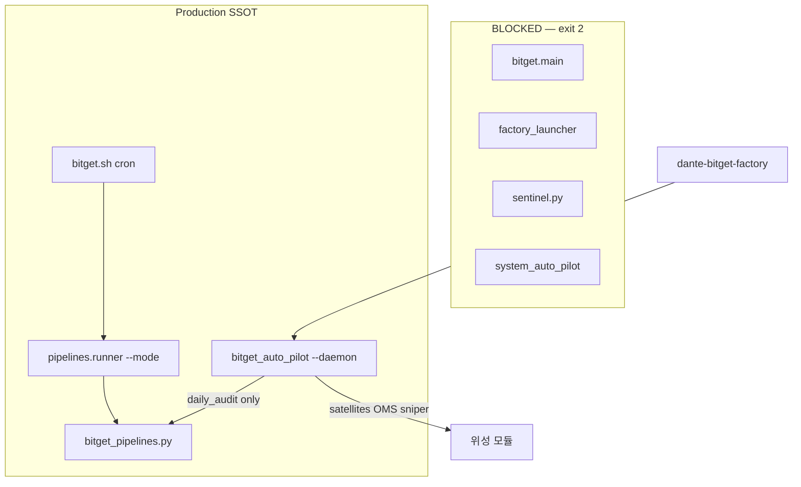

# 02 — Phase 1·2 실행 보고서 (진입점 SSOT + 파이프라인 Prelude)

> **작성일:** 2026-06-14  
> **승인 근거:** `01_architecture_mapping_and_diagnosis.md` Phase 1·2  
> **수정 범위:** `bitget/` only (루트 주식 파일 **미수정**)

---

## 0. Executive Summary

| Phase | 목표 | 결과 |
|-------|------|------|
| **Phase 1** | 레거시 진입점 무력화, 단일 SSOT | ✅ `bitget_auto_pilot` + `bitget.sh` only |
| **Phase 2** | 주식 prelude 안전망 이식 | ✅ `meta_sync` + `artifact_guard`가 scan/daily 선행 |

**프로덕션 SSOT (확정)**

```
cron / 수동 one-shot  →  bitget/deploy/bitget.sh --mode
                      →  python -m bitget.pipelines.runner --mode

24/7 daemon           →  dante-bitget-factory
                      →  python -m bitget.pipelines.bitget_auto_pilot --daemon
```

---

## 1. Phase 1 — 진입점·운영 SSOT 고정

### 1.1 무력화된 레거시 진입점

| 파일 | 이전 동작 | 변경 후 |
|------|-----------|---------|
| `bitget/main.py` | 7개 스레드 (MTF·스캐너·auto_pilot·스나이퍼·대시보드…) | `SystemExit(2)` + SSOT 안내 |
| `bitget/factory_launcher.py` | `sentinel.run_sentinel()` spawn | `SystemExit(2)` |
| `bitget/sentinel.py` | dashboard/heatmap subprocess 무한 재시작 | `SystemExit(2)` |
| `bitget/system_auto_pilot.py` | 별도 24/7 루프 | `SystemExit(2)` |
| `bitget/auto_pilot.py` `system_main_loop()` | 인라인 daily/위성/OMS 루프 (~100줄) | `RuntimeError` (호출 시 즉시 실패) |

**핵심 스니펫 — `main.py` hard block:**

```python
# bitget/main.py
_LEGACY_MSG = (
    "[BLOCKED] bitget.main is removed. Production SSOT:\n"
    "  24/7 daemon : python -m bitget.pipelines.bitget_auto_pilot --daemon\n"
    "  cron jobs   : bitget/deploy/bitget.sh --scan-all|--daily-audit|...\n"
)
if __name__ == "__main__":
    sys.stderr.write(_LEGACY_MSG)
    raise SystemExit(2)
```

**핵심 스니펫 — `auto_pilot.system_main_loop` 제거:**

```python
# bitget/auto_pilot.py
def system_main_loop() -> None:
    raise RuntimeError(
        "bitget.auto_pilot.system_main_loop is removed. "
        "Use python -m bitget.pipelines.bitget_auto_pilot --daemon "
        "and bitget/deploy/bitget.sh for cron pipelines."
    )
```

> `run_autonomous_analysis`, `detect_coin_regime`, `_safe_run_satellite` 등 **도메인 함수는 유지** —  
> `bitget_auto_pilot` 데몬·파이프라인 step에서 계속 호출.

### 1.2 `bitget.sh --daemon` SSOT 정렬

**변경 전:** `python -m bitget.factory_launcher` (sentinel)  
**변경 후:** `python -m bitget.pipelines.bitget_auto_pilot --daemon`

```bash
# bitget/deploy/bitget.sh
if [[ "$MODE" == "daemon" ]]; then
  exec python -m bitget.pipelines.bitget_auto_pilot --daemon >>"$LOG_FILE" 2>&1
fi
```

### 1.3 단일 엔진 구조 (After)



**이중 실행 제거 포인트:**
- `main.py`가 더 이상 `auto_pilot.system_main_loop` 스레드를 spawn하지 않음
- `auto_pilot` 인라인 daily_audit (UTC 00:00 리포트·evolution) 제거 → **cron `daily_audit` only**
- dashboard/heatmap은 **systemd 유닛** only (sentinel 제거)

### 1.4 데몬 부트 Self-Heal 추가

`bitget_auto_pilot` 시작 시 주식 `system_auto_pilot`과 동일하게 artifact guard 1회:

```python
# bitget/pipelines/bitget_auto_pilot.py (system_main_loop)
from bitget.infra.artifact_guard import ensure_bitget_artifacts
boot = ensure_bitget_artifacts()
logger.info("daemon boot artifact guard: %s", boot)
```

---

## 2. Phase 2 — 파이프라인 Prelude 이식

### 2.1 신규 모듈

#### `bitget/infra/artifact_guard.py`

주식 `factory_artifact_guard.py` 패턴 이식 (Bitget DB 전용).

| 함수 | 역할 |
|------|------|
| `verify_bitget_market_db_schema()` | `bitget_forward_trades`, `bitget_real_execution` 필수 테이블 검증 |
| `ensure_bitget_meta_governor_state()` | meta degraded 시 `rebuild_bitget_meta_state` 호출 |
| `ensure_bitget_artifacts()` | scan/daily prelude 진입점 |

```python
REQUIRED_TABLES = ("bitget_forward_trades", "bitget_real_execution")

def verify_bitget_market_db_schema(*, heal: bool = True):
    if heal:
        from bitget.forward.shared import init_forward_db
        init_forward_db()  # 스키마 self-heal
    # ... missing table 검사
```

#### `bitget/governance/meta_sync.py`

주식 `meta_state_store.py` 패턴 이식 (Bitget config SQLite + JSON 미러).

| 함수 | 역할 |
|------|------|
| `rebuild_bitget_meta_state()` | regime refresh → meta cycle → config align |
| `is_bitget_meta_degraded()` | **타임스탬프 age 검사 포함** (주식 보완 패턴) |
| `detect_coin_regime` 위임 | `bitget.auto_pilot.detect_coin_regime` (BTC/ETH 국면) |
| `sync_config_regime_from_meta()` | `REGIME_ANALYSIS`, `CURRENT_REGIME_KEY`, `DYNAMIC_KELLY_RISK` 동기화 |

**저장소 SSOT:**
- `bitget_system_config.sqlite` → `config_kv.META_GOVERNOR_STATE`
- `bitget_meta_governor_state.json` (미러)

```python
def rebuild_bitget_meta_state(*, force=False, refresh_regime=True):
    # 1) _refresh_coin_regime() → detect_coin_regime
    # 2) _run_bitget_meta_governor_cycle() → META_* 헤더 + kelly_cap
    # 3) ensure_config_regime_aligned()
    # degraded 잔존 시 RuntimeError (주식 factory_pipelines와 동일 fail-fast)
```

`ACTION_BY_REGIME` / `default_meta_state`는 루트 `meta_governor.py` **읽기 전용 import** (격리 원칙 준수).

### 2.2 `bitget_pipelines.py` prelude 구조

주식 `factory_pipelines.py`와 동일 순서:

| Prelude | Step 순서 |
|---------|-----------|
| **scan_*** | `meta_governor_sync_scan` → `artifact_guard` → `config_bootstrap` → scan body |
| **daily_audit** | `meta_governor_sync` → `artifact_guard` → `config_bootstrap` → `sentiment_mining` → body |

**핵심 스니펫 — meta sync step (주식 `_step_meta_governor_sync` 대칭):**

```python
def _step_meta_governor_sync() -> None:
    from bitget.governance.meta_sync import (
        ensure_config_regime_aligned,
        is_bitget_meta_degraded,
        load_bitget_meta_resolved,
        rebuild_bitget_meta_state,
    )
    out = rebuild_bitget_meta_state(force=False, refresh_regime=True)
    align = ensure_config_regime_aligned()
    # ... failures 수집 → degraded 시 RuntimeError
```

**핵심 스니펫 — artifact guard step:**

```python
def _step_artifact_guard() -> None:
    from bitget.infra.artifact_guard import ensure_bitget_artifacts
    result = ensure_bitget_artifacts()
    if result.get("error") == "no_db":
        raise RuntimeError(...)
    if result.get("error") == "schema_incomplete":
        raise RuntimeError(...)
```

**핵심 스니펫 — scan prelude:**

```python
def _with_scan_prelude(steps):
    return [_META_SYNC_SCAN, _ARTIFACT_GUARD, _CONFIG_BOOTSTRAP, *steps]

def _pipeline_scan_all():
    return _with_scan_prelude([
        StepSpec("gap_heal", ...),
        StepSpec("data_refresh_incremental", ...),
        StepSpec("scan_spot", ...),
        # ...
    ])
```

**daily_audit step 순서 (최종):**

```
meta_governor_sync → artifact_guard → config_bootstrap → sentiment_mining
→ doomsday_radar → track_spot → track_futures → deep_dive_* → comprehensive_report
→ ai_overseer → reconcile
```

### 2.3 모드별 prelude 적용 범위

| Mode | meta_sync + full artifact_guard |
|------|--------------------------------|
| `scan_spot` / `scan_futures` / `scan_all` | ✅ scan prelude |
| `daily_audit` | ✅ daily prelude |
| `track_positions`, `reconcile`, `data_refresh`, … | config_bootstrap + artifact_guard only (기존 `_with_guard`) |

---

## 3. 변경 파일 목록

### 신규 생성
- `bitget/governance/__init__.py`
- `bitget/governance/meta_sync.py`
- `bitget/infra/artifact_guard.py`
- `bitget/docs/02_phase1_2_execution_report.md`

### 수정
- `bitget/main.py`
- `bitget/factory_launcher.py`
- `bitget/sentinel.py`
- `bitget/auto_pilot.py`
- `bitget/system_auto_pilot.py`
- `bitget/pipelines/bitget_pipelines.py`
- `bitget/pipelines/bitget_auto_pilot.py`
- `bitget/deploy/bitget.sh`
- `bitget/docs/README.md`

### 루트 주식 파일
- **변경 없음** ✅

---

## 4. 운영 검증 명령 (Ubuntu 서버)

```bash
# 레거시 차단 확인 (exit 2 기대)
python -m bitget.main
python -m bitget.factory_launcher

# SSOT health
./bitget/deploy/bitget.sh --health

# prelude 동작 확인 (dry-run)
./bitget/deploy/bitget.sh --scan-all --dry-run
./bitget/deploy/bitget.sh --daily-audit --dry-run --skip-telegram

# heartbeat component (bitget_auto_pilot only)
sqlite3 $BITGET_OPS_DB \
  "SELECT component, MAX(ts_utc) FROM ops_events WHERE event='heartbeat.tick' GROUP BY 1;"

# regime 동기화 확인
sqlite3 $BITGET_CONFIG_DB \
  "SELECT key, substr(value_json,1,120) FROM config_kv
   WHERE key IN ('CURRENT_REGIME_KEY','REGIME_ANALYSIS','DYNAMIC_KELLY_RISK','META_GOVERNOR_STATE');"

# env 확인
grep BITGET_WATCHDOG_HEARTBEAT_COMPONENT .env bitget/.env
# 기대값: bitget_auto_pilot
```

---

## 5. 알려진 후속 작업 (Phase 3+)

본 Phase 1·2 범위 **밖** (다음 승인 대기):

| 항목 | 설명 |
|------|------|
| Config JSON 직접 읽기 제거 | `forward/shared.py`, `ai_overseer.py` → `config_manager` only |
| `meta_governor_consumer` Bitget 래퍼 | `bitget/governance/meta_consumer.py` — 주식 DB 오염 방지 |
| PIL 파이프라인 연결 | `_step_pil_bitget_reports` in daily_audit |
| `forward/reports.py` SQL 바인딩 수정 | bug #2 |

---

## 6. 참조 (읽기 전용)

- `factory_artifact_guard.py`, `factory_pipelines.py` (`_with_daily_audit_prelude`, `_step_meta_governor_sync`)
- `meta_state_store.py` (`rebuild_meta_state`, `is_meta_state_degraded`, `ensure_config_regime_aligned`)
- `bitget/auto_pilot.py` (`detect_coin_regime`)

---

*Phase 1·2 코드 작업 완료. Phase 3 승인 시 `03_phase3_config_meta_unification.md` 설계 문서부터 진행.*
