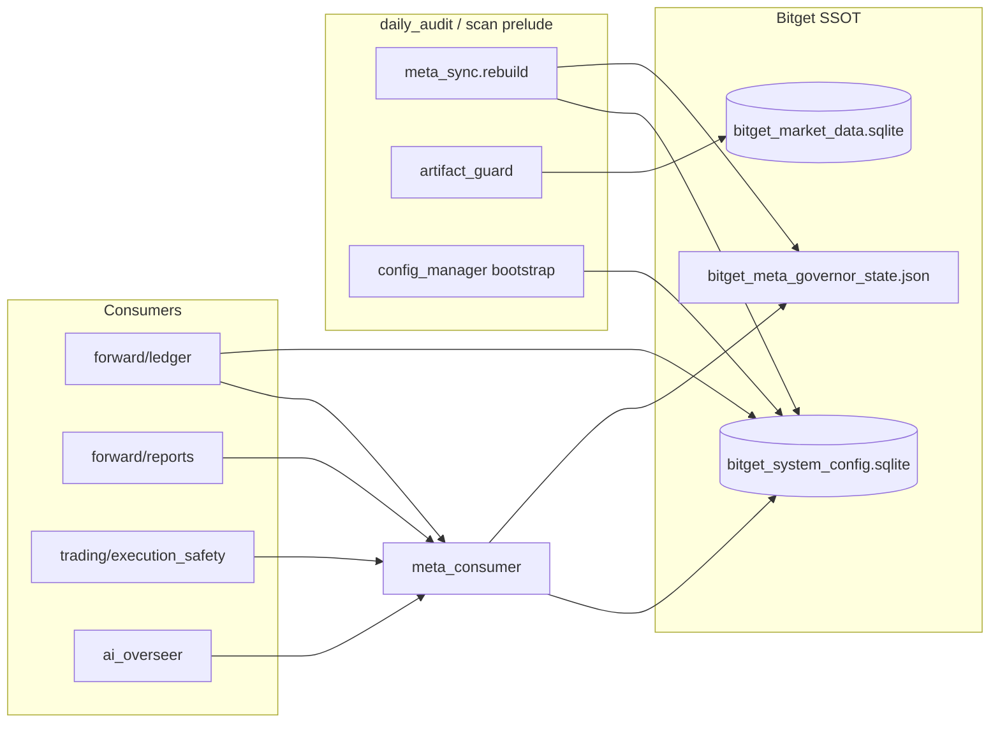

<<<<<<< HEAD
# 03 — Phase 3·4 실행 보고서 (Config·Meta 단일화 + PIL 파이프라인)

> **작성일:** 2026-06-14  
> **선행 작업:** `02_phase1_2_execution_report.md` (Phase 1·2 완료)  
> **수정 범위:** `bitget/` only (루트 주식 파일 **미수정**)

---

## 0. Executive Summary

| Phase | 목표 | 결과 |
|-------|------|------|
| **Phase 3** | Config·Meta 읽기 경로 Bitget SSOT 단일화 | ✅ |
| **Phase 4** | PIL 실무자 리포트 daily_audit 연결 | ✅ |

**핵심 성과**
- 거래·리포트·OMS 경로가 **주식 `meta_governor_consumer` / `system_config.sqlite`를 더 이상 읽지 않음**
- Config 읽기/쓰기가 **`bitget.infra.config_manager` (SQLite KV) 단일 경로**로 수렴
- `daily_audit` 파이프라인에 **PIL step** 추가 (주식 `pil_practitioner_reports` 대칭)

---

## 1. Phase 3 — Config·Meta 읽기 경로 단일화

### 1.1 신규: `bitget/governance/meta_consumer.py`

주식 `meta_governor_consumer.py` **API 대칭**, 데이터 소스는 **Bitget 전용**.

| 함수 | 데이터 소스 |
|------|-------------|
| `load_meta_state_resolved()` | `meta_sync.load_bitget_meta_unified()` + Bitget `config_kv` 캐시 핑거프린트 |
| `resolve_trading_kelly_base()` | `bitget_system_config.sqlite` + `META_REGIME_ACTION.kelly_cap` |
| `apply_meta_weight_bounds_clamp()` | Bitget meta `weight_s1/s4_bounds` |
| `apply_meta_kelly_merge()` | Bitget meta mult + KILL_SWITCH |
| `effective_max_position_pct()` | sys config + `META_MAX_POSITION_PCT` |
| `invalidate_meta_state_cache()` | consumer 캐시 무효화 |

```python
# bitget/governance/meta_consumer.py
def load_meta_state_resolved(path=None) -> Dict[str, Any]:
    fp = _meta_cache_fingerprint()  # Bitget JSON mtime + config_kv META_GOVERNOR_STATE
    ...
    data = load_bitget_meta_unified()  # NOT equity market_data.sqlite
    return data
```

**`meta_sync.py` 연동:** Governor cycle 완료 후 consumer 캐시 무효화:

```python
# bitget/governance/meta_sync.py (_run_bitget_meta_governor_cycle)
save_bitget_meta_unified(state)
from bitget.governance.meta_consumer import invalidate_meta_state_cache
invalidate_meta_state_cache()
```

### 1.2 Config SSOT — JSON 직접 I/O 제거 (핵심 경로)

| 파일 | 변경 전 | 변경 후 |
|------|---------|---------|
| `forward/shared.py` | SQLite 실패 시 JSON fallback read/write | `config_manager` only |
| `config_hub.py` | JSON read + atomic JSON write | `config_manager` thin facade |
| `ai_overseer.py` | `open(bitget_system_config.json)` | `config_manager.load_system_config()` |
| `auto_pilot.py` | `config_hub` (JSON 기반) | `config_hub` → 이제 SQLite 위임 |
| `system_auto_pilot.py` | JSON load/save | `config_manager` (레거시 파일, 실행 차단됨) |

**핵심 스니펫 — `forward/shared.py`:**

```python
def load_system_config() -> dict:
    from bitget.infra import config_manager
    return config_manager.load_system_config() or {}

def save_system_config(cfg: dict) -> None:
    from bitget.infra import config_manager
    config_manager.save_system_config(cfg)
```

**핵심 스니펫 — `config_hub.py`:**

```python
def load_config():
    return config_manager.load_system_config() or {}

def save_config_atomic(cfg):
    return config_manager.save_system_config(cfg or {})
```

> JSON 파일(`bitget_system_config.json`)은 **bootstrap 전용** — `config_manager.bootstrap_from_json_if_empty()`만 사용.  
> 런타임 read/write는 SQLite `bitget_system_config.sqlite` only.

### 1.3 Meta import 경로 교체 (주식 consumer → Bitget consumer)

| 모듈 | import 변경 |
|------|-------------|
| `forward/ledger.py` | `bitget.governance.meta_consumer` |
| `forward/reports.py` | `bitget.governance.meta_consumer` |
| `trading/execution_safety.py` | `bitget.governance.meta_consumer` |
| `auto_pilot.py` `detect_coin_regime` | `bitget.governance.meta_consumer` |
| `system_auto_pilot.py` | `bitget.governance.meta_consumer` |

**Before (문제):**
```python
from meta_governor_consumer import load_meta_state_resolved
# → equity system_config.sqlite + equity meta_governor_state.json 읽기
```

**After:**
```python
from bitget.governance.meta_consumer import load_meta_state_resolved
# → bitget_system_config.sqlite META_GOVERNOR_STATE + bitget_meta_governor_state.json
```

### 1.4 `ai_overseer` — 경로·Meta 감사 필드 정렬

- `DB_PATH` → `market_data_db_path()` (data_paths SSOT)
- `CSV_PATH` → `flow_csv_path()`
- `load_config()` → `config_manager`
- 감사 리포트에 **Meta vs Config 분열 감지 필드** 추가:

```python
report_data["config_status"] = {
    "regime": config.get("CURRENT_REGIME_KEY"),
    "meta_regime": meta.get("META_REGIME_KEY"),
    "meta_governor_last_run": meta.get("META_GOVERNOR_LAST_RUN_AT"),
    "meta_kelly_cap": (meta.get("META_REGIME_ACTION") or {}).get("kelly_cap"),
    ...
}
```

→ 이전 `GOVERNOR_SYNC_FATAL_REPORT` 증상(BULL vs UNKNOWN)을 **감사관이 직접 비교** 가능.

### 1.5 아직 JSON 직접 읽기가 남은 모듈 (후속 Phase 5 범위)

다음 파일들은 **위성·스캐너** 계층으로, `config_hub`/`config_manager` 위임은 Phase 5에서 일괄 정리 예정:

- `supernova_hunter.py`, `master_scanner.py`, `signal_engines.py`
- `shadow_performance_tracker.py`, `doomsday_bot.py`, `data_miner.py` 등

**핵심 거래·리포트·파이프라인 경로는 Phase 3에서 완료.**

---

## 2. Phase 4 — PIL 파이프라인 연결

### 2.1 `daily_audit` step 추가

주식 `factory_pipelines._PIL_PRACTITIONER` 대칭:

```python
# bitget/pipelines/bitget_pipelines.py
def _step_pil_practitioner_reports() -> None:
    from bitget.forward.reports import send_group_practitioner_reports
    send_group_practitioner_reports()
```

**daily_audit 최종 순서 (Phase 3·4 반영):**

```
meta_governor_sync → artifact_guard → config_bootstrap → sentiment_mining
→ doomsday_radar → track_spot → track_futures
→ deep_dive_spot → deep_dive_futures
→ pil_practitioner_reports          ← NEW (Phase 4)
→ comprehensive_report → ai_overseer → reconcile
```

### 2.2 PIL 구현체

- `bitget/forward/reports.py` → `send_group_practitioner_reports()`
- `bitget/forward/practitioner_bitget_adapter.py` → PRACT_01~30
- `load_meta_state_resolved` → **Bitget consumer** (Phase 3)
- 루트 `practitioner_intelligence` — **읽기 전용 import** (PYTHONPATH, 기존 설계 유지)

---

## 3. 데이터 흐름 (After)



---

## 4. 변경 파일 목록

### 신규
- `bitget/governance/meta_consumer.py`
- `bitget/docs/03_phase3_4_execution_report.md`

### 수정
- `bitget/forward/shared.py`
- `bitget/config_hub.py`
- `bitget/forward/ledger.py`
- `bitget/forward/reports.py`
- `bitget/trading/execution_safety.py`
- `bitget/auto_pilot.py`
- `bitget/ai_overseer.py`
- `bitget/system_auto_pilot.py`
- `bitget/governance/meta_sync.py`
- `bitget/pipelines/bitget_pipelines.py`
- `bitget/docs/README.md`

### 루트 주식
- **변경 없음** ✅

---

## 5. 검증 명령 (Ubuntu)

```bash
# import 경로 확인 (equity meta_consumer 미사용)
python -c "
from bitget.governance.meta_consumer import load_meta_state_resolved
from bitget.forward.shared import load_system_config
m = load_meta_state_resolved()
c = load_system_config()
print('meta_regime', m.get('META_REGIME_KEY'))
print('config_regime', c.get('CURRENT_REGIME_KEY'))
print('kelly', c.get('DYNAMIC_KELLY_RISK'))
"

# daily_audit prelude + PIL (dry-run)
./bitget/deploy/bitget.sh --daily-audit --dry-run --skip-telegram

# config SQLite SSOT
sqlite3 $BITGET_CONFIG_DB \
  "SELECT key FROM config_kv ORDER BY key LIMIT 20;"
```

---

## 6. 후속 작업 (Phase 5+)

| 항목 | 설명 |
|------|------|
| 위성 모듈 config 통합 | `supernova_hunter`, `master_scanner` 등 → `config_hub` 위임 |
| `forward/reports.py` deep_dive SQL | bug #2 바인딩 수정 |
| 위성 JSON 일괄 제거 스크립트 | grep 기반 mechanical refactor |

---

*Phase 3·4 완료. Phase 5(데몬·cron·위성 config) 승인 시 `04_phase5_satellite_config.md`부터 진행.*
=======
# 03 — Phase 3·4 실행 보고서 (Config·Meta 단일화 + PIL 파이프라인)

> **작성일:** 2026-06-14  
> **선행 작업:** `02_phase1_2_execution_report.md` (Phase 1·2 완료)  
> **수정 범위:** `bitget/` only (루트 주식 파일 **미수정**)

---

## 0. Executive Summary

| Phase | 목표 | 결과 |
|-------|------|------|
| **Phase 3** | Config·Meta 읽기 경로 Bitget SSOT 단일화 | ✅ |
| **Phase 4** | PIL 실무자 리포트 daily_audit 연결 | ✅ |

**핵심 성과**
- 거래·리포트·OMS 경로가 **주식 `meta_governor_consumer` / `system_config.sqlite`를 더 이상 읽지 않음**
- Config 읽기/쓰기가 **`bitget.infra.config_manager` (SQLite KV) 단일 경로**로 수렴
- `daily_audit` 파이프라인에 **PIL step** 추가 (주식 `pil_practitioner_reports` 대칭)

---

## 1. Phase 3 — Config·Meta 읽기 경로 단일화

### 1.1 신규: `bitget/governance/meta_consumer.py`

주식 `meta_governor_consumer.py` **API 대칭**, 데이터 소스는 **Bitget 전용**.

| 함수 | 데이터 소스 |
|------|-------------|
| `load_meta_state_resolved()` | `meta_sync.load_bitget_meta_unified()` + Bitget `config_kv` 캐시 핑거프린트 |
| `resolve_trading_kelly_base()` | `bitget_system_config.sqlite` + `META_REGIME_ACTION.kelly_cap` |
| `apply_meta_weight_bounds_clamp()` | Bitget meta `weight_s1/s4_bounds` |
| `apply_meta_kelly_merge()` | Bitget meta mult + KILL_SWITCH |
| `effective_max_position_pct()` | sys config + `META_MAX_POSITION_PCT` |
| `invalidate_meta_state_cache()` | consumer 캐시 무효화 |

```python
# bitget/governance/meta_consumer.py
def load_meta_state_resolved(path=None) -> Dict[str, Any]:
    fp = _meta_cache_fingerprint()  # Bitget JSON mtime + config_kv META_GOVERNOR_STATE
    ...
    data = load_bitget_meta_unified()  # NOT equity market_data.sqlite
    return data
```

**`meta_sync.py` 연동:** Governor cycle 완료 후 consumer 캐시 무효화:

```python
# bitget/governance/meta_sync.py (_run_bitget_meta_governor_cycle)
save_bitget_meta_unified(state)
from bitget.governance.meta_consumer import invalidate_meta_state_cache
invalidate_meta_state_cache()
```

### 1.2 Config SSOT — JSON 직접 I/O 제거 (핵심 경로)

| 파일 | 변경 전 | 변경 후 |
|------|---------|---------|
| `forward/shared.py` | SQLite 실패 시 JSON fallback read/write | `config_manager` only |
| `config_hub.py` | JSON read + atomic JSON write | `config_manager` thin facade |
| `ai_overseer.py` | `open(bitget_system_config.json)` | `config_manager.load_system_config()` |
| `auto_pilot.py` | `config_hub` (JSON 기반) | `config_hub` → 이제 SQLite 위임 |
| `system_auto_pilot.py` | JSON load/save | `config_manager` (레거시 파일, 실행 차단됨) |

**핵심 스니펫 — `forward/shared.py`:**

```python
def load_system_config() -> dict:
    from bitget.infra import config_manager
    return config_manager.load_system_config() or {}

def save_system_config(cfg: dict) -> None:
    from bitget.infra import config_manager
    config_manager.save_system_config(cfg)
```

**핵심 스니펫 — `config_hub.py`:**

```python
def load_config():
    return config_manager.load_system_config() or {}

def save_config_atomic(cfg):
    return config_manager.save_system_config(cfg or {})
```

> JSON 파일(`bitget_system_config.json`)은 **bootstrap 전용** — `config_manager.bootstrap_from_json_if_empty()`만 사용.  
> 런타임 read/write는 SQLite `bitget_system_config.sqlite` only.

### 1.3 Meta import 경로 교체 (주식 consumer → Bitget consumer)

| 모듈 | import 변경 |
|------|-------------|
| `forward/ledger.py` | `bitget.governance.meta_consumer` |
| `forward/reports.py` | `bitget.governance.meta_consumer` |
| `trading/execution_safety.py` | `bitget.governance.meta_consumer` |
| `auto_pilot.py` `detect_coin_regime` | `bitget.governance.meta_consumer` |
| `system_auto_pilot.py` | `bitget.governance.meta_consumer` |

**Before (문제):**
```python
from meta_governor_consumer import load_meta_state_resolved
# → equity system_config.sqlite + equity meta_governor_state.json 읽기
```

**After:**
```python
from bitget.governance.meta_consumer import load_meta_state_resolved
# → bitget_system_config.sqlite META_GOVERNOR_STATE + bitget_meta_governor_state.json
```

### 1.4 `ai_overseer` — 경로·Meta 감사 필드 정렬

- `DB_PATH` → `market_data_db_path()` (data_paths SSOT)
- `CSV_PATH` → `flow_csv_path()`
- `load_config()` → `config_manager`
- 감사 리포트에 **Meta vs Config 분열 감지 필드** 추가:

```python
report_data["config_status"] = {
    "regime": config.get("CURRENT_REGIME_KEY"),
    "meta_regime": meta.get("META_REGIME_KEY"),
    "meta_governor_last_run": meta.get("META_GOVERNOR_LAST_RUN_AT"),
    "meta_kelly_cap": (meta.get("META_REGIME_ACTION") or {}).get("kelly_cap"),
    ...
}
```

→ 이전 `GOVERNOR_SYNC_FATAL_REPORT` 증상(BULL vs UNKNOWN)을 **감사관이 직접 비교** 가능.

### 1.5 아직 JSON 직접 읽기가 남은 모듈 (후속 Phase 5 범위)

다음 파일들은 **위성·스캐너** 계층으로, `config_hub`/`config_manager` 위임은 Phase 5에서 일괄 정리 예정:

- `supernova_hunter.py`, `master_scanner.py`, `signal_engines.py`
- `shadow_performance_tracker.py`, `doomsday_bot.py`, `data_miner.py` 등

**핵심 거래·리포트·파이프라인 경로는 Phase 3에서 완료.**

---

## 2. Phase 4 — PIL 파이프라인 연결

### 2.1 `daily_audit` step 추가

주식 `factory_pipelines._PIL_PRACTITIONER` 대칭:

```python
# bitget/pipelines/bitget_pipelines.py
def _step_pil_practitioner_reports() -> None:
    from bitget.forward.reports import send_group_practitioner_reports
    send_group_practitioner_reports()
```

**daily_audit 최종 순서 (Phase 3·4 반영):**

```
meta_governor_sync → artifact_guard → config_bootstrap → sentiment_mining
→ doomsday_radar → track_spot → track_futures
→ deep_dive_spot → deep_dive_futures
→ pil_practitioner_reports          ← NEW (Phase 4)
→ comprehensive_report → ai_overseer → reconcile
```

### 2.2 PIL 구현체

- `bitget/forward/reports.py` → `send_group_practitioner_reports()`
- `bitget/forward/practitioner_bitget_adapter.py` → PRACT_01~30
- `load_meta_state_resolved` → **Bitget consumer** (Phase 3)
- 루트 `practitioner_intelligence` — **읽기 전용 import** (PYTHONPATH, 기존 설계 유지)

---

## 3. 데이터 흐름 (After)


---

## 4. 변경 파일 목록

### 신규
- `bitget/governance/meta_consumer.py`
- `bitget/docs/03_phase3_4_execution_report.md`

### 수정
- `bitget/forward/shared.py`
- `bitget/config_hub.py`
- `bitget/forward/ledger.py`
- `bitget/forward/reports.py`
- `bitget/trading/execution_safety.py`
- `bitget/auto_pilot.py`
- `bitget/ai_overseer.py`
- `bitget/system_auto_pilot.py`
- `bitget/governance/meta_sync.py`
- `bitget/pipelines/bitget_pipelines.py`
- `bitget/docs/README.md`

### 루트 주식
- **변경 없음** ✅

---

## 5. 검증 명령 (Ubuntu)

```bash
# import 경로 확인 (equity meta_consumer 미사용)
python -c "
from bitget.governance.meta_consumer import load_meta_state_resolved
from bitget.forward.shared import load_system_config
m = load_meta_state_resolved()
c = load_system_config()
print('meta_regime', m.get('META_REGIME_KEY'))
print('config_regime', c.get('CURRENT_REGIME_KEY'))
print('kelly', c.get('DYNAMIC_KELLY_RISK'))
"

# daily_audit prelude + PIL (dry-run)
./bitget/deploy/bitget.sh --daily-audit --dry-run --skip-telegram

# config SQLite SSOT
sqlite3 $BITGET_CONFIG_DB \
  "SELECT key FROM config_kv ORDER BY key LIMIT 20;"
```

---

## 6. 후속 작업 (Phase 5+)

| 항목 | 설명 |
|------|------|
| 위성 모듈 config 통합 | `supernova_hunter`, `master_scanner` 등 → `config_hub` 위임 |
| `forward/reports.py` deep_dive SQL | bug #2 바인딩 수정 |
| 위성 JSON 일괄 제거 스크립트 | grep 기반 mechanical refactor |

---

*Phase 3·4 완료. Phase 5(데몬·cron·위성 config) 승인 시 `04_phase5_satellite_config.md`부터 진행.*
>>>>>>> a6f17ca59385c6492c35a2f0368a732550fef092
