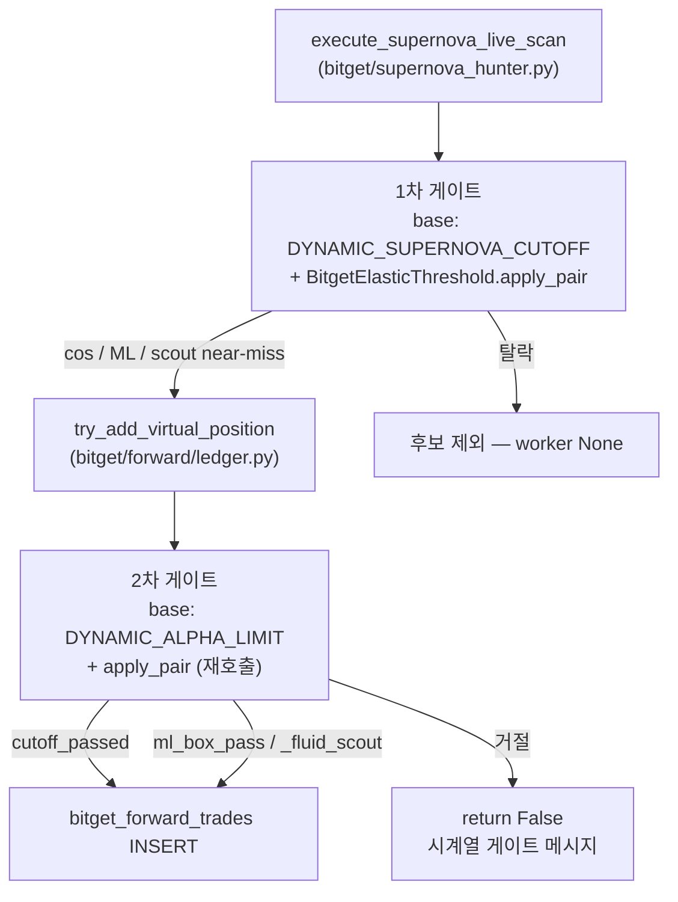

# Bitget 이중 커toff 분석 (Issue #4)

> **범위**: Bitget 코인(`bitget/`) 전용 — Supernova 1차 게이트 vs Ledger 2차 게이트  
> **상태**: 분석·정책 문서 (코드 수정 없음)  
> **작성 배경**: Bitget 팩토리 이식 감사(audit) 중 발견된 구조적 정합성 이슈  
> **관련 커밋 맥락**: elastic 1차 게이트(`supernova_hunter`), ledger 2차 게이트, weekly PRI starvation

---

## 1. 요약 (Executive Summary)

Bitget 코인 파이프라인은 **동일한 elastic 엔진**(`BitgetElasticThreshold.apply_pair`)을 두 번 호출하지만, **서로 다른 config base cutoff**에서 출발한다.

| 단계 | 모듈 | 역할 | Base cos config key | 코드 기본값 |
|------|------|------|---------------------|-------------|
| **1차 (스캔·발견)** | `bitget/supernova_hunter.py` | 후보 탐지·supernova scan | `DYNAMIC_SUPERNOVA_CUTOFF` | **0.50** |
| **2차 (장부·자본)** | `bitget/forward/ledger.py` | `try_add_virtual_position` 실제 진입 | `DYNAMIC_ALPHA_LIMIT` → (없으면) `DYNAMIC_SUPERNOVA_CUTOFF` → (없으면) hard default | **0.75** |

**핵심 결론**

- 이는 **런타임 예외(crash) 버그가 아니라**, 주식 팩토리(`supernova_hunter` + `forward/shared.py`)와 **동형인 2단 필터** 설계로 보인다.
- 다만 **plain cosine `[SUPERNOVA]` 경로**에서는 1차 elastic 완화 효과가 2차에서 **상당 부분 상쇄**되며, **silent drop**(조용한 미체결)과 **지표·로그 왜곡**이 발생할 수 있다.
- Scout / ML box 경로는 2차 cos 재검사를 **우회**하므로, 경로별 진입 빈도 **편향**이 생길 수 있다.

---

## 2. 아키텍처 — 신호 흐름



### 2.1 Supernova → Ledger 호출

Supernova scan이 1차 게이트를 통과하면 즉시 ledger를 호출한다.

- 파일: `bitget/supernova_hunter.py` — `execute_supernova_live_scan()` 마지막 루프
- API: `try_add_virtual_position(market_type, symbol, timeframe, sig_type, score, entry_price, facts)`

### 2.2 다른 진입 경로 (Supernova 1차 없음)

| 경로 | 1차 supernova | 2차 ledger | 비고 |
|------|---------------|------------|------|
| `supernova_hunter` | ✅ | ✅ | 이 문서의 핵심 대상 |
| `master_scanner` | ❌ | ✅ | ledger ALPHA 기준만 적용 |
| 기타 forward hook | ❌ | ✅ | mutant / pipeline 직행 |

`master_scanner`는 supernova 1차를 거치지 않으므로, **스캔 기준과 장부 기준이 애초에 다르다**는 점을 별도로 인지해야 한다.

---

## 3. 코드 근거 (SSOT 위치)

### 3.1 1차 게이트 — Supernova

**파일**: `bitget/supernova_hunter.py`

```python
def _resolve_elastic_scan_cutoffs(cfg, market_type: str):
    base_cos = float(cfg.get("DYNAMIC_SUPERNOVA_CUTOFF", 0.50))
    base_ml = float(cfg.get("DYNAMIC_ML_BOX_CUTOFF", 0.50))
    state = BitgetElasticThreshold(cfg, market_type).apply_pair(base_cos, base_ml)
    return float(state.cos_cutoff), float(state.ml_cutoff), state
```

**판정 함수**: `_evaluate_supernova_scan_gate()`

- cosine 합격: `eff_cos >= eff_cos_cutoff` AND `best_dtw <= dtw_cutoff`
- ML box 합격: `best_ml_ratio >= eff_ml_cutoff`
- 둘 다 실패 시: `evaluate_scout_candidate()` near-miss → scout 허용

**facts / sig_type 분기** (1차 통과 후 ledger로 전달):

| 1차 통과 유형 | facts 플래그 | sig_type 예시 |
|---------------|--------------|---------------|
| Scout near-miss | `_fluid_scout=True` | `[🔭SCOUT/...][SUPERNOVA][TF] ...` |
| ML box | `ml_box_pass=True` | `[SUPERNOVA_MLBOX][TF] ...` |
| Plain cosine | (없음) | `[SUPERNOVA][TF] ...` |

### 3.2 2차 게이트 — Ledger

**파일**: `bitget/forward/ledger.py` — `try_add_virtual_position()`

```python
dyn_cos_limit = float(cfg.get("DYNAMIC_ALPHA_LIMIT", cfg.get("DYNAMIC_SUPERNOVA_CUTOFF", 0.75)))
dyn_ml_cutoff = float(cfg.get("DYNAMIC_ML_BOX_CUTOFF", 0.50))

elastic_state = BitgetElasticThreshold(cfg, market_type).apply_pair(dyn_cos_limit, dyn_ml_cutoff)
dyn_cos_limit = float(elastic_state.cos_cutoff)
dyn_ml_cutoff = float(elastic_state.ml_cutoff)

cutoff_passed = (max_alpha_cos_effective >= dyn_cos_limit) and dtw_ok

if facts.get("ml_box_pass"):
    cutoff_passed = True
if facts.get("_fluid_scout"):
    cutoff_passed = True
```

**거절 메시지** (plain cosine이 2차에서 막힐 때):

```
시계열 게이트: AST 융합 Cos_eff={...} (기준≥{dyn_cos_limit}) 또는 DTW 조건 불만족(...)
```

### 3.3 Elastic 엔진 (공통)

**파일**: `bitget/evolution/elastic_threshold_bg.py` — `BitgetElasticThreshold.apply_pair()`

동일 공식, **다른 base 입력**:

```
relief  = starvation_index × ELASTIC_MAX_RELIEF   (기본 0.18)
tighten = max(0, vol_proxy - 1.0) × ELASTIC_VOL_TIGHTEN  (기본 0.06)

cos_cutoff = clip(base_cos × (1 + tighten) - relief, floor, ceil)
```

**starvation_index**는 `bitget_forward_trades` 최근 진입 빈도 등에서 계산 — 1차·2차 모두 **동일 DB·동일 시점**이면 starvation 값은 같지만, **base가 다르면 최종 cutoff는 달라진다**.

### 3.4 Cosine 점수 정합성 (이중 alpha 가산 아님)

Supernova:

- `eff_cos = min(1.0, best_cos + alpha_bonus)`
- `facts["sn_score"] = best_cos` (alpha 미포함)
- `score = eff_cos × 100`

Ledger:

- `_facts_cos_scalar_01()` — `sn_score` 우선 → `best_cos` (0~1)
- `max_alpha_cos_effective = min(1.0, max_alpha_cos + alpha_bonus_score)` (ledger에서 alpha 재계산)

**결론**: 최종 비교 스칼라 `max_alpha_cos_effective`는 supernova의 `eff_cos`와 **의도적으로 align**된다. Issue #4의 본질은 **점수 불일치가 아니라 base cutoff 키 불일치**이다.

---

## 4. 주식 팩토리와의 대응 (의도적 2단 필터)

| 레이어 | 주식 | Bitget 코인 |
|--------|------|-------------|
| 스캔·발견 | `supernova_hunter.py` — `DYNAMIC_SUPERNOVA_CUTOFF` (~0.50) | `bitget/supernova_hunter.py` — 동일 키 |
| 장부·자본 | `forward/shared.py` — `DYNAMIC_ALPHA_LIMIT` (~0.75) | `bitget/forward/ledger.py` — 동일 키 |
| Elastic | `elastic_threshold.py` | `elastic_threshold_bg.py` |

주식 weekly PRI / factory pipeline도 supernova(넓은 발견)와 forward ledger(좁은 자본 투입)를 **분리**해 운영한다. Bitget 이식은 이 패턴을 **의도적으로 복제**한 것으로 해석하는 것이 타당하다.

---

## 5. 전문적 분석

### 5.1 문제의 성격 분류

| 분류 | 해당 여부 | 설명 |
|------|-----------|------|
| Correctness bug (크래시) | ❌ | 예외 없이 `False` 반환 |
| Data corruption | ❌ | DB 오염 없음 |
| Design / policy mismatch | ✅ | 2단 필터 + config 키 이원화 |
| Observability gap | ✅ | silent drop, 로그·텔레그램 불일치 |
| Evolution feedback loop | ⚠️ | starvation relief가 plain path에 제한적으로만 반영 |

### 5.2 수치 예시 (개념)

config 가정:

- `DYNAMIC_SUPERNOVA_CUTOFF = 0.50`
- `DYNAMIC_ALPHA_LIMIT = 0.75`
- `ELASTIC_MAX_RELIEF = 0.18`, `starvation_index = 0.55` → `relief ≈ 0.10`

| | Base | Elastic 후 cutoff |
|--|------|-------------------|
| 1차 (supernova) | 0.50 | **≈ 0.40** |
| 2차 (ledger) | 0.75 | **≈ 0.65** |

후보 `eff_cos = 0.55`:

- 1차: **통과** (0.55 ≥ 0.40)
- 2차: **거절** (0.55 < 0.65) → plain `[SUPERNOVA]` 경로

starvation이 **1.0**(극단적 기아)이어도:

- 1차: 0.50 − 0.18 = **0.32** (floor 0.32)
- 2차: 0.75 − 0.18 = **0.57**
- `eff_cos = 0.50` → 1차 통과, 2차 **여전히 거절**

→ **elastic starvation을 올려도 plain cosine supernova → ledger 갭은 구조적으로 남는다** (base gap 0.25).

### 5.3 경로별 비대칭 (Scout / ML 우회)

2차에서 cos 재검사를 **생략**하는 조건:

1. `facts["ml_box_pass"] == True` — supernova ML box 1차 합격
2. `facts["_fluid_scout"] == True` — supernova scout 1차 near-miss
3. Ledger 자체 scout: 1차 cosine/ML 실패 후 `evaluate_scout_candidate()` — **단, base는 ALPHA_LIMIT 기준**

**영향**

- Weekly PRI가 starvation을 올리면 → 1차 scout near-miss **증가** → 2차 bypass **증가**
- Plain cosine “약한 합격” 구간 → 1차만 통과, 2차 drop → **scout/ML 비중 상대적 증가**
- Ratchet RL / free-runner 표본도 scout cap(소액) 경로에 **편중**될 수 있음

### 5.4 Scout band의 이중 기준

Supernova scout near-miss band:

- `cos_floor = eff_cos_cutoff_supernova - scout_gap`

Ledger scout (plain 경로가 1차 없이 ledger만 탈 때):

- `cos_floor = eff_cos_cutoff_alpha - scout_gap`

**같은 `best_cos_sim`이라도** supernova에서 scout로 살아남은 후보와, ledger-only scout 후보는 **near-miss 구간 자체가 다르다**.

Supernova scout는 `_fluid_scout`로 2차 bypass되므로, ledger scout 재평가는 **supernova scout에는 적용되지 않는다** (이미 `cutoff_passed=True`).

### 5.5 운영·관측 영향

#### (1) Silent drop

- `try_add_virtual_position` → `False, "시계열 게이트: ..."`
- Supernova 텔레그램: **`ok=True`일 때만** 발송 (`supernova_hunter.py`)
- Shadow tracking: ANTI_PATTERNS / TOXIC / DOOMSDAY 등 **일부 거절만** 기록 — **커toff 거절은 shadow 미기록**

→ 운영자는 “스캔은 돌았는데 왜 포지션이 없지?”를 **로그만으로 추적하기 어렵다**.

#### (2) 로그 왜곡

Supernova 마지막 출력:

```
✅ [spot/1H] 실시간 저격 완료: {len(valid)}건 합격 후보
```

`valid` = **1차 게이트 통과 수**, ledger `ok` 수가 아님.

#### (3) 재스캔 반복

`scanned_today_cache`는 **ledger `ok=True`일 때만** 심볼 등록.

→ 1차 통과 + 2차 거절 시 **같은 날 동일 심볼 재스캔** 가능 (CPU/DB 부하, 중복 worker).

#### (4) Evolution 피드백

- `elastic_threshold_bg` starvation: **ledger 진입 빈도** 기반
- Supernova 1차 hit ↑ + ledger fill ↓ → starvation ↑ → 1차 cutoff ↓ → **scout/ML bypass ↑**, plain gap **유지**

→ “기아 완화” 정책이 **의도와 다른 경로**로 흡수될 수 있다.

### 5.6 언제 문제가 거의 안 보이는가

- Config에 `DYNAMIC_ALPHA_LIMIT` **미설정**, `DYNAMIC_SUPERNOVA_CUTOFF`만 존재 → ledger fallback으로 **0.50 정렬**
- 운영 진입이 **ML box / scout 위주**
- 두 키를 **운영적으로 동일 값**으로 수동/sync 관리

대부분 PRI / weekly evolution이 **두 키를 별도로** 다루면 갭은 **재발**한다.

---

## 6. 발생 가능 “오류” 체크리스트

| # | 현상 | 심각도 | 기술적 원인 |
|---|------|--------|-------------|
| 1 | Supernova 후보인데 포지션 없음 | 🟠 Medium | 2차 ALPHA cutoff 거절 |
| 2 | 텔레그램·장부 불일치 | 🟡 Low | 텔레그램은 ledger ok 후만 |
| 3 | “N건 합격” 로그 vs 실제 진입 수 불일치 | 🟡 Low | `len(valid)` = 1차 통과 |
| 4 | Starvation ↑인데 plain supernova 진입 안 늘음 | 🟠 Medium | relief가 2차 base에 덜 반영 |
| 5 | Scout/ML 비중 비정상적으로 높음 | 🟡 Low | 2차 bypass 편향 |
| 6 | 동일 심볼 intraday 반복 scan | 🟡 Low | cache는 ok 후만 |
| 7 | Python exception / DB corruption | ❌ None | 정상 reject 경로 |

**None of the above is a capital logic crash** — 거래 로직은 “더 보수적으로 거절”하는 방향이다. 리스크는 **기회 손실·관측 공백·진화 편향** 쪽에 있다.

---

## 7. 수정 방향 (정책 옵션 — 미구현)

> 아래는 **향후 결정용** 옵션이다. 본 문서 작성 시점에는 **코드 변경 없음**.

### Option A — Config 정렬 (최소 침습)

**내용**: `DYNAMIC_ALPHA_LIMIT`와 `DYNAMIC_SUPERNOVA_CUTOFF`를 Bitget config SSOT에서 **동일 값**으로 유지 (또는 ALPHA = SUPERNOVA × (1 + δ) 명시적 δ).

| 장점 | 단점 |
|------|------|
| 코드 diff 거의 없음 | 2단 필터 “의도” 희석 가능 |
| 즉시 배포 가능 | 주식과 다른 정책이 될 수 있음 |

**적합**: “스캔 = 진입 후보”로 **단일 기준**을 원할 때.

---

### Option B — Sig-type-aware ledger base (구조적 정합)

**내용**: `try_add_virtual_position`에서 `sig_type`이 `[SUPERNOVA]` 계열이면 base cutoff를 `DYNAMIC_SUPERNOVA_CUTOFF`로, 그 외(mutant/master)는 `DYNAMIC_ALPHA_LIMIT` 유지.

| 장점 | 단점 |
|------|------|
| 1차 elastic 완화가 plain supernova에 **전달** | ledger 분기 증가 |
| master_scanner 등 **보수적 2차** 유지 | sig_type 문자열 의존 |
| 주식 2-tier 철학과 **절충** | 테스트·문서 필요 |

**적합**: “supernova pipeline만 1차=2차 align, 나머지는 엄격” 정책.

---

### Option C — 현행 유지 + Observability (의도 명시)

**내용**: 2단 필터 **의도적 유지**. 대신:

- Supernova: ledger reject 시 **명시 로그 / shadow / metrics** (`SUPERNOVA_LEDGER_REJECT`)
- 완료 로그: `1차 {n}건 / 장부 {m}건` 분리
- (선택) 2차 reject도 shadow에 **별도 reason** 기록

| 장점 | 단점 |
|------|------|
| 리스크 정책(보수적 장부) **유지** | plain path gap **그대로** |
| 운영 가시성 **대폭 개선** | 코드는 observability만 |

**적합**: “발견은 aggressive, 체결은 conservative”를 **제품 정책**으로 고수할 때.

---

### Option D — Single gate (아키텍처 변경)

**내용**: Supernova 1차에서 elastic+cos+DTW+scout **최종 판정** 후, ledger는 **anti-pattern / kelly / quota / frontrun** 등 **비-cos 게이트만**.

| 장점 | 단점 |
|------|------|
| 중복 apply_pair 제거 | ledger 책임 축소·이동 |
| silent drop **원천 제거** | 주식 구조와 ** divergence** |
| | 회귀 범위 큼 |

**적합**: Bitget-only 장기 리팩터, 주식 미동기 전제.

---

### Option E — Elastic state handoff (중간)

**내용**: Supernova가 1차에서 계산한 `elastic_state.cos_cutoff` / scout verdict를 `facts`에 실어 ledger가 **동일 eff cutoff**로 2차 검증 (또는 supernova 합격 시 2차 cos skip + ledger는 risk gate만).

| 장점 | 단점 |
|------|------|
| 이중 compute 감소 | facts 스키마·신뢰 경계 |
| 1·2차 cutoff **강제 일치** | master_scanner 경로 별도 처리 |

---

## 8. 권고 (Professional Recommendation)

**단기 (운영)**

1. Bitget config에서 `DYNAMIC_SUPERNOVA_CUTOFF` vs `DYNAMIC_ALPHA_LIMIT` **현재 값을 확인**하고, 의도적 gap(예: 0.50 vs 0.75)인지 기록한다.
2. Supernova scan 직후 ledger reject가 잦다면 **Option C** 관측 보강을 우선 검토한다 (리스크 프로파일 변경 없음).

**중기 (제품 정책)**

- “2단 필터 유지”가 맞다 → **Option C** (+ 필요 시 weekly brief에 “scan fill rate” KPI)
- “supernova hit ≈ ledger entry”가 맞다 → **Option B** 또는 **Option A**

**장기**

- Bitget-only evolution이 주식과 diverge할 경우 **Option D/E**를 별도 RFC로.

**주식 코드(`forward/`, root `supernova_hunter.py`)는 이 이슈 수정 시 건드리지 않는 것**이 프로젝트 제약과 일치한다. 모든 변경은 `bitget/` 또는 Bitget config 정책으로 한정.

---

## 9. 검증 시나리오 (수정 시 회귀용)

향후 어떤 옵션을 선택하든, 아래 시나리오로 회귀 테스트를 권장한다.

| ID | 설정 | eff_cos | 1차 | 2차 (현행) | 기대 (Option B 예) |
|----|------|---------|-----|------------|-------------------|
| T1 | SN=0.50, AL=0.75, starv=0.5 | 0.55 | Pass | **Reject** | Pass (supernova sig) |
| T2 | 동일 | 0.55 + ml_box_pass | Pass | Pass (bypass) | Pass |
| T3 | 동일 | 0.55 + _fluid_scout | Pass | Pass (bypass) | Pass |
| T4 | AL unset, SN=0.50 | 0.52 | Pass | Pass (aligned) | Pass |
| T5 | master_scanner mutant | 0.55 | N/A | Reject | Reject (ALPHA 유지) |

**테스트 파일 후보**: `bitget/tests/test_transplant_gaps.py`에 `TestDualCutoffSupernovaLedger` 클래스 추가.

---

## 10. 관련 파일 인덱스

| 파일 | 역할 |
|------|------|
| `bitget/supernova_hunter.py` | 1차 gate, facts 조립, ledger 호출 |
| `bitget/forward/ledger.py` | 2차 gate, 포지션 INSERT |
| `bitget/evolution/elastic_threshold_bg.py` | Elastic + scout near-miss |
| `bitget/pipelines/scanner_hooks.py` | supernova scan 스케줄 hook |
| `bitget/master_scanner.py` | ledger 직행 (1차 없음) |
| `supernova_hunter.py` (root) | 주식 1차 — 참조 only |
| `forward/shared.py` (root) | 주식 2차 — 참조 only |

---

## 11. 변경 이력

| 날짜 | 내용 |
|------|------|
| 2026-07-08 | 초안 — audit Issue #4 전체, 분석, 수정 방향 (코드 미변경) |

---

## 12. 부록 — Audit Issue #1~#3 (참고, 해당 커밋에서 수정 완료)

Issue #4 문서화 시점 기준, 아래는 **별도 커밋 `1078918`에서 Bitget-only 수정 완료**되었다.

| # | 이슈 | 수정 |
|---|------|------|
| 1 | Ratchet κ weekly persist 실패 | `exit_ratchet_rl_bg.py` — `persist=True` 시 항상 Bitget config 저장 |
| 2 | `evolve_gamma` 주식 SSOT 오염 | `doomsday_dampener_bg.py` 신규 + weekly tail 연결 |
| 3 | `fetch_funding_snapshot` ledger 미import | `ledger.py` import 추가 |

Issue #4는 **본 문서로 추적**하며, 정책 결정 후 별도 작업으로 다룬다.
