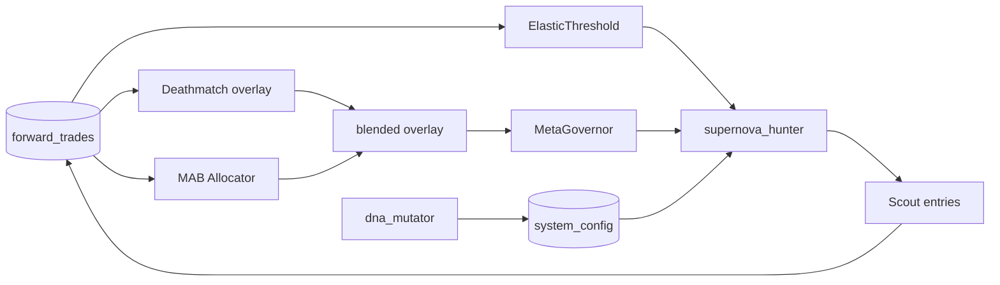

# Fluid Evolution Architecture — 유기적 자가진화 레이어

> Sample Starvation(표본 기아) 을 끊기 위해 **고무줄 허들 · MAB 탐험 · DNA 돌연변이** 를 기존 MetaGovernor/데스매치 위에 얹은 설계.

---

## 1. 설계 철학 (수식 우물 밖)

시장은 고정 공식이 아니라 **우리 forward_trades 에 쌓인 사건의 연쇄**다.

```
관측(장부) → 압력(기아·변동성) → 형태변화(커트라인·배분·DNA) → 행동(스캔·소액정찰) → 새 관측
```

| 압력 | 시스템 반응 |
|------|-------------|
| 진입·청산 밀도 ↓ (기아) | 커트라인 **당김** + **정찰병** near-miss 허용 |
| 변동성 ↑ | 커트라인 **소폭 조임** (노이즈 필터) |
| 데스매치 승자 과점 | MAB **30% 탐험** 으로 인큐베이터·도태·미검증 arm 에 연료 |
| DNA 템플릿 정체 | 주말 **3~5% 돌연변이** → INCUBATOR → 장부 검증 |

**우상향 보장은 하지 않는다.** 다만 “안 매매해서 학습이 멈춤” 루프는 끊는다.

---

## 2. 모듈 지도

| 파일 | 역할 |
|------|------|
| `elastic_threshold.py` | `ElasticThreshold` — 고무줄 cos/ml 커트라인, `evaluate_scout_candidate` |
| `mab_capital_allocator.py` | Thompson/UCB, 70/30 exploit/explore overlay |
| `dna_mutator.py` | `run_weekend_dna_mutation_cycle` — MUTANT_* 인큐베이터 |
| `evolution/fluid_evolution_bridge.py` | MetaGovernor·팩토리·자율조율 연결 |

---

## 3. 데이터 흐름



---

## 4. 통합 지점 (기존 파괴 없음)

| 훅 | 위치 | 동작 |
|----|------|------|
| 장중 스캔 | `supernova_hunter.py` | elastic 커트라인 적용 → 실패 시 scout |
| 진입 | `forward/shared.py` `try_add_virtual_position` | `_fluid_scout` 시 소액 캡 |
| 주말 뇌수술 | `system_auto_pilot.run_autonomous_analysis` | DNA mutation + MAB sync |
| 일일 prelude | `factory_pipelines._step_meta_governor_sync` | MAB·elastic 스냅샷 |
| 데스매치 | `blend_deathmatch_and_mab` | DM 70% + MAB 30% 선형 블렌드 |

MetaGovernor Treasury·lifecycle·changelog 는 **그대로**.  
`META_GROUP_KELLY_MULT = health × blended_overlay` 규칙 유지.

---

## 5. 설정 키 (선택)

| 키 | 기본 | 의미 |
|----|------|------|
| `ELASTIC_SCOUT_ENABLED` | on | 정찰병 |
| `ELASTIC_SCOUT_INVEST_PCT` | 0.003 | 계좌 대비 정찰 상한 |
| `ELASTIC_TARGET_ENTRIES_PER_WEEK` | 8 | 기아 목표 진입 수 |
| `MAB_EXPLOIT_RATIO` | 0.70 | 활용 비중 |
| `MAB_MODE` | thompson | thompson \| ucb |
| `DNA_MUTATION_RATE` | 0.04 | 돌연변이 강도 |

---

## 6. 운영 신호

- 텔레그램: `🔭 정찰병 진입`, `[🔭SCOUT]` sig_type
- `system_config.FLUID_ELASTIC_STATE` — 시장별 starv/cutoff/scout_gap
- `meta.META_MAB_KELLY_OVERLAY` — 탐험 배분
- `INCUBATOR_TEMPLATES` 내 `MUTANT_*` — 주말 돌연변이

## 7. Hook Guide (Monkey Patch / Integration)

### 7.1 `factory_pipelines.py`

| 위치 | 함수 | 훅 |
|------|------|-----|
| `_step_meta_governor_sync` 말미 (~L60) | `post_meta_governor_fluid_sync()` | MAB·elastic 스냅샷 → `META_GROUP_KELLY_MULT` |

### 7.2 `supernova_hunter.py`

| 위치 | 동작 |
|------|------|
| DNA 커트라인 직전 (~L1595) | `ElasticThreshold.apply_pair` → `eff_cos_cutoff` / `eff_ml_cutoff` |
| DNA 합격 실패 직후 (~L1724) | `evaluate_scout_candidate` → `[🔭SCOUT]` 반환 |

### 7.3 `forward/shared.py`

| 위치 | 동작 |
|------|------|
| `try_add_virtual_position` Kelly 계산 후 (~L2113) | `facts._fluid_scout` → `enforce_scout_hard_cap` (0.3% 절대 상한) |

### 7.4 `system_auto_pilot.py`

| 위치 | 동작 |
|------|------|
| `run_autonomous_analysis` 주말 말미 (~L1732) | `run_fluid_evolution_weekend_hooks` — DNA mutation + MAB sync |

### 7.5 `meta_governor.py` / `deathmatch_report.py`

| 위치 | 동작 |
|------|------|
| `_fetch_kr_ledger_rows` | `is_fluid_scout_sig` — 정찰병 청산 제외 |
| `_step_treasury` | `filter_treasury_rows_exclude_scouts` — wr/PF 오염 방지 |
| `classify_strategy_arm` | SCOUT sig → `None` (데스매치 집계 제외) |

### 7.6 검증

```bash
python -m unittest tests.test_fluid_evolution tests.test_us_fluid_upstream -v
```

---

*2026-06-11 · KR/US 공통 레이어*
