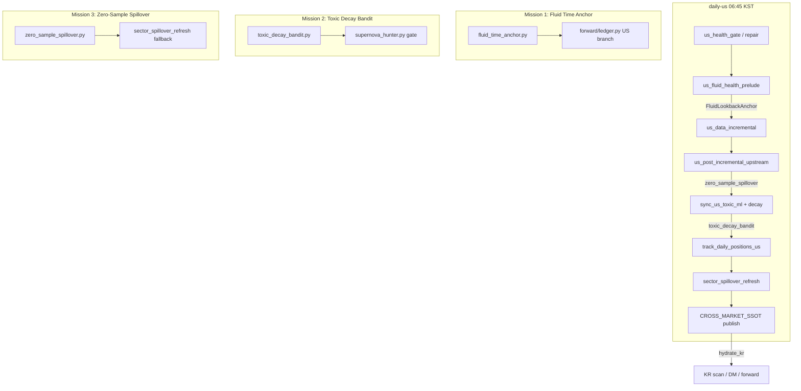

# Fluid US Upstream Architecture

> US 파이프라인이 KR 상류(Upstream)로서 **표본 기아·휴장·독성 과적합**에 멈추지 않도록 하는 3축 유동 진화 레이어.

## 문제 요약

| 증상 | 원인 | 기존 동작 |
|------|------|-----------|
| `track_daily_positions_us` 스킵 | SPY 캔들 ≠ ET 오늘 | 전체 트래킹 중단 → `bars_held` 정지 |
| DM-A 정체 | `us_closed_zero` | `CROSS_MARKET_SSOT` 미발행 → KR 대기 |
| 알파 상실 | `US_TOXIC_ML_ANTIPATTERNS` 영구 차단 | 레짐 전환 후에도 진입 불가 |

## 아키텍처 개요



## Mission 1 — Fluid Lookback Anchor

**모듈:** `fluid_time_anchor.py`

- `FluidLookbackAnchor.resolve("US")` → `live` | `carry_over` | `halt`
- `carry_over`: 마지막 유효 SPY/DB 세션일로 결산 유지, `bars_held`는 세션당 1회만 증가 (`FLUID_TRACK_SESSION_US`)
- `resolve_us_with_db_fallback`: 증분 OHLCV 직후 `US_SPY` DB 날짜 우선
- **통합:** `forward/ledger.py` (US만), `factory_us_health.py`, `evolution/us_fluid_upstream_bridge.py`

**설정 키**

| 키 | 기본 | 의미 |
|----|------|------|
| `FLUID_US_MAX_CARRY_LAG_DAYS` | 3 | 캘린더 대비 허용 영업일 지연 |
| `FLUID_US_MAX_STALE_BUSINESS_DAYS` | 5 | SPY 데이터 노후 시 halt |
| `FLUID_US_ANCHOR_STATE` | (런타임) | health·리포트 스냅샷 |

## Mission 2 — Toxic Decay & Forgiveness Bandit

**모듈:** `toxic_decay_bandit.py`

- `decay_strength(bounds)` — 반감기(기본 45일) 기반 차단 강도 1.0→0.0
- `evaluate_toxic_ml_gate` — `block` | `forgiveness_scout` | `allow`
- `forgiveness_scout`: MAB식 1~2% 정찰 (`TOXIC_FORGIVENESS_SCOUT_PCT`, `_fluid_scout` 태그)
- **통합:** `factory_pipelines._step_sync_us_toxic_ml_ssot` (decay enrich), `supernova_hunter.py`

## Mission 3 — Zero-Sample US Spillover

**모듈:** `zero_sample_spillover.py`

- US 청산 표본 없을 때 증분 OHLCV → `infer_dark_horse_sector_from_ohlcv` (DBSCAN 또는 sector aggregate)
- `US_SPILLOVER_SECTOR` / `US_ZERO_SAMPLE_SPILLOVER` 갱신 → `publish_zero_sample_cross_market`
- **통합:** `factory_pipelines` `us_post_incremental_upstream`, `sector_spillover_refresh.refresh_us_spillover_from_db` 폴백

## Integration Plan (daily-us)

`factory_pipelines._with_daily_audit_us_prelude` 순서:

1. `meta_governor_sync` → `artifact_guard` → `sentiment_mining`
2. `us_health_gate_daily` → `us_health_repair_daily`
3. **`us_fluid_health_prelude`** — 앵커·독성 decay·강화 health 로그
4. `us_data_incremental`
5. **`us_post_incremental_upstream`** — zero-sample + cross_market
6. `sync_us_toxic_ml_ssot` (JSON + decay enrich)
7. `report_pipeline_hydrate_us` → track → spillover → publish

**충돌 방지**

- KR `track_daily_positions` — 기존 엄격 휴장 가드 유지
- `sector_spillover_refresh` — ledger 표본 있으면 기존 경로 우선, `no_hot_sample` 시만 zero-sample
- Global Fluid (`elastic_threshold`, `mab_capital_allocator`) — US bridge는 별도 파일, `post_meta_governor_fluid_sync`와 독립

## 운영 점검

```bash
python -c "from factory_us_health import assess_us_pipeline_health, format_us_health_log_line as f; print(f(assess_us_pipeline_health()))"
python -m unittest tests.test_us_fluid_upstream -v
bash factory.sh --daily-us
```

**기대 로그:** `🌊 [US Fluid] anchor=carry_over ...`, `us_post_incremental_upstream`, `zero_sample_dark_horse`, `[🔭SCOUT]` / toxic forgiveness 태그.
