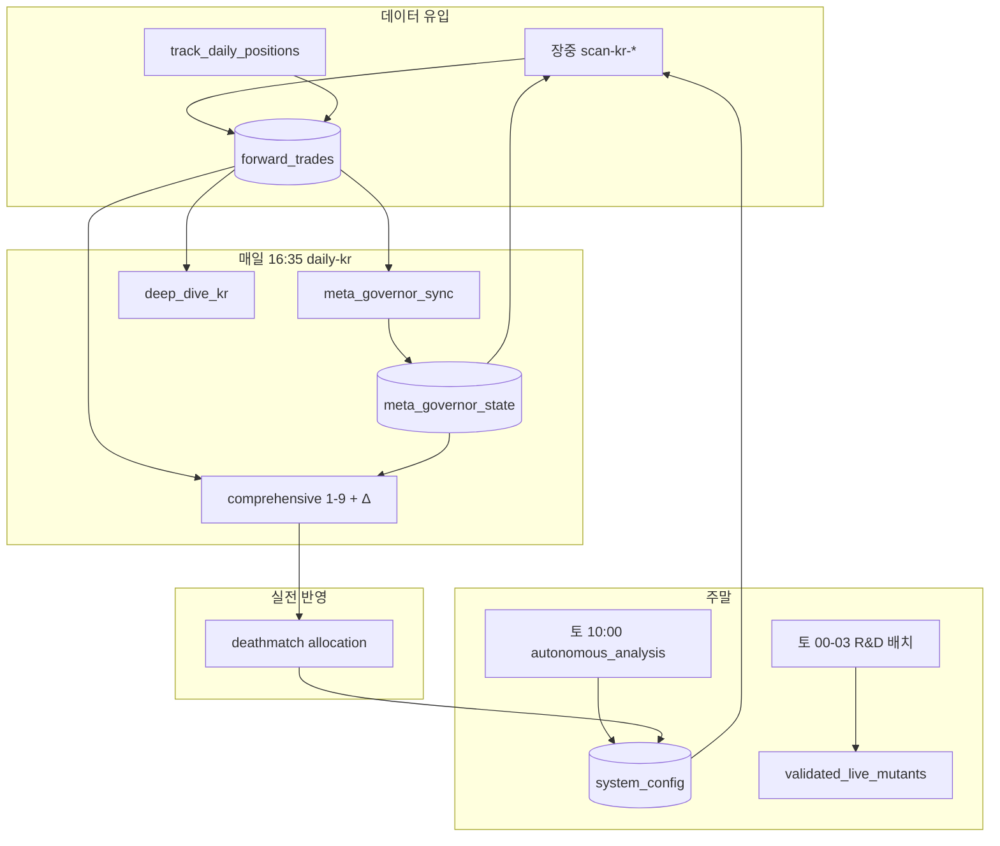

# 한국(KR) 진화·튜닝 구조 감사 — 결과지 해설 & 자가진화 여부

> **작성 기준:** 저장소 코드·파이프라인 SSOT (`factory_pipelines.py`, `system_auto_pilot.py`, `meta_governor.py`, `forward/deep_dive.py` 등)  
> **범위:** 코드 변경 없음 · 문서만 · **KR 우선**, US/글로벌은 교차 참조  
> **독자:** 텔레그램 결과지를 받아도 “무슨 말인지 모르겠다”는 운영자

---

## 1. 한 줄 요약

| 질문 | 답 |
|------|-----|
| 진화·튜닝이 뭔가? | **실전 장부(`forward_trades`) + 설정(`system_config`) + 메타(`meta_governor_state`)** 를 매일/매주 돌려 **커트라인·켈리·전략 승격/도태·DNA 템플릿** 을 바꾸는 자동 루프 |
| 결과지가 왜 어렵나? | **같은 날 5~15통** (딥다이브 1통 + 일일 [1~9]×2시장 + [Δ] + PIL + 주말 뇌수술) 이고, **버전명(V28/V60)·엔진 번호·메타 키** 가 그대로 노출됨 |
| 100% 구조가 스스로 우상향하나? | **의도는 그렇게 설계됨.** 다만 **우상향은 보장되지 않음** — 표본 부족·장외 스캔·워터마크 정체 시 루프가 “돌아가도 숫자는 안 움직임”. 일부 주간 마이닝 루프는 **현재 factory 배포 경로에 미연결** (§8) |

---

## 2. KR 100% 구조에서 진화가 끼어드는 위치

### 2.1 실행 주체 3갈래

```
┌─────────────────────────────────────────────────────────────────┐
│  [A] cron → factory.sh --mode                                     │
│      장중: scan-kr-* (스캐너 1종/30분) → forward_trades 진입      │
│      16:35: daily-kr → track → deep_dive → daily [0~9] → overseer │
├─────────────────────────────────────────────────────────────────┤
│  [B] systemd dante-factory → system_auto_pilot.py --daemon        │
│      24h 위성 작업 + 토 10:00 자율 튜닝 + 토 00~03 R&D 배치       │
├─────────────────────────────────────────────────────────────────┤
│  [C] systemd dante-async → 텔레그램 큐 발송 (리포트 전달만)       │
└─────────────────────────────────────────────────────────────────┘
```

**진화에 직접 영향:** A의 `daily-kr`, B의 주말·위성 배치.  
**진화에 간접 영향:** A의 장중 스캔(없으면 장부가 안 쌓여 모든 튜닝이 빈 껍데기).

### 2.2 `daily-kr` 파이프라인 (진화 관련만 추출)

순서는 `factory_pipelines.py` → `_pipeline_daily_audit_kr()` 고정:

| 순서 | Step | 진화·튜닝 역할 |
|------|------|----------------|
| 1 | `meta_governor_sync` | MetaGovernor 1사이클 — 레짐·켈리·레지스트리·`META_CHANGELOG` |
| 2 | `factory_artifact_guard` | DB/아티팩트 자가치유 |
| 3 | `sentiment_mining` | 당일 뉴스 센티 (위성 데이터) |
| 4 | `report_pipeline_hydrate_kr` | OHLCV·매크로 갱신 |
| 5 | US track + spillover + KR hydrate | US→KR 테마 가중 (크로스마켓 진화 입력) |
| 6 | `track_daily_positions_kr` | **청산·MFE/MAE 갱신** → 이후 모든 통계의 원천 |
| 7 | `deep_dive_kr` | **딥다이브 텔레그램** — DNA·인큐베이터·스필오버·순환매 |
| 8 | `doomsday_bridge_sync` | DEFCON·인버스 모드 브릿지 |
| 9 | `pil_practitioner_reports_kr` | 실무자(PIL) 그룹별 생존·페널티 |
| 10 | `comprehensive_daily_report` | **일일 [1~9] + 말미 [Δ] 진화·튜닝** |
| 11 | `ai_overseer` | Rules+LLM 감사 (critical 실패 시 스킵) |

---

## 3. 텔레그램 결과지 종류 — “이게 뭔 말이냐” 사전

### 3.1 🔬 [KR장 포워드 딥 다이브] (`run_deep_dive_analysis("KR")`)

**언제:** `daily-kr` 안, track 직후.  
**최소 조건:** 롤링 윈도우(기본 90일) 내 **청산 CLOSED ≥ 10건**. 미만이면 “표본 부족 생략” 한 통만 옴.

| 블록 | 읽는 법 |
|------|---------|
| `리포트일 KST` / `세션앵커` / `DB청산워터마크` | **리포트가 어느 날짜까지의 청산을 믿는지** — 워터마크가 멈추면 내용도 멈춤 |
| `Staleness GREEN\|YELLOW\|RED` | **데이터 신선도** — RED면 Micro-DNA 등 일부 블록 축소 |
| `LIVE` / `HIST` | 듀얼트랙: 실전 행 vs 역사 행 수 |
| Universal DNA | 최근 청산 전체의 **cpv/tb/v_energy/dyn_rs** 분포 요약 |
| Micro-DNA (점수 버킷) | 점수대별 승패 패턴 — “어느 점수대가 먹히나” |
| `자율 진화` 인큐베이터 | 저점수대 대박주 DNA → `INCUBATOR_TEMPLATES` 에 **후보 등록** (아직 LIVE 아님) |
| Flow Tag / Toxic | 반복 손실 태그 → **안티패턴·필터** 쪽 누적 |
| V28 스필오버 (KR만) | **미국 주도 섹터 → 한국 스캔 가중** 해석 |
| V29 순환매 | 섹터 **체류 일수·자금 이동 경로** (Markov 스타일) |
| 자금관리 평행우주 | **고정 2% vs 켈리** 누적 손익 비교 (표시만, 당일 설정 강제 변경은 아님) |

**오해하기 쉬운 점:** 딥다이브는 “오늘 매매 조언”이 아니라 **최근 N일 청산의 부검 리포트**다.

---

### 3.2 📢 [일일 통합 성과 리포트] [1/9] ~ [9/9] (`send_comprehensive_daily_report`)

KR/US 각각 **9통** + 헤더/위성. KR은 [1/9] 앞에 **위성 브리핑**(스마트머니·센티·오답노트)이 붙음.

| # | 제목 | 한 줄 의미 | 진화와의 관계 |
|---|------|-----------|----------------|
| **0** | (헤더·위성) | Staleness·lag·스마트머니·센티 | 데이터 없으면 “데이터 없음” — **진화 입력 품질** 표시 |
| **1** | 거시 국면 & 국고 | `META_REGIME_KEY`, `CENTRAL_TREASURY_KR`, 최근 PnL | MetaGovernor·자율조율이 쓰는 **국면·국고** 스냅샷 |
| **2** | 로직별 복리 생존 리더보드 | sig_type 그룹별 **가상 잔고·승률·PF** | **전체 기간** CLOSED 기준 — 윈도우 밖 청산도 포함 → “5월 고정”처럼 보일 수 있음 |
| **3** | 통합 계좌 대결 | 고정 vs 켈리 (Capital Deathmatch) | 자금 배분 철학 비교 (내러티브) |
| **4** | 섹터 포트폴리오 다중화 | 🔥주도주 vs 🛡️차기섹터 **OPEN 비중** | 크로스마켓·스필오버가 반영된 **현재 편대** |
| **5** | 티어·데스콤보 검증 | 80점대·데스콤보 승률 | 필터가 “죽은 조합”을 막는지 검증 |
| **6** | 4차원 DNA 부검 | 대박/참사 종목 DNA | 스캐너 컷라인·안티패턴 **학습 재료** |
| **7** | 섹터 순환매·스필오버 | 회전·US→KR 테마 | V28/V29의 **일일판** |
| **8** | 메타 최적화·알파 반감기 | `META_STRATEGY_REGISTRY` LIVE/COOLED/CANDIDATE | **승격·강등·도태** 상태판 — MetaGovernor lifecycle |
| **9** | 시스템 데스매치 | 로직군 Battle Royal + (가능 시) **배분 반영** | 승자 로직에 **켈리 오버레이** 적용 (`DEATHMATCH_APPLY_ALLOCATION`) |

**말미 [Δ] 진화·튜닝** (`evolution_digest.py`):

```
━━━━━━━━━━━━━━━━━━━━
📐 [Δ] 진화·튜닝 (글로벌 · MetaGovernor)
• META_GROUP_KELLY_MULT (treasury_groups) [시각]
  - 그룹명: 1.00 ➔ 0.75
• META_REGIME_KEY BULL ➔ CHOP (regime_resolve)
스냅샷 Δ: DYNAMIC_SUPERNOVA_CUTOFF, …
```

| 항목 | 의미 |
|------|------|
| `META_GROUP_KELLY_MULT` | **로직 그룹별 켈리 배율** — 1.0=정상, 낮을수록 비중 축소(방어) |
| `META_GLOBAL_KELLY_MULT` | **전역 켈리 감쇠** — treasury가 나쁠 때 일괄 축소 |
| `META_REGIME_KEY` | `BULL` / `CHOP` / `BEAR` / `HIGH_VOL` / `UNKNOWN` |
| `META_STRATEGY_REGISTRY` (숫자만) | 레지스트리 **행 개수 변화** (상세는 [8/9]) |
| `스냅샷 Δ` | 어제 vs 오늘 `system_config` 스냅샷 diff — 커트라인·DEFCON 등 |

**1.0 배율·무변경 그룹은 의도적으로 생략** (`tuning_digest_formatter.py`).

---

### 3.3 📊 [System B 자율 조율 리포트] (토요일 10:00 KST)

**트리거:** `dante-factory` daemon → `system_auto_pilot.py --run-autonomous-analysis-only`  
**코드:** `system_auto_pilot.run_autonomous_analysis()` (~2000줄, 엔진 다수)

| 섹션 | 하는 일 (KR 관점) |
|------|-------------------|
| Regime / VIX / Breadth | SPY·VIX·RSP/SPY로 **S1/S4 비중·룩백 일수** 조정 → `WEIGHT_S1`, `WEIGHT_S4` 저장 |
| 테일리스크 펀드 | `CENTRAL_TREASURY_KR`, `TAIL_RISK_FUND_KR` 적립/발동 시뮬 |
| 엔진 1.6 스필오버 | US 고MFE 섹터 → `US_SPILLOVER_SECTOR` |
| 타점별 커트라인 | `DYNAMIC_*_CUTOFF` — 승률 낮으면 **허들↑**, 표본 기아면 **허들↓** (Death-Spiral Relief) |
| V60 도태·국고 환수 | SUPERNOVA 템플릿 승률/PF 나쁘면 **ARCHIVED** + ANTI_PATTERNS |
| (기타 엔진) | 인큐베이터 심판, 뮤턴트, 인버스 스위치 등 — 설정 키 다수 |

**표본 < 10건이면:** 국면 키만 살짝 갱신하고 **“이번 주 조율 스킵”** 통으로 끝.

---

### 3.4 PIL 실무자 리포트 (`pil_practitioner_reports_kr`)

**그룹(sig_type)별** Post-Mortem·Vitality·LLM 브리핑.  
Zombie 그룹 → MetaGovernor에 **Kelly=0 / COOLED** 후보 반영 (`practitioner_penalty_bridge`).

---

### 3.5 주간 Flow (`weekly_master`, 토 10:05)

`weekly_flow_report.py` — 주간 PnL·lifecycle·데스매치 요약.  
일일 [2/9]와 달리 **주간 윈도우** 기준.

---

### 3.6 기타 위성 리포트 (daemon, KR 관련)

| 시각 (KST) | 스크립트 | 진화 입력 |
|------------|----------|-----------|
| 평일 09:05 | forensics_pioneer KR | 상한가·先행 패턴 |
| 11:50 / 15:40 / 16:20 | limit_up_forensics KR | 상한가 DNA |
| 16:10 | smart_money_tracker | SMART_MONEY_RADAR |
| 19:00 / 일 02:00 | toxic_graveyard_analyzer | KR 독성·안티패턴 |
| 토 00:00~03:10 | synthetic / shadow / incubator / mutant OOS | R&D 파이프라인 |
| 토 10:10 | time_machine_backtester | 스트레스 시나리오 (데모 종목) |

---

## 4. MetaGovernor — 진화의 “메타 뇌”

**파일:** `meta_governor.py`  
**호출:** 매 `daily-kr` prelude, comprehensive 리포트 내 `rebuild_meta_state`  
**저장:** `meta_governor_state.json` (+ `META_CHANGELOG`)

### 4.1 한 사이클 6단계

```
수집·검증 → Calibrator → Treasury → Regime → Lifecycle → Changelog
```

| 단계 | 산출물 | KR에서 쓰는 곳 |
|------|--------|----------------|
| Calibrator | `META_SCORE_DIST_SNAPSHOT`, `META_TIER_CUTS`, `META_BREADTH_THRESHOLDS` | 리포트 티어·점수 해석 |
| Treasury | `META_STRATEGY_HEALTH`, **`META_GROUP_KELLY_MULT`**, `META_GLOBAL_KELLY_MULT` | 스캔 시 비중·[Δ]·[8/9] |
| Regime | `META_REGIME_KEY`, `META_REGIME_ACTION` | 국면 방어/공격 템플릿 |
| Lifecycle | `META_STRATEGY_REGISTRY`, LIVE/RETIRED IDs | [8/9], 승격 엔진 |
| Changelog | `META_CHANGELOG` | **[Δ] 진화·튜닝** |

### 4.2 Treasury가 그룹 켈리를 깎는 직관

- 최근 90일(기본) 청산으로 **그룹별** 승률·연속손실·MDD 계산  
- `mult < 1` → 그 그룹 신호 **비중 축소** (0이면 사실상 차단)  
- 전체의 45% 이상이 mult=0이면 `META_GLOBAL_KELLY_MULT` 추가 감쇠  
- 데스매치 [9/9] 승자는 `META_DEATHMATCH_KELLY_OVERLAY` 로 **일시 부스트** (cap 있음)

### 4.3 Lifecycle (strategy_promotion_engine)

| 상태 | 의미 |
|------|------|
| `OBSERVING` | 표본 쌓는 중 |
| `CANDIDATE` | 후보 (게이트 통과) |
| `LIVE` | 실전 편대 |
| `COOLED` | 강등·휴면 (capital_mult↓) |
| `RETIRED` | 도태 |

**Hard Gate:** LIVE 유지하려면 최소 거래 수·승률·PF·MDD·Whipsaw(연속 열화 일수) 통과 필요.

---

## 5. 데스매치 [9/9] 읽는 법

**파일:** `evolution/deathmatch_report.py`, `forward/deathmatch_report_section.py`

### 5.1 로직군(arm) 자동 분류

| arm 라벨 | 대략적 출처 |
|----------|-------------|
| A (오리지널) | STANDARD |
| B (초신성) | SUPERNOVA_* |
| C (야수/BEAST) | SUPERNOVA_BEAST |
| UD (언더독) | UNDERDOG |
| BH (블랙홀) | BLACKHOLE |
| 기타·… | 그 외 sig_type |

### 5.2 Fallback 티어 (표본 부족 시)

| 티어 | 메시지 느낌 | 의미 |
|------|-------------|------|
| **DM-A** | “청산 0건 · Battle Royal 보류” | 윈도우에 **exit_date 있는 CLOSED 없음** — track/스캔 문제 |
| **DM-B** | “Registry arm 0” | 청산은 있는데 **sig_type↔레지스트리 매핑 실패** |
| **DM-C** | “arm당 최소 N건 미달” | 청산 수는 있으나 **통계적으로 순위 못 냄** |

정상 시: 순위표 + (설정 시) **승자 그룹 켈리 오버레이 적용**.

### 5.3 ACE 진화 한 줄

`format_ace_evolution_oneliner` — **에이스 플레이북**과 실전 청산 비교 한 줄 (관측 전용일 수 있음, `observe_only`).

---

## 6. 진화 피드백 루프 (설계도)



**핵심:** 모든 튜닝은 결국 `system_config` / `meta_governor_state` / 스캐너 컷오프로 돌아가 **다음 스캔·다음 비중**에 반영된다.

---

## 7. “우상향만 할 수밖에 없나?” — 정직한 평가

### 7.1 설계상 **자가 개선을 노린** 장치 (KR)

| 장치 | 메커니즘 | 기대 |
|------|---------|------|
| 포워드 장부 | 실전 가상매매만 학습 | 백테스트 과최적화 완화 |
| MetaGovernor Treasury | 연속손실·MDD 나쁜 그룹 **비중↓** | 나쁜 로직 자동 축소 |
| Deathmatch [9/9] | 상대 우수 arm에 배분 | 자본을 강자 쪽으로 |
| 자율 조율 커트라인 | 승률↓ → 허들↑, 표본 기아 → 허들↓ | 과도한 조이기 방지 |
| 도태·ARCHIVED | 템플릿 승률/PF 나쁘면 냉동 | 죽은 유전자 제거 |
| ANTI_PATTERNS / Toxic | 참사 DNA 누적 | 동일 실수 차단 |
| Staleness Gate | RED 시 Micro-DNA 등 축소 | 썩은 데이터로 튜닝 금지 |
| PIL Zombie | 무기력 그룹 COOLED | 장기 잔존 방지 |
| 인큐베이터·R&D 토 배치 | 합성→OOS→PENDING | 신규 전략 공급 |

### 7.2 **우상향을 보장하지 않는** 이유

1. **학습 목표 ≠ 수익 보장**  
   - PF·승률·켈리는 **과거 청산** 기준. 레짐이 바뀌면 과거 최적이 미래 손실.

2. **표본 의존**  
   - 딥다이브 ≥10건, 자율조율 ≥10건, 데스매치 arm당 ≥5건(기본).  
   - **장외 스캔·락·휴장 skip** → 표본 0 → “진화 루프 공회전”.

3. **다중 루프 충돌 가능**  
   - 토요일 `run_autonomous_analysis` 커트라인 ↑  
   - MetaGovernor treasury mult ↓  
   - Deathmatch overlay ↑  
   → 같은 주에 **서로 다른 방향** 조정 가능.

4. **관측 전용·지연 반영**  
   - ACE playbook `observe_only`  
   - 인큐베이터 `INCUBATING`  
   - [Δ]는 **변경 로그**일 뿐 성과 확약 아님.

5. **위성 데이터 단절**  
   - 센티·스마트머니·스필로버 없으면 [0]·MetaGovernor satellite 블록 빈약 — **진화 입력 품질 저하**.

6. **국고·테일 펀드**  
   - 시뮬레이션 성격. 실계좌와 1:1 아님.

### 7.3 현재 배포에서의 **구조적 갭** (코드 기준, KR)

| 기능 | 설계 위치 | factory 100% 경로에서 |
|------|-----------|------------------------|
| 장중 스캔 | cron `scan-kr-*` | ✅ (전제: 장중·락 없음) |
| daily-kr 진화 | cron 16:35 | ✅ |
| MetaGovernor | daily prelude | ✅ |
| 토 10:00 자율 조율 | daemon | ✅ (`WARMUP_DAYS` 이후) |
| 토 R&D 배치 | daemon | ✅ |
| **`hunt_supernovas` + `evolve_alpha_factors` + `data_miner.run_cluster_mining`** | `supernova_hunter.run_miner_scheduler` (**월 17:00**) | ⚠️ **`supernova_hunter.py` 를 `__main__` 으로 띄울 때만** 내장 스레드에서 동작. `dante-factory`는 `system_auto_pilot --daemon`만 실행 → **이 주간 마이닝 루프는 기본 배포에 미연결** |
| `run_live_sniper_scheduler` (구 4회 스나이퍼) | supernova_hunter | ⚠️ cron 스태거드 스캔으로 **대체된 설계** — 중복 의도적 제거 |

**실무 함의:**  
- 일일·메타·데스매치·토요일 뇌수술은 **돌아가도록 연결됨**.  
- **주간 DNA 재채굴·알파 팩터 진화(`EVOLVED_ALPHA_FACTORS`)** 는 코드에 있으나 **현재 systemd+cron만으로는 자동 실행 경로가 없음** (수동 `python supernova_hunter.py` 또는 별도 스케줄 필요).

---

## 8. KR 진화가 “살아 있다”고 볼 체크리스트

운영자가 코드 없이 서버에서 확인:

```bash
# 1) 장부가 움직이는가
sqlite3 market_data.sqlite \
  "SELECT MAX(substr(entry_date,1,10)), COUNT(*) FROM forward_trades WHERE market='KR' AND status='OPEN';"

# 2) daily-kr가 돌았는가
ls -lt logs/factory_daily_audit_kr_* | head -1
grep -E 'deep_dive|comprehensive|meta_governor' logs/factory_daily_audit_kr_*.log | tail -5

# 3) MetaGovernor changelog가 쌓이는가
python -c "
import json; m=json.load(open('meta_governor_state.json',encoding='utf-8'))
print('regime', m.get('META_REGIME_KEY'))
print('changelog_tail', (m.get('META_CHANGELOG') or [])[-2:])
"

# 4) 토요일 자율조율 로그 (daemon journal)
sudo journalctl -u dante-factory --since 'last saturday' | grep -i autonomous
```

**건강 신호:** `max_entry` 전진, `META_CHANGELOG` 갱신, [Δ]에 그룹 켈리 변동, [9/9] DM-A 아님.

**병목 신호:** `장외`/`SKIPPED_SESSION` 다수, Staleness RED, [2/9] “윈도우 청산 0”, `DNA_SUPERNOVA_KR_MULTI` 장기 미갱신.

---

## 9. 결과지 → 행동 매핑 (운영자 치트시트)

| 텔레그램에서 보면 | 시스템이 한 일 | 당신이 할 일 |
|------------------|----------------|-------------|
| [Δ] 그룹 켈리 1.0→0.75 | 해당 로직군 **비중 25% 삭감** | 그 그룹 최근 청산·연속손실 확인 |
| [8/9] CANDIDATE↑ LIVE↑ | 승격 엔진 작동 | 신규 LIVE 그룹 모니터 |
| [9/9] DM-A 청산 0 | 튜닝 **안 함** (표본 없음) | track·스캔·lag 먼저 해결 |
| 딥다이브 “표본 부족” | deep_dive **스킵** | forward_trades 적재 |
| 자율조율 “조율 스킵” | 주말 뇌수술 **최소만** | 평일 청산 늘리기 |
| Staleness RED | 리포트 **fail-safe** | `master_sync_kr_us.sh` 또는 track |
| 인큐베이터 신규 등재 | DNA **후보**만 추가 | LIVE 아님 — 기대치 조절 |

---

## 10. 용어 빠른 참조

| 용어 | 뜻 |
|------|-----|
| forward_trades | 가상 포워드 장부 (진입·청산·수익률) |
| session_anchor | 리포트가 “오늘 장”을 어느 영업일로 보는지 (KST) |
| watermark_exit | DB에 기록된 **가장 최근 청산일** |
| lag | anchor 대비 watermark **영업일 지연** |
| sig_type | 신호 이름 (로직·태그 포함) |
| group_key | sig_type에서 뽑은 **순수 로직명** |
| PF | Profit Factor = 총이익÷총손실 (표시 상한 99.99) |
| 커트라인 / CUTOFF | 스캐너 ML·코사인 **진입 허들** (0~1) |
| 국고 CENTRAL_TREASURY | 시뮬 국가 재정 (도태 환수·테일 펀드) |
| DEFCON / DOOMSDAY | 거시 공포 **방어 레벨** |
| Battle Royal | 데스매치 arm 순위전 |
| PIL | Practitioner Intelligence Layer — 그룹별 실무자 리포트 |

---

## 11. 결론

1. **진화·튜닝 결과지**는 “한 통의 요약”이 아니라 **장부→메타→설정→다음 스캔** 으로 이어지는 **다층 로그**다. [Δ]는 그중 **설정 변경 diff**, [8/9][9/9]는 **전략 생태계 상태**, 딥다이브는 **최근 청산 부검**, 토요일 리포트는 **커트라인·템플릿 도태**다.

2. 구조는 **스스로 학습·도태·재배분하도록** 꽤 촘촘히 짜여 있으나, **수익 우상향은 보장하지 않는다.** 과거 최적화·표본 부족·데이터 정체 시 **진화만 하고 성과는 정체**할 수 있다.

3. **KR 100% factory 배포** 기준, **일일·메타·주말 자율조율·R&D 배치**는 연결되어 있다. **주간 `hunt_supernovas` / `evolve_alpha_factors` / 클러스터 마이닝** 은 `supernova_hunter` 단독 실행 경로에 묶여 있어 **기본 daemon만으로는 자동 돌지 않을 수 있음** — 이 부분이 “진화가 안 되는 것 같다”는 체감의 원인 후보다.

4. **우선순위:** 장중 스캔 정상 → track → watermark/lag GREEN → 그 다음 [9/9]·[Δ]·주말 뇌수술 해석. 이 순서가 맞아야 “진화 튜닝” 문자가 **실제 성과 루프**와 연결된다.

---

*문서 버전: 2026-06-11 · 코드 스냅샷 기준 · 변경 요청 시 이 파일만 갱신*
