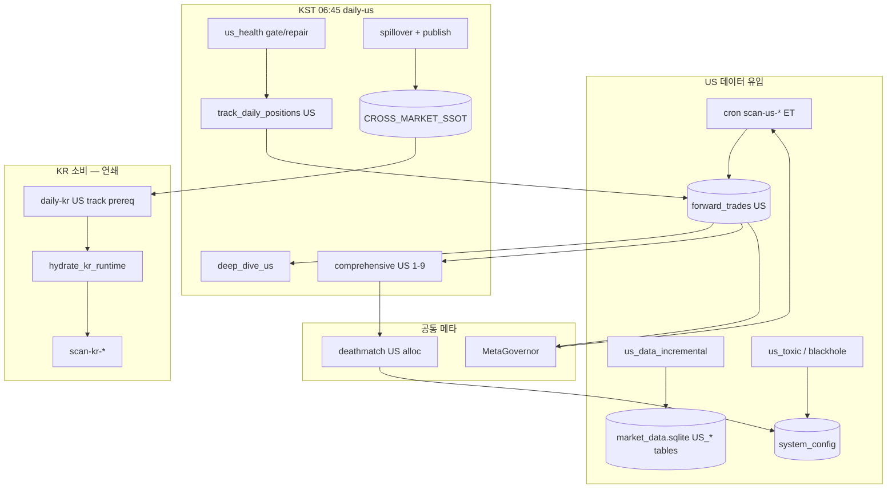

# 미국(US) 진화·튜닝 구조 감사 — 결과지 해설 & 자가진화 여부

> **작성 기준:** 저장소 코드·파이프라인 SSOT (`factory_pipelines.py`, `factory_scan_schedule.py`, `factory_us_health.py`, `forward/deep_dive.py`, `cross_market_ssot.py` 등)  
> **범위:** 코드 변경 없음 · 문서만 · **US 중심**, KR과의 교차는 명시  
> **짝 문서:** [`KR_진화튜닝_구조감사.md`](./KR_진화튜닝_구조감사.md)

---

## 1. 한 줄 요약

| 질문 | 답 |
|------|-----|
| US 진화·튜닝이 뭔가? | **미장 가상 장부 + US OHLCV + 독성 ML + 스필오버** 를 쌓고, **MetaGovernor·데스매치·주말 자율조율** 로 커트라인·켈리·템플릿을 바꾸는 루프 |
| KR과 뭐가 다르나? | **시간축(ET vs KST)**, **daily-us 06:45 KST**, **US health/repair·증분 OHLCV·toxic ML** prelude, **US→KR 크로스마켓 발행**, 스캐너 **5종(마스터 없음)** |
| 결과지가 왜 어렵나? | US도 **딥다이브 + 일일 [1~9] + [Δ]** 가 오고, **DM-A/휴장일 skip/possibly delisted** 같은 운영 메시지가 섞임 |
| 우상향 보장? | **아니요.** US는 **휴장일 track skip·OHLCV 공백·표본 적음** 이 KR보다 자주 걸려 **데스매치·DNA가 유휴** 상태가 길어질 수 있음 |

---

## 2. US 100% 구조에서 진화가 끼어드는 위치

### 2.1 실행 주체 (KR과 공통 + US 전용)

```
┌──────────────────────────────────────────────────────────────────────┐
│  [A] /etc/cron.d/dual-screener-factory-us  (CRON_TZ=America/New_York) │
│      평일 ET 10:00~14:30  scan-us-* → forward_trades US 진입         │
├──────────────────────────────────────────────────────────────────────┤
│  [B] /etc/cron.d/dual-screener-factory-kr  (CRON_TZ=Asia/Seoul)       │
│      화~토 06:45 KST  factory.sh --daily-us  ← US 일일 감사 SSOT      │
├──────────────────────────────────────────────────────────────────────┤
│  [C] dante-factory daemon — US 위성·글로벌 R&D·토 10:00 자율조율      │
│      (06:00 limit_up US, 07:00 us_toxic, 08:30 blackhole …)          │
├──────────────────────────────────────────────────────────────────────┤
│  [D] daily-kr 16:35 — US track 선행 → spillover → KR hydrate         │
│      (US 장부가 KR 스캔 가중에 간접 영향)                             │
└──────────────────────────────────────────────────────────────────────┘
```

**US 진화의 “심장”:** `daily-us` (06:45 KST) + 평일 `scan-us-*` + daemon US 위성.  
**KR과의 연결:** US 청산·섹터 → `US_SPILLOVER_SECTOR` → **KR 장중 스캔 테마 가중**.

### 2.2 시간축 — 헷갈리기 쉬운 부분

| 이벤트 | 시각 | 의미 |
|--------|------|------|
| 미장 정규장 스캔 | **ET 09:30~16:00** (cron 슬롯은 10:00~14:30) | `market_session_gate` — 장외면 `SKIPPED_SESSION` |
| `daily-us` | **KST 06:45, 화~토** | 전일 **US Last Trading Day** 마감 직후 감사 (월 KST 아침 = 금 US 마감 반영) |
| `daily-kr` 내 US track | **KST 16:35 전** | 당일 KR 리포트용 US 장부·스필오버 최신화 |
| ReportTimekeeper US anchor | **US Last Trading Day (ET)** | 리포트 “오늘”의 US 기준일 — KST 날짜와 **다를 수 있음** |

예: **KST 화요일 06:45** `daily-us` → 앵커는 보통 **ET 월요일** (US Last Trading Day).

---

## 3. `daily-us` 파이프라인 (진화 관련만)

`factory_pipelines.py` → `_pipeline_daily_audit_us()`:

| 순서 | Step | US 진화·튜닝 역할 |
|------|------|-------------------|
| 1 | `meta_governor_sync` | KR/US 공통 메타 — **US 청산도 Treasury·Registry에 포함** |
| 2 | `factory_artifact_guard` | DB·아티팩트 치유 |
| 3 | `sentiment_mining` | 글로벌 뉴스 센티 (US 리포트 위성) |
| 4 | `us_health_gate_daily` | **US 혈관 검사** — SPY/QQQ·universe·장부 |
| 5 | `us_health_repair_daily` | **증분 OHLCV** 등 자가복구 |
| 6 | `us_data_incremental` | `run_us_incremental_db_update()` |
| 7 | `sync_us_toxic_ml_ssot` | `us_toxic_ml_antipatterns.json` → `system_config` |
| 8 | `report_pipeline_hydrate_us` | US 매크로·OHLCV hydrate |
| 9 | `track_daily_positions_us` | **US OPEN 청산·MFE/MAE** (SPY 캔들=오늘 ET 아니면 **전체 skip**) |
| 10 | `sector_spillover_refresh` | US 고MFE 섹터 KV |
| 11 | `us_cross_market_publish` | **CROSS_MARKET_SSOT** 발행 → KR이 읽음 |
| 12 | `cross_market_theme_snapshot` | spillover + publish + hydrate 통합 스냅샷 |
| 13 | `deep_dive_us` | **US 딥다이브 텔레그램** |
| 14 | `doomsday_bridge_sync` | DEFCON·인버스 |
| 15 | `pil_practitioner_reports_us` | US 그룹별 PIL |
| 16 | `comprehensive_daily_report` | **US [1~9] + 말미 글로벌 [Δ]** |
| 17 | `ai_overseer` | 감사 (optional) |

**KR `daily-kr`과의 차이:** US 일일은 **KR spillover prerequisite 없이** US 자체 prelude로 시작. 대신 **health·증분·toxic ML** 이 US 전용으로 앞에 붙음.

---

## 4. 장중 `scan-us-*` 파이프라인

### 4.1 스태거드 슬롯 (`factory_scan_schedule.py`)

| 회차 | ET 시각 | 모드 | 스캐너 |
|------|---------|------|--------|
| 1회차 | 10:00 | `scan_us_supernova` | 슈퍼노바 (**full prelude**) |
| | 10:30 | `scan_us_nulrim` | 눌림목 |
| | 11:00 | `scan_us_dante` | 역매공파 |
| | 11:30 | `scan_us_ema5` | 5일선 |
| | 12:00 | `scan_us_bowl` | 밥그릇 (+ doomsday + **US publish tail**) |
| 2회차 | 13:00~14:30 | `scan_us_*_r2` | 슈퍼노바·눌림·역매·5일 (**light prelude** on supernova r2) |

**KR 대비:** US는 **마스터 스캐너 없음**, 밥그릇 1회차 끝에 **cross_market publish** tail.

### 4.2 `scan_us_supernova` full prelude

```
meta_governor_sync_scan
→ us_health_gate (scan)
→ us_health_repair (증분 OHLCV)
→ sync_us_toxic_ml_ssot
→ supernova_scan_us
→ cross_market_theme_snapshot (일부 슬롯)
→ doomsday_bridge (bowl 1회차 등)
```

**진화 연결:** 스캔 전 **OHLCV·독성 규칙·메타** 가 맞아야 진입 품질이 유지됨.

### 4.3 장중 게이트

- `market_session_gate`: US **09:30~16:00 ET**, 주말 차단  
- cron이 ET 10:00~14:30 이므로 정상 설치 시 **장중만 실행**  
- 주말 audit의 `SKIPPED_SESSION` = **정상** (장외)

---

## 5. US 전용 인프라 — 진화 입력 품질

### 5.1 `factory_us_health` (혈관 검진)

`assess_us_pipeline_health()` 가 보는 것:

| 항목 | 실패/경고 의미 |
|------|----------------|
| `universe_rows < 50` | US 종목 유니버스 붕괴 → 스캔·증분 무의미 |
| `US_SPY` / `US_QQQ` 행 < 100 | 벤치마크 OHLCV stale → **track 휴장일 오판** 위험 |
| `us_ohlcv_tables` sparse | 티커별 테이블 부족 |
| `ledger_closed == 0` | **데스매치·DNA 유휴** (`deathmatch_and_dna_idle`) |
| `DNA_SUPERNOVA_US_MULTI` empty | 템플릿 미채굴 (`hunt_supernovas` 미실행) |
| `cron_scan_us` not found | US cron 미설치 |

`repair_us_pipeline` → `run_us_incremental_db_update()` 재시도.

### 5.2 US 증분 OHLCV

- `data_updater.run_us_incremental_db_update()`  
- 로그에 `possibly delisted` 다수 = **흔한 노이즈** (상폐·심볼 변경)  
- 끝에 `✅ [US 증분] 완료` 가 나와야 함

### 5.3 US 독성 ML · 블랙홀 (daemon)

| KST | 작업 | 설정 반영 |
|-----|------|-----------|
| **06:00** | `limit_up_forensics` US | 상한가·급등 DNA |
| **07:00** | `us_toxic_graveyard_analyzer` | `us_toxic_ml_antipatterns.json` |
| **08:30** | `blackhole_hunter` | 블랙홀 스캐너 입력 |
| daily-us / scan | `sync_us_toxic_ml_ssot` | JSON → `US_TOXIC_ML_ANTIPATTERNS` |

**진화:** 독성 패턴이 **US 스캔 필터·안티패턴** 으로 누적 → 반복 손실 구조 차단.

### 5.4 크로스마켓 — US가 “상류”

```
US forward_trades / sector_spillover
    → publish_us_market_snapshot (CROSS_MARKET_SSOT)
    → KR scan 시 hydrate_kr_runtime_from_ssot
    → KR 스캐너 테마·가중 반영
```

| 모드 | 의미 |
|------|------|
| `US_ONLINE` | 유효 US 주도 섹터 있음 — KR이 US 테마 참조 |
| `KR_STANDALONE` | US 스냅샷 없/무효 — KR 단독 |

**US 진화가 멈추면 KR V28 스필로버·테마 가중도 빈약해짐** (연쇄 효과).

---

## 6. 텔레그램 결과지 — US 읽는 법

KR 문서 §3와 **형식은 동일**, **시장·앵커·통화 해석만 US로** 바꿔 읽으면 됨.

### 6.1 🔬 [US장 포워드 딥 다이브]

- **조건:** 롤링(기본 90일) **US CLOSED ≥ 10건**  
- **앵커:** `US Last Trading Day (ET)` — KST 리포트일과 다를 수 있음  
- **V28 스필로버 블록:** KR 딥다이브에만 있음 — US 딥다이브에는 **순환매(V29)·DNA·Flow Tag** 중심  
- **표본 부족 시:** “생략” 한 통 — **US closed 적음** 이 흔한 원인

### 6.2 🇺🇸 [일일 통합 성과 리포트] [1/9]~[9/9]

| # | US에서 특히 볼 점 |
|---|-------------------|
| **0** | 위성·센티 — US 테마·뉴스 |
| **1** | `CENTRAL_TREASURY_US`, US 국면 |
| **2** | 로직 리더보드 — **전기간** CLOSED 포함 → 정체처럼 보일 수 있음 |
| **4** | OPEN VIP 편대 — US 장 마감 후 06:45 기준 스냅샷 |
| **5** | 80점대·데스콤보 — US 윈도우 청산 적으면 “0건” |
| **6** | DNA 부검 — US 티커·섹터명(영문) |
| **7** | 순환매·스필로버 — **US 주도 섹터** 가 KR에 넘어가는 원천 |
| **8** | `META_STRATEGY_REGISTRY` 중 `market=US` 행 |
| **9** | 데스매치 — **DM-A/B/C** 빈번 (US 표본 적음) |

### 6.3 [9/9] 데스매치 — US 특이사항

`deathmatch_min_n_for_market(..., market="US")`:

- `DEATHMATCH_MIN_TRADES_PER_ARM_US` 로 override 가능  
- 기본보다 **arm당 최소 건수 완화** (closed 적을 때)  
- 그래도 **DM-A “윈도우 청산 0”** 이면 튜닝·순위 **보류**

**휴장일 track skip** 이 연속되면 OPEN만 있고 CLOSED 워터마크가 안 움직여 **DM-A 고착**.

### 6.4 [Δ] 진화·튜닝 (글로벌)

KR과 **동일 블록 1회** — `META_GROUP_KELLY_MULT` 에 **US 그룹 키** (`US|로직명`) 이 섞여 나옴.  
`스냅샷 Δ` 에 `DYNAMIC_SUPERNOVA_CUTOFF` 등 **KR/US 공용 키** 변경 표시.

### 6.5 📊 [System B 자율 조율] (토 10:00)

**한 통에 KR+US 동시** — 예:

- `CENTRAL_TREASURY_US` / `TAIL_RISK_FUND_US`  
- 엔진 1.6 → `US_SPILLOVER_SECTOR` (KR이 소비)  
- V60 도태 → `DNA_SUPERNOVA_US_MULTI` 템플릿  
- 타점 커트라인 — US sig_type 포함 동적 룩백 표본

### 6.6 PIL US (`pil_practitioner_reports_us`)

US `sig_type` 그룹별 Vitality — Zombie 시 MetaGovernor **US 그룹 COOLED** 후보.

---

## 7. MetaGovernor — US가 들어가는 지점

KR 문서 §4와 동일 사이클. US 전용으로 기억할 것:

| 산출물 | US 데이터 소스 |
|--------|----------------|
| `META_SCORE_DIST_SNAPSHOT.US_forward_trades` | US CLOSED `total_score` 분포 |
| `META_STRATEGY_HEALTH` | 키 `US\|group_key` — 그룹 켈리 mult |
| `META_GROUP_KELLY_MULT` | US 로직군 배율 |
| `META_STRATEGY_REGISTRY` | `market: "US"` 승격·도태 |
| `META_DEATHMATCH_*` | [9/9] US 승자 오버레이 |

**Treasury:** KR/US **같은 forward DB** 에서 시장 분리 집계.

---

## 8. 진화 피드백 루프 (US 중심)



---

## 9. “우상향만 할 수밖에 없나?” — US 정직 평가

### 9.1 US에 유리한 설계

| 장치 | 효과 |
|------|------|
| scan 전 health + 증분 | OHLCV stale 시 **스캔 전 복구 시도** |
| toxic ML + blackhole | US 급등·독성 패턴 **학습 차단** |
| spillover → KR | US 주도 섹터 **한국 장에 전달** |
| 데스매치 US min_n 완화 | 표본 적은 시장 **순위 가능성** |
| 자율조율 US_SPILLOVER | 고MFE US 섹터 **자동 저장** |
| 동일 MetaGovernor | US 나쁜 그룹 **켈리 자동 삭감** |

### 9.2 US에 불리·우상향 미보장 요인

1. **휴장일 track skip** (`forward/ledger.py`)  
   - SPY 최신 캔들 날짜 ≠ ET 오늘 → **track 전체 return**  
   - 미국 공휴일·데이터 지연 시 **청산·워터마크 정체** → DM-A·Staleness RED

2. **시차**  
   - 운영자는 KST로 생각, 장부는 ET — **“어제 US”** 리포트가 **KST 아침**에 옴

3. **표본 밀도**  
   - KR 대비 US CLOSED 적으면 딥다이브·자율조율·데스매치 **동시에 스킵/유휴**

4. **OHLCV·delisted 노이즈**  
   - 증분은 돌아가도 **유니버스 품질** 이 health warning 이면 스캔 품질 저하

5. **주간 DNA 마이닝 갭** (KR 문서 §7.3 동일)  
   - `hunt_supernovas('US')` + `evolve_alpha_factors` + `data_miner` = **`supernova_hunter` 단독 스케줄**  
   - **dante-factory daemon만으로는 주간 자동 실행 경로 없음**  
   - `DNA_SUPERNOVA_US_MULTI_empty` 경고의 직접 원인

6. **글로벌 자율조율 충돌**  
   - VIX·breadth는 **US 지수(SPY/RSP)** 기준 — KR 장과 **국면 불일치** 가능

---

## 10. US 진화 “살아 있다” 체크리스트

```bash
cd /home/ubuntu/dante_bots/Dual-Screener-Bot
source venv/bin/activate

# 1) US 장부
python - <<'PY'
import sqlite3
from market_db_paths import MARKET_DATA_DB_PATH
c=sqlite3.connect(MARKET_DATA_DB_PATH)
o=c.execute("SELECT COUNT(*) FROM forward_trades WHERE market='US' AND status='OPEN'").fetchone()[0]
cl=c.execute("SELECT MAX(substr(exit_date,1,10)) FROM forward_trades WHERE market='US' AND status LIKE 'CLOSED%'").fetchone()[0]
ent=c.execute("SELECT MAX(substr(entry_date,1,10)) FROM forward_trades WHERE market='US'").fetchone()[0]
print(f"US OPEN={o} max_exit={cl} max_entry={ent}")
PY

# 2) US health
python -c "from factory_us_health import assess_us_pipeline_health, format_us_health_log_line as f; print(f(assess_us_pipeline_health()))"

# 3) daily-us 로그
ls -lt logs/factory_daily_audit_us_* 2>/dev/null | head -1
grep -E 'us_health|incremental|track|deep_dive|휴장일' logs/factory_daily_audit_us_*.log 2>/dev/null | tail -10

# 4) 장중 US 스캔 (미장 평일 ET 10:30 이후)
ls -lt logs/factory_scan_us_supernova_* 2>/dev/null | head -1

# 5) 크로스마켓
python -c "from cross_market_ssot import load_cross_market_ssot; import json; print(json.dumps(load_cross_market_ssot(), indent=2, ensure_ascii=False)[:800])"
```

**건강:** `max_entry`/`max_exit` 전진, health `critical_failures` 없음, `mode: US_ONLINE`, [9/9] DM-A 아님.

**병목:** `휴장일 감지` 연속, `SKIPPED_SESSION`, `us_closed_zero`, `DNA_SUPERNOVA_US_MULTI_empty`.

---

## 11. 수동 복구 (운영 명령만 — 코드 변경 없음)

```bash
cd /home/ubuntu/dante_bots/Dual-Screener-Bot
source venv/bin/activate

# OHLCV + health
python -c "from data_updater import run_us_incremental_db_update; print(run_us_incremental_db_update())"
python -c "from factory_us_health import ensure_us_pipeline_ready_for_scan; print(ensure_us_pipeline_ready_for_scan(context='manual', repair=True))"

# track (ET 거래일·SPY 캔들 당일일 때만 실제 청산 갱신)
python -c "from auto_forward_tester import track_daily_positions; track_daily_positions('US')"

# daily-us 전체
bash factory.sh --daily-us

# 또는 KR+US 통합 master sync
bash scripts/master_sync_kr_us.sh
```

---

## 12. 결과지 → 행동 (US 치트시트)

| 텔레그램 | 의미 | 조치 |
|----------|------|------|
| `휴장일 감지` (track 로그) | SPY 날짜 ≠ ET 오늘 | **공휴일/데이터** — 다음 거래일 재시도 |
| `SKIPPED_SESSION` (scan) | 장외 cron | 주말 정상 / 평일이면 **cron TZ·시각** 점검 |
| `possibly delisted` (증분) | 상폐 심볼 | 완료 메시지까지 대기 — 보통 무시 |
| US [9/9] DM-A | 윈도우 CLOSED 0 | track + 장중 scan |
| `us_closed_zero` (health) | US 청산 없음 | scan·진입 게이트·장외 이력 |
| `US_ONLINE` → `KR_STANDALONE` | US 스냅샷 끊김 | daily-us·spillover·publish |
| [Δ] `US\|…` mult 하락 | US 로직 비중 삭감 | 해당 US sig 그룹 청산 확인 |

---

## 13. KR vs US 한눈에

| 항목 | KR | US |
|------|----|----|
| 스캔 cron TZ | Asia/Seoul | America/New_York |
| 일일 감사 | 16:35 KST `daily-kr` | 06:45 KST `daily-us` (화~토) |
| 스캐너 수 | 6 + r2 4 | 5 + r2 4 (마스터 없음) |
| track 벤치마크 | 069500 / KST | SPY / ET |
| 일일 prelude 특화 | KR hydrate, US 선행 track | health, 증분, toxic ML |
| 크로스마켓 | **소비자** (hydrate) | **생산자** (publish) |
| 딥다이브 V28 | ✅ KR 섹션 | ❌ (순환매는 공통) |
| 데스매치 min_n | 기본 5 | 완화 로직 있음 |
| daemon 독성 | toxic_kr 19:00/일02 | us_toxic 07:00, blackhole 08:30 |

---

## 14. 용어 (US 추가)

| 용어 | 뜻 |
|------|-----|
| ET / America/New_York | 미동부 — **DST 자동** (cron `CRON_TZ`) |
| US Last Trading Day | 리포트 US **세션 앵커** 영업일 |
| `US_*` sqlite 테이블 | 티커별 OHLCV (`US_AAPL` 등) |
| `US_TOXIC_ML_ANTIPATTERNS` | US ML 독성 규칙 SSOT |
| `US_SPILLOVER_SECTOR` | US 주도 섹터 — KR 가중 입력 |
| `possibly delisted` | yfinance 증분 시 상폐 추정 — 대량 로그 흔함 |
| DM-A/B/C | 데스매치 표본 부족 단계 (US에서 DM-A 빈번) |

---

## 15. 결론

1. **US 진화·튜닝** 은 `scan-us` → `daily-us` → MetaGovernor/데스매치 → **크로스마켓으로 KR에 파급** 하는 **상류 구조**다.

2. 결과지 해석은 KR과 **같은 [1~9]·[Δ]·딥다이브·주말 자율조율** 이지만, **앵커=ET·06:45 KST·휴장일 track** 을 항상 같이 본다.

3. **우상향은 보장되지 않는다.** US는 **표본·휴장·OHLCV·DNA 마이닝 경로** 때문에 “루프는 도는데 리포트만 반복”이 KR보다 길게 갈 수 있다.

4. **우선순위:** US health GREEN → 증분 완료 → ET 거래일 track → `US_ONLINE` → [9/9]·[Δ] 해석.

---

*문서 버전: 2026-06-11 · KR 짝 문서와 동기 기준 · 코드 변경 없음*
