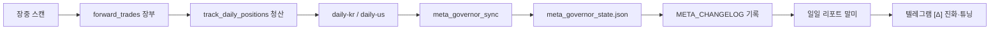

# [Δ] 진화·튜닝 메시지 전체 해설서

> **대상:** 텔레그램 말미 `📐 [Δ] 진화·튜닝 (글로벌 · MetaGovernor)` 블록  
> **작성:** 2026-06-11 · 코드 기준 (`evolution_digest.py`, `tuning_digest_formatter.py`, `meta_governor.py`)  
> **서버 전체 32건 목록:** 이 문서는 **구조·의미·스크린샷 해독**을 담습니다. 실제 32건 전체 이름은 서버 `meta_governor_state`에 있으므로 아래 **§7 명령**으로 `docs/진화튜닝_런타임_전체덤프.md`를 생성하세요.

---

## 0. 한 줄 요약 (스크린샷이 말하는 것)

```
MetaGovernor가 어제 밤 장부를 보고
「로직 그룹별 켈리(비중) 배율」을 다시 계산했고,
32개 그룹의 숫자가 바뀌었다 → 텔레그램에는 8개만 보이고 「외 24건」으로 잘렸다.
```

**1.07 → 1.00** 은 “그 그룹에 걸려 있던 **7% 가속(또는 데스매치 오버레이)** 이 풀려서 **정상 비중(1.0)** 으로 돌아갔다”는 뜻입니다.  
**나쁜 신호가 아니라**, 이전에 붙었던 **임시 가중이 해제**된 경우가 많습니다.

---

## 1. 이 메시지는 어디서 오나?



| 단계 | 파일 | 하는 일 |
|------|------|---------|
| 장부 적재 | `supernova_hunter` → `try_add_virtual_position` | 가상매매 OPEN |
| 청산 | `forward/ledger.py` `track_daily_positions` | CLOSED + `final_ret` |
| 메타 갱신 | `factory_pipelines` → `meta_governor_sync` | `MetaGovernor.run_governor_cycle()` |
| 변경 이력 | `meta_governor.py` `_push_changelog` | `META_CHANGELOG` append |
| 텔레그램 | `forward/deep_dive.py` | KR·US [1~9] 끝난 뒤 **글로벌 1회** `build_global_evolution_digest_html()` |

**중요:** [Δ]는 KR/US **각각이 아니라 하루 1통**입니다. 그룹 키에 `KR_`, `US_`, `MUTANT_`가 섞여 나옵니다.

---

## 2. 스크린샷 줄별 해독

텔레그램 예시:

```
📐 [Δ] 진화·튜닝 (글로벌 · MetaGovernor)
• META_GROUP_KELLY_MULT (treasury_groups) [2026-06-22T15:33:03]
• 그룹 켈리 배율 변경 32건
  - KR_UNDERDOG_50점: 1.02 → 1.00
  - MUTANT_1 #순환매_선취매: 1.07 → 1.00
  ...
  … 외 24건
  (배율 1.0±0.02 · 무변경 37개 그룹 생략)
```

| 줄 | 의미 |
|----|------|
| `META_GROUP_KELLY_MULT` | **로직 그룹 이름 → 켈리 배율** 맵. 키는 `sig_type`에서 뽑은 **코어 그룹명** (예: `RANK_C_단기테마`) |
| `(treasury_groups)` | 변경 이유 태그 — **Treasury(국고) 단계**에서 장부 롤링 성과로 산출 |
| `[2026-06-22T15:33:03]` | MetaGovernor가 이 스냅샷을 **기록한 시각** (UTC ISO) |
| `그룹 켈리 배율 변경 32건` | 이전 메타 vs 이번 메타를 비교해 **숫자가 달라진 그룹이 32개** |
| `1.07 → 1.00` | 그 그룹의 다음 진입 시 **켈리 리스크%에 곱해지는 배율**이 7% 부스트에서 정상으로 |
| `… 외 24건` | **표시 상한 8건** (`tuning_digest_formatter.py` `max_show=8`) 때문에 생략 |
| `무변경 37개 그룹 생략` | 배율이 **1.0±0.02 안**이고 변화도 없는 그룹은 목록에서 숨김 |

---

## 3. 「켈리 배율」이 실제 매매에 쓰이는 방식

신규 가상매매 진입 시 (`forward/shared.py` `try_add_virtual_position`):

```
effective_kelly = base_kelly
                × META_GLOBAL_KELLY_MULT      (시장 전체)
                × META_NS_KELLY_MULT[네임스페이스]  (예: KR_SUPERNOVA_MASTER)
                × META_GROUP_KELLY_MULT[코어그룹]   ← [Δ]에서 보는 것
                → kelly_cap / kelly_floor 로 clamp
```

| 배율 값 | 해석 |
|---------|------|
| **1.00** | 정상 — 기본 켈리 그대로 |
| **0.35** | 소프트 컷 — 비중 약 65% 축소 (연패·낮은 승률) |
| **0.00** | 하드 컷 — 사실상 그 그룹 신규 진입 차단 |
| **1.07** | 7% 가속 — 데스매치 승자·오버레이 등으로 **일시 부스트** |
| **>1.0** | `META_DEATHMATCH_KELLY_OVERLAY` 등과 곱해진 결과 (상한 ~1.5) |

코어 그룹명 추출 규칙 (`deep_dive.py` / `try_add_virtual_position` 동일):

1. `sig_type`에서 `[...]` 태그 제거  
2. 맨 앞 `SUPERNOVA` 등 접두 제거  
3. 첫 ` [` 이전 문자열 → 예: `RANK_C_단기테마`, `MUTANT_1`

---

## 4. MetaGovernor Treasury — 32건이 만들어지는 수학

**파일:** `meta_governor.py` → `_step_treasury()` → `_build_treasury_health_and_mult()`

### 4.1 입력

- `forward_trades` **청산 행** (KR + Bitget US)
- 롤링 윈도우: 기본 **90일** (레짐에 따라 18~120일 가변 `resolve_asymmetric_treasury_lookback_days`)
- 그룹 키: `{market}|{core_group}` 예: `KR|RANK_C_단기테마`

### 4.2 그룹별 건강도 → `mult`

| 조건 (표본 n ≥ min_trades, 기본 10) | `mult` | `reason` |
|-------------------------------------|--------|----------|
| 정상 | **1.0** | `ok` |
| 연패 ≥ 5 **또는** 승률 < 34% **또는** MDD ≤ -30% | **0.0** | `hard_cut` |
| 연패 ≥ 3 **또는** 승률 < 42% | **0.35** | `soft_cut` |
| 표본 부족 | **1.0** | `insufficient_sample` |

### 4.3 `META_GROUP_KELLY_MULT` 확정

1. 위 `mult`를 그룹명만으로 모음 (`KR|RANK_C` → `RANK_C_단기테마`)  
2. 같은 그룹에 시장별 키가 여러 개면 **더 작은 mult(보수적)** 채택  
3. `META_DEATHMATCH_KELLY_OVERLAY`가 있으면 **곱셈** (주간 데스매치 승자 부스트)  
4. 이전 스냅샷과 다르면 `META_CHANGELOG`에 **old → new 전체 dict** 저장

### 4.4 스크린샷에서 대부분 `→ 1.00`인 이유

- 전일 메타에 **데스매치/플루이드 오버레이로 1.02~1.07** 이 붙어 있었고  
- 이번 Treasury 재계산에서 **건강도가 ok(1.0)** 로 돌아오면서 **오버레이가 갱신·제거**됨  
- 또는 **주간 데스매치 주기**가 끝나 overlay dict가 비워짐  

→ “진화가 망했다”가 아니라 **「임시 가중 해제 → 기본선 복귀」** 로 읽는 경우가 많습니다.

---

## 5. 스크린샷에 보인 8개 그룹 상세

| 그룹 키 | 역할 (시스템 내) | 1.07→1.00 해석 |
|---------|------------------|----------------|
| `KR_UNDERDOG_50점` | 한국 언더독(50점대) 템플릿 | 소폭 부스트(1.02) 해제 |
| `MUTANT_1` + `#순환매_선취매` | 인큐베이터 돌연변이 1번 + 순환매 선취매 태그 붙은 진입 | 데스매치/오버레이 7% 해제 |
| `MUTANT_2` | 돌연변이 2번 | 동일 |
| `RANK_A_장기매집` | 슈퍼노바 장기 매집 랭크 | 동일 |
| `RANK_B_중기스윙` | 중기 스윙 | 동일 |
| `RANK_C_단기테마` | 단기 테마 (리더보드 상위에 자주 등장) | 동일 |
| `RANK_D_초단기밈` | 초단기 밈 | 동일 |
| `US_MEME_슈팅` | 미국 밈 슈팅 템플릿 | 동일 |

`#순환매_선취매`는 **그룹 키가 아니라 sig_type 꼬리 태그**가 이름에 붙어 보인 것입니다. Treasury 키는 보통 `#` 앞 **코어 그룹**입니다.

---

## 6. 「외 24건」에 들어갈 수 있는 그룹 유형 (코드베이스 전체)

서버마다 실제 이름은 다르지만, 구조상 아래 **패밀리**로 32건이 채워집니다.

### 6.1 RANK 티어 (슈퍼노바 DNA)

| 키 | 설명 |
|----|------|
| `RANK_A_장기매집` | 장기 매집 |
| `RANK_B_중기스윙` | 중기 스윙 |
| `RANK_C_단기테마` | 단기 테마 |
| `RANK_D_초단기밈` | 초단기 밈 |
| `US_RANK_A_장기매집` | 미국 A |
| `US_RANK_B_중기스윙` | 미국 B |
| `US_RANK_C_단기테마` | 미국 C |
| `US_RANK_D_초단기밈` | 미국 D |
| `US_MEME_슈팅` | 미국 밈 |

### 6.2 MUTANT / 인큐베이터

| 키 | 설명 |
|----|------|
| `MUTANT_1` ~ `MUTANT_3` | 주말 `dna_mutator` / 인큐베이터 기본 3종 |
| `MUTANT_KR_*` / `MUTANT_US_*` | 부모 DNA 변형 자식 |

### 6.3 마스터 / 스캐너 네임스페이스 (sig_type 코어)

| 예시 | 설명 |
|------|------|
| `KR_MASTER_S1`, `KR_MASTER_S4` | 마스터 전략 슬롯 |
| `KR_NULRIM_S1`, `KR_5EMA_S1` | 눌림목·5EMA |
| `KR_UNDERDOG_50점` | 언더독 |
| `US_BOWL`, `US_MASTER` | 미국 스캐너 계열 |

### 6.4 태그가 이름에 붙는 경우

- `#순환매_선취매`, `🔥주도주`, `🛡️차기섹터` 등은 **표시용 태그**  
- Treasury 집계는 **청산 시점의 sig_type**에서 코어를 뽑으므로, 같은 로직이라도 태그 조합마다 **별도 키**가 생길 수 있음 → 32건이 빨리 찰 수 있음

---

## 7. 서버에서 「잘린 24건」까지 포함한 전체 .md 뽑기

배포 후 Ubuntu 서버에서:

```bash
cd /path/to/Dual-Screener-Bot
python scripts/dump_evolution_tuning_md.py
```

생성 파일: **`docs/진화튜닝_런타임_전체덤프.md`**

포함 내용:

1. 현재 `META_GROUP_KELLY_MULT` **전 그룹** (잘림 없음)  
2. `META_CHANGELOG` 최근 20건 — `META_GROUP_KELLY_MULT` diff는 **max_show=9999**  
3. `META_STRATEGY_HEALTH` 그룹별 n, WR, PF, mult, reason  

로컬에 `meta_governor_state.json`이 없으면 빈 덤프가 나옵니다. **반드시 factory 서버**에서 실행하세요.

---

## 8. 텔레그램이 잘리는 이유 (코드 위치)

| 제한 | 값 | 파일 |
|------|-----|------|
| 변경 그룹 표시 | **8건** | `tuning_digest_formatter.py` `max_show=8` |
| CHANGELOG 항목 | **5건** | `format_meta_changelog_telegram(max_entries=5)` |
| 본문 줄 | **12줄** | `evolution_digest.py` `lines[:12]` |
| 1.0 근처 무변경 | ±0.02 | `mult_epsilon=0.02` |

그래서 **32건 변경 + 37건 생략** 같은 숫자가 동시에 보입니다.

**개선 (2026-06-11 반영):**

1. 켈리 배율 변경 **15건 단위**로 [Δ] 연속 메시지 송출 (`… 외 N건` 제거)
2. 서버에서 `python scripts/dump_evolution_tuning_md.py` → **전체 .md 덤프**

---

## 9. [Δ]와 다른 「진화」 블록 구분

| 블록 | 위치 | 내용 |
|------|------|------|
| **[Δ] 진화·튜닝** | 일일 리포트 **맨 끝** (1회) | `META_CHANGELOG` — **무엇이 바뀌었나** |
| **[8/9] 전략 생태계** | 시장별 | 데스매치·인큐베이터·도태 후보 |
| **[9/9] 부검** | 시장별 | 최근 청산 DNA·독성 |
| **토요일 10:00 자율조율** | `system_auto_pilot` | 커트라인·DNA·스필오버 대규모 |
| **PRI / Fluid** | 주간·휴장 | 내부 마찰·탄력 허들 (외부지수 없음) |

[Δ]만 보면 “오늘 뭐가 바뀌었는지”만 알 수 있고, **왜 수익이 났/망했는지**는 [2/9] 리더보드·[8/9]와 함께 봐야 합니다.

---

## 10. 운영자 체크리스트

| 확인 | 명령/위치 |
|------|-----------|
| MetaGovernor 마지막 실행 | `meta_governor_state.json` → `META_GOVERNOR_LAST_RUN_AT` |
| 전 그룹 배율 | `python scripts/dump_evolution_tuning_md.py` |
| Treasury 표본 수 | 덤프 §3 `n_rows`, `cutoff` |
| 스캔에 반영 여부 | 다음 스캔 로그에 `apply_meta_kelly_merge` 적용된 kelly% |
| CHANGELOG만 바뀌고 장부 0 | `diag_forward_open_book.py` (OPEN 장부 단절) |

---

## 11. 관련 문서

- [`진화튜닝_전체검토보고서.md`](./진화튜닝_전체검토보고서.md) — 전체 루프·주말·Fluid  
- [`KR_진화튜닝_구조감사.md`](./KR_진화튜닝_구조감사.md) — 한국 일일 파이프라인  
- [`US_진화튜닝_구조감사.md`](./US_진화튜닝_구조감사.md) — 미국 상류·스필오버  
- [`FLUID_EVOLUTION_ARCHITECTURE.md`](./FLUID_EVOLUTION_ARCHITECTURE.md) — MAB·elastic·DNA  

---

## 12. 스크린샷 사건 요약 (운영자용 한 페이지)

```
언제: 2026-06-22 15:33 UTC 경 MetaGovernor Treasury 주기
무엇: META_GROUP_KELLY_MULT 갱신 (treasury_groups)
규모: 32 그룹 배율 변경, 37 그룹은 1.0±0.02 로 목록 생략
패턴: 다수 1.07/1.02 → 1.00 (임시 가속 해제·정상화)
텔레그램: 8건만 표시, 24건 생략 → dump 스크립트로 전체 확인
다음 액션: 서버에서 dump_evolution_tuning_md.py 실행 후
           진화튜닝_런타임_전체덤프.md 로 잘린 24건 이름 확인
```

---

*이 문서는 코드 구조 검토 기준이며, 「외 24건」의 정확한 그룹명 목록은 서버 런타임 메타 상태에만 존재합니다.*
