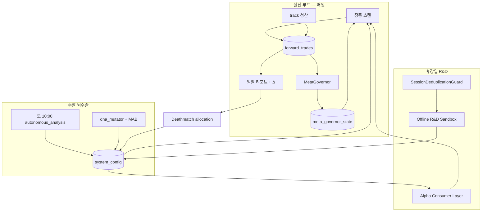

# 진화·튜닝 전체 검토 보고서 — “무슨 말인지”부터 “진짜 진화하나”까지

> **작성일:** 2026-06-11  
> **범위:** Dual-Screener-Bot (KR/US 공통 루트) · **코드 수정 없음** · 운영자·개발자용 해설  
> **관련 문서:** [`KR_진화튜닝_구조감사.md`](./KR_진화튜닝_구조감사.md), [`US_진화튜닝_구조감사.md`](./US_진화튜닝_구조감사.md), [`FLUID_EVOLUTION_ARCHITECTURE.md`](./FLUID_EVOLUTION_ARCHITECTURE.md), [`FLUID_US_UPSTREAM_ARCHITECTURE.md`](./FLUID_US_UPSTREAM_ARCHITECTURE.md)

---

## 0. 이 문서를 읽기 전에

텔레그램에 `[Δ] 진화·튜닝`, `데스매치`, `MetaGovernor`, `인큐베이터` 같은 말이 매일 온다면 **시스템이 스스로 뭔가 바꾸고 있다**는 뜻이다.  
다만 그게 **수익이 오른다**는 뜻은 **아니다**. 이 보고서는 두 가지를 분리해서 설명한다.

| 질문 | 한 줄 답 |
|------|----------|
| 진화·튜닝이 뭐냐? | **가상 장부(`forward_trades`)의 실전 결과**를 읽고, **설정·메타·스캐너 허들**을 자동으로 바꾸는 **닫힌 루프** |
| 진짜 “진화”하냐? | **의도는 진화(선택·도태·재배분)** 이 맞다. **수익 우상향은 보장되지 않는다.** 일부 루프는 **관측만** 하거나 **배포 경로에 안 묶여** 있을 수 있다. |

---

## 1. “진화튜닝”을 한 문장으로

```
장중 스캔 → 가상 매매(장부) → 청산·통계 → 메타/설정 갱신 → 다음 스캔에 반영
```

**진화(Evolution)** = 시간이 지나며 **전략·DNA·비중·허들**이 바뀌는 것.  
**튜닝(Tuning)** = 그 바뀜이 **숫자(커트라인, Kelly 배율, 레짐)** 로 구체화되는 것.

비유하면:

- **장부** = 팀 경기 기록표  
- **MetaGovernor** = 감독 (잘하는 선수 비중↑, 연패 선수 벤치)  
- **데스매치** = 포지션 내 경쟁전 (이번 주 누가 잘했나)  
- **자율 조율(토요일 뇌수술)** = 시즌 오프 시 커트라인·템플릿 정리  
- **Fluid Evolution** = 표본이 너무 적을 때 **허들을 살짝 낮추고 정찰병**을 보내 학습이 끊기지 않게 함  
- **Proprietary R&D (휴장일)** = 스캔이 막힌 날 **내부 데이터만**으로 스트레스·다크호스 마이닝 → 다음날 가중치에 반영  

---

## 2. 시스템에 진화가 끼어 있는 3개 층

### 2.1 층 A — 매일 도는 “생존 루프” (가장 중요)

| 시각·트리거 | 무엇이 돌아가나 | 진화 산출물 |
|-------------|-----------------|-------------|
| **장중** `scan-kr-*` / `scan-us-*` | `supernova_hunter` 등 스캐너 | `forward_trades` **신규 진입** |
| **장후** `track_daily_positions` | OHLCV로 OPEN 포지션 MFE/MAE·청산 | **청산·수익률** (모든 통계의 원천) |
| **daily-kr** (KST 16:35) / **daily-us** (KST 06:45) | `meta_governor_sync` → 딥다이브 → 일일 [1~9] | `meta_governor_state.json`, 텔레그램 [Δ] |
| **매 스캔 prelude** | `meta_governor_sync_scan` | 스캔 직전 최신 메타·켈리 |

**이 층이 안 돌면** 진화는 **공회전**한다. (로그만 바뀌고 장부·메타가 안 움직임)

### 2.2 층 B — 주말·위성 “뇌수술 + R&D”

`system_auto_pilot.py --daemon` (`dante-factory` 서비스) 안의 스케줄:

| 시각 (KST) | 작업 | 진화 의미 |
|------------|------|-----------|
| 토 **00:00** | `synthetic_data_generator` | 합성 유니버스·뮤턴트 스트레스 |
| 토 **01:00** | `shadow_performance_tracker` | 그림자 장부 평가 |
| 토 **02:00** | `incubator_engine` | 인큐베이터 DNA 평가 |
| 토 **03:00** | `mutant_oos_validator` | OOS 검증 |
| 토 **03:10** | `mutant_pending_bridge` | 검증 통과 뮤턴트 대기열 |
| 토 **10:00** | `run_autonomous_analysis()` | **커트라인·도태·국고·스필오버** 등 대규모 자율 조율 |
| 토 **10:05** | 주간 Flow 리포트 | 주간 요약 |
| 토 **10:10** | `time_machine_backtester` | 스트레스 시나리오 (데모 종목) |
| 매일 다수 | limit_up / toxic / smart_money / doomsday … | **안티패턴·섹터·거시** 입력 축적 |

토요일 10:00 **자율 조율** 말미에는 `run_fluid_evolution_weekend_hooks()` → **DNA 돌연변이 + MAB 탐험** 동기화가 붙어 있다 (`dna_mutator.py`, `mab_capital_allocator.py`).

### 2.3 층 C — Fluid·Proprietary (2026년 보강 레이어)

| 모듈 | 역할 | “진화”에 가까운가? |
|------|------|-------------------|
| `fluid_time_anchor.py` | 휴장·지연 시 `carry_over` 앵커 | **데이터 왜곡 방지** (중복 학습 오염 차단의 전제) |
| `elastic_threshold.py` | 표본 기아 시 cos/ml 커트라인 **탄력 조정** + 정찰병 | ✅ 학습 루프 유지 |
| `mab_capital_allocator.py` | 데스매치 70% + 탐험 30% | ✅ 자본 재배분 |
| `dna_mutator.py` | 주말 `MUTANT_*` 인큐베이터 | ✅ 신규 유전자 공급 |
| `session_deduplication_guard.py` | 동일 session 재스캔 차단 | ✅ 과적합 오염 방지 |
| `offline_rnd_sandbox.py` | 휴장일 내부 스트레스·다크호스 마이닝 | ✅ 다음날 테마·DEFCON 가중 |
| `proprietary_alpha_consumer.py` | `HIDDEN_SPILLOVER_THEME_*` → 스코어 프리미엄 | ✅ R&D 결과 **실전 스캔 반영** |

---

## 3. 진화의 “뇌” — MetaGovernor

**파일:** `meta_governor.py`  
**저장:** `meta_governor_state.json` (+ SQLite `meta_state_log`, `config_kv`)

### 3.1 한 사이클이 하는 일

```
수집·검증 → Calibrator → Treasury → Regime → Lifecycle → Changelog
```

| 단계 | 만드는 것 | 실전에서 쓰이는 곳 |
|------|-----------|-------------------|
| **Calibrator** | 점수 분포·티어 컷 | 리포트 해석 |
| **Treasury** | `META_STRATEGY_HEALTH`, **`META_GROUP_KELLY_MULT`**, `META_GLOBAL_KELLY_MULT` | **로직군별 비중** 축소/확대 |
| **Regime** | `META_REGIME_KEY` (BULL/CHOP/BEAR/HIGH_VOL…) | 방어·공격 템플릿, Fluid Premium 상한 |
| **Lifecycle** | `META_STRATEGY_REGISTRY` (OBSERVING→LIVE→COOLED→RETIRED) | [8/9] 승격·도태 |
| **Changelog** | `META_CHANGELOG` | 텔레그램 **[Δ] 진화·튜닝** |

### 3.2 Treasury 직관 (가장 자주 체감하는 “튜닝”)

- 최근 약 **90일** 청산으로 **sig_type 그룹별** 승률·연속손실·MDD 계산  
- `mult < 1.0` → 그 그룹 신호 **비중 감소** (`0`이면 사실상 차단)  
- 전체 그룹의 45% 이상이 `mult=0` → `META_GLOBAL_KELLY_MULT` **추가 감쇠**  
- 데스매치 승자 → `META_DEATHMATCH_KELLY_OVERLAY` 로 **일시 부스트** (상한 있음)

**이것이 “진화”인 이유:** 잘 안 되는 패턴은 **자동으로 연료(비중)가 줄고**, 상대적으로 나은 arm에 **연료가 몰린다.**

---

## 4. 데스매치 [9/9] — 로직군 경쟁

**파일:** `evolution/deathmatch_report.py`, `forward/deathmatch_report_section.py`

| arm | 대략적 의미 |
|-----|-------------|
| A | STANDARD |
| B | SUPERNOVA_* |
| C | SUPERNOVA_BEAST |
| UD | UNDERDOG |
| BH | BLACKHOLE |

**정상:** 청산 표본이 충분하면 순위 + (설정 시) 승자 그룹에 Kelly 오버레이 적용.

**자주 보는 “진화 안 되는 것 같음” 메시지:**

| 티어 | 의미 | 진짜 원인 |
|------|------|-----------|
| **DM-A** | Battle Royal 보류 | 윈도우에 **청산 0건** — track/스캔 문제 |
| **DM-B** | Registry arm 0 | 청산은 있는데 **sig_type 매핑 실패** |
| **DM-C** | arm당 N건 미달 | 청산 적음 — **통계 부족** |

→ 데스매치가 DM-A면 **튜닝이 의도적으로 멈춘 것**이지, 버그가 아닐 수 있다.

---

## 5. 텔레그램 결과지 — 무엇이 “진화 로그”인가

### 5.1 매일 오는 것들

| 리포트 | 한 줄 의미 |
|--------|------------|
| **딥다이브** | 최근 N일 청산 **부검** (DNA·인큐베이터 후보·스필오버) |
| **일일 [1/9]~[9/9]** | 거시·리더보드·티어·DNA·데스매치 등 **다층 성적표** |
| **말미 [Δ] 진화·튜닝** | `META_CHANGELOG` + `system_config` 스냅샷 diff — **“무엇이 바뀌었나”** |
| **PIL 실무자** | 그룹별 생존·좀비 → COOLED 후보 |

### 5.2 [Δ]를 읽는 법

예시:

```
META_GROUP_KELLY_MULT (treasury_groups)
  - SUPERNOVA_COSINE: 1.00 ➔ 0.75
META_REGIME_KEY BULL ➔ CHOP
스냅샷 Δ: DYNAMIC_SUPERNOVA_CUTOFF, …
```

| 항목 | 뜻 |
|------|-----|
| 그룹 켈리 1.0→0.75 | 해당 로직 **비중 25% 삭감** (다음 스캔·진입부터) |
| REGIME BULL→CHOP | 국면 방어 모드 — Fluid Premium 상한도 **1.05x 쪽**으로 |
| 스냅샷 Δ | 어제 대비 `system_config` 에서 바뀐 키 나열 |

**[Δ]는 “성과 보장”이 아니라 “변경 기록”**이다.

### 5.3 토요일 자율 조율 리포트

`run_autonomous_analysis()` (~2000줄) — 대표 작업:

- VIX·Breadth 기반 **S1/S4 비중** (`WEIGHT_S1`, `WEIGHT_S4`)
- 승률 낮으면 **커트라인↑**, 표본 기아면 **커트라인↓** (Death-Spiral Relief)
- SUPERNOVA 템플릿 **ARCHIVED** + `ANTI_PATTERNS` 누적
- 말미 **DNA mutation + MAB** (`fluid_evolution_bridge`)

**표본 < 10건이면** “이번 주 조율 스킵” — **진화 루프는 돌았지만 손은 안 댐.**

---

## 6. Fluid Evolution — “표본 기아”를 끊는 설계

**철학** (`FLUID_EVOLUTION_ARCHITECTURE.md`):

> 우상향을 **보장하지 않는다**. 대신 **“안 사서 학습이 멈춤”** 루프는 끊는다.

| 압력 | 반응 |
|------|------|
| 진입·청산 밀도 ↓ | 커트라인 **완화** + **정찰병(🔭SCOUT)** near-miss 허용 |
| 변동성 ↑ | 커트라인 **소폭 조임** |
| 데스매치 승자 과점 | MAB **30% 탐험** |
| DNA 정체 | 주말 **3~5% 돌연변이** → `INCUBATOR_TEMPLATES` |

**통합 지점 (실제 코드에 연결됨):**

| 위치 | 동작 |
|------|------|
| `supernova_hunter.py` | `ElasticThreshold` → 커트라인, 실패 시 scout |
| `forward/shared.py` `try_add_virtual_position` | 정찰병 **0.3% 하드캡** |
| `factory_pipelines._step_meta_governor_sync` | `post_meta_governor_fluid_sync()` |
| `system_auto_pilot` 토 10:00 | `run_fluid_evolution_weekend_hooks()` |
| `meta_governor` / `deathmatch_report` | SCOUT 거래 **통계에서 제외** (오염 방지) |

---

## 7. Proprietary Synergy — 휴장일 R&D → 다음날 스캔

**흐름:**

```
carry_over로 동일 session 재스캔 시도
  → SessionDeduplicationGuard Abort (과적합 방지)
  → Offline R&D Sandbox (백그라운드)
       ├─ Stress-Test → PROPRIETARY_DEFCON_WEIGHTS_*
       └─ Toxic-Inverted Mining → HIDDEN_SPILLOVER_THEME_*
  → 다음 영업일 supernova_hunter
       └─ calculate_fluid_theme_premium() (레짐·Kelly 연동)
```

**외부 API 없음** — `market_data.sqlite`, `forward_trades`, `meta_governor_state`, `system_config` 만 사용.

이 레이어는 **“휴장일에도 CPU를 학습에 쓴다”**는 의미에서 진화 파이프라인의 **확장**이다.

---

## 8. “진짜 진화하게 튜닝되어 있나?” — 정직한 판정

### 8.1 ✅ 설계·배포상 **살아 있는** 진화 (증거 있음)

| 메커니즘 | 바뀌는 것 | 다음 행동에 반영 |
|----------|-----------|------------------|
| MetaGovernor Treasury | 그룹 Kelly mult | ✅ 진입 비중 |
| Deathmatch overlay | 승자 arm 부스트 | ✅ (설정 시) |
| 자율 조율 커트라인 | `DYNAMIC_*_CUTOFF` | ✅ 스캔 합격률 |
| 도태·ARCHIVED | DNA 템플릿 냉동 | ✅ 스캐너 풀 |
| ANTI_PATTERNS / Toxic ML | 참사 DNA 차단 | ✅ 스캔 필터 |
| Lifecycle 승격·COOLED | LIVE/RETIRED | ✅ [8/9]·비중 |
| Fluid elastic + scout | near-miss 학습 | ✅ 소액 정찰 진입 |
| DNA mutator (주말) | `MUTANT_*` 인큐베이터 | ✅ 검증 후 편입 가능 |
| Proprietary R&D + Alpha Consumer | 히든 테마 프리미엄 | ✅ `final_score` |

### 8.2 ⚠️ **진화처럼 보이지만 약하거나 조건부**인 것

| 메커니즘 | 제한 |
|----------|------|
| **ACE Evolution** (`ace_evolution_refresh.py`) | 기본 **`observe_only`** — `ENABLE_ACE_EVOLUTION_WEIGHTING` 꺼짐 + `ACE_EVOLUTION_FORCE_OBSERVE` 기본 True → **관측·리포트 위주** |
| **인큐베이터** | `INCUBATING` — **LIVE 자동 승격 아님**, 후보 등록 |
| **타임머신 백테스트** | 고정 데모 종목 3개 — **전체 유니버스 진화 아님** |
| **합성 데이터 R&D** | 실전 장부와 **별 트랙** — 브릿지 통과해야 반영 |
| **Fluid Premium** | 레짐·Kelly 나쁘면 **1.0x 수렴** — 방어적 설계 |

### 8.3 ❌ **코드는 있으나 기본 factory만으로는 안 도는** 것 (중요)

| 기능 | 위치 | 상태 |
|------|------|------|
| `hunt_supernovas('KR'/'US')` | `supernova_hunter.py` | **주간 DNA 재채굴** (타임머신) |
| `evolve_alpha_factors()` | `supernova_hunter.py` | 알파 팩터 진화 |
| `data_miner.run_cluster_mining()` | `data_miner.py` | K-Means 클러스터 → `LIVE_CLUSTER_TEMPLATES` |
| **스케줄** | `run_miner_scheduler()` — **월요일 17:00**, `supernova_hunter.py`를 **`__main__`으로 직접 실행할 때만** 내장 스레드 |

**`dante-factory` daemon은 `system_auto_pilot --daemon`만 실행** → 위 **주간 마이닝 루프는 cron/systemd 기본 경로에 없음**.

**체감:** “DNA_SUPERNOVA_*_MULTI가 오래 안 바뀐다” → **일일·주말 뇌수술은 도는데, 주간 대규모 재채굴은 안 돌 수 있음.**

### 8.4 진화 ≠ 수익 우상향인 이유 (구조적)

1. **과거 최적화** — PF·승률은 **이미 청산된 표본** 기준. 레짐 전환 시 과거 최적이 미래 손실.  
2. **표본 의존** — 딥다이브 ≥10건, 자율조율 ≥10건, 데스매치 arm당 ≥5건(기본).  
3. **다중 루프 충돌** — 토요일 커트라인↑ vs Treasury mult↓ vs Deathmatch overlay↑ 가 **같은 주에 반대 방향** 가능.  
4. **장외·휴장·락** — `SKIPPED_SESSION`, track skip → **DM-A·표본 0**.  
5. **가상 장부** — 실계좌 슬리피지·체결과 1:1 아님.

---

## 9. 전체 피드백 루프 (한 장 그림)



---

## 10. “진화가 살아 있다” 체크리스트 (서버에서)

```bash
# 1) 장부가 움직이는가
sqlite3 market_data.sqlite \
  "SELECT market, MAX(substr(entry_date,1,10)), COUNT(*) FROM forward_trades WHERE status='OPEN' GROUP BY market;"

# 2) daily 감사가 돌았는가
ls -lt logs/factory_daily_audit_* | head -3

# 3) MetaGovernor가 갱신되는가
python -c "
import json
m=json.load(open('meta_governor_state.json',encoding='utf-8'))
print('regime:', m.get('META_REGIME_KEY'))
print('global_kelly:', m.get('META_GLOBAL_KELLY_MULT'))
print('changelog:', (m.get('META_CHANGELOG') or [])[-1:])
"

# 4) 토요일 자율조율
sudo journalctl -u dante-factory --since 'last saturday' | grep -i autonomous

# 5) Fluid / Fluid Premium 로그
grep -E 'Fluid Premium|SessionDeduplication|Offline R&D' logs/factory_*.log | tail -20
```

| 신호 | 건강 | 병목 |
|------|------|------|
| `max(entry_date)` 전진 | ✅ | 장중 스캔·락 확인 |
| `META_CHANGELOG` 갱신 | ✅ | `meta_governor_sync` 실패 로그 |
| [9/9] DM-A 아님 | ✅ | track·US SPY stale |
| [Δ] 그룹 켈리 변동 | ✅ 튜닝 작동 | 전부 1.0 고정 = 표본 부족 |
| `DNA_SUPERNOVA_*_MULTI` 장기 동일 | ⚠️ | 주간 `hunt_supernovas` 미실행 의심 |

---

## 11. 결과지 → 행동 치트시트

| 텔레그램 | 시스템이 한 일 | 당신이 할 일 |
|----------|----------------|-------------|
| [Δ] 켈리 1.0→0.75 | 해당 로직 **비중 삭감** | 최근 그 그룹 청산 확인 |
| [8/9] LIVE↑ | 승격 | 신규 LIVE 모니터 |
| [9/9] DM-A | **튜닝 안 함** | 스캔·track 먼저 |
| 딥다이브 표본 부족 | 부검 스킵 | 장부 적재 |
| 자율조율 조율 스킵 | 최소 갱신만 | 평일 청산 늘리기 |
| 🌊 Fluid Premium Boost 1.0x | Kelly/레짐 방어 | 정상 — 계좌 체력 약함 |
| SessionDeduplication ABORT | 중복 session 차단 + R&D | 정상 carry_over 동작 |

---

## 12. 용어 사전 (진화튜닝 맥락)

| 용어 | 쉬운 뜻 |
|------|---------|
| `forward_trades` | 가상 포워드 매매 장부 — **진화의 원천 데이터** |
| `system_config` | 스캐너 커트라인·템플릿·스필오버 등 **실행 설정** |
| `meta_governor_state` | 레짐·켈리·승격 — **메타 뇌** (스캐너가 직접 안 읽음 → consumer 경유) |
| `sig_type` / `group_key` | 신호 이름 / 순수 로직명 |
| `META_GROUP_KELLY_MULT` | 로직군별 **비중 배율** |
| `커트라인` | 스캔 합격 **최소 점수/유사도** |
| `데스매치` | 로직군 **상대 성적 순위** |
| `인큐베이터` | 아직 LIVE 아닌 **DNA 실험 풀** |
| `carry_over` | 휴장일에 **마지막 유효 거래일** 데이터로 트래킹 유지 |
| `🔭SCOUT` | 표본 기아 시 **소액 정찰** 진입 (통계에서 분리) |

---

## 13. 최종 결론

### Q1. 진화튜닝이 무슨 말이냐?

**가상 장부에 쌓인 실전(가상) 매매 결과를 읽어, 나쁜 로직은 비중·허들을 줄이고 좋은 쪽에 연료를 주며, 주말·휴장일에는 DNA·테마·안티패턴을 갱신해서 **다음 스캔이 이전과 다르게 동작하도록** 만드는 자동 루프**다. 텔레그램 [Δ]·[8/9]·[9/9]·딥다이브는 그 과정의 **다층 로그**다.

### Q2. 진짜 “진화”하도록 튜닝되어 있나?

| 판정 | 내용 |
|------|------|
| **구조** | ✅ **선택·도태·재배분·변이·정찰** 메커니즘이 코드에 있고, **일일 MetaGovernor·데스매치·토요일 자율조율·Fluid 레이어**는 factory/daemon에 **연결됨** |
| **완전 자동 유전자 재채굴** | ⚠️ `hunt_supernovas` / `data_miner` **주간 루프는 기본 배포에 미연결** — 수동 또는 별도 cron 필요 |
| **ACE·인큐베이터 일부** | ⚠️ **관측·후보 단계**가 많고 LIVE 자동 승격은 **게이트 통과 필요** |
| **수익** | ❌ **우상향 보장 없음** — 과거 최적화·표본 부족·레짐 전환 시 **진화만 하고 성과는 정체** 가능 |

### Q3. 운영 우선순위 (진화가 “느껴지게” 하려면)

1. **장중 스캔** 정상 (장외 `SKIPPED_SESSION` 과다 X)  
2. **track** 으로 청산·워터마크 전진  
3. **daily-kr / daily-us** 성공  
4. 그다음 **[9/9]·[Δ]·토요일 뇌수술** 해석  
5. DNA 템플릿 장기 정체면 **`hunt_supernovas` 실행 경로** 점검  

---

## 14. 모듈·파일 색인 (진화 관련)

| 영역 | 대표 파일 |
|------|-----------|
| 일일 파이프라인 | `factory_pipelines.py` |
| 메타 뇌 | `meta_governor.py`, `meta_governor_consumer.py` |
| 승격·도태 | `strategy_promotion_engine.py` |
| 데스매치 | `evolution/deathmatch_*.py` |
| [Δ] 요약 | `evolution_digest.py` |
| 주말 뇌수술 | `system_auto_pilot.py` → `run_autonomous_analysis()` |
| Fluid 진화 | `elastic_threshold.py`, `mab_capital_allocator.py`, `dna_mutator.py`, `evolution/fluid_evolution_bridge.py` |
| US 휴장·지연 | `fluid_time_anchor.py`, `evolution/us_fluid_upstream_bridge.py` |
| 휴장 R&D | `session_deduplication_guard.py`, `offline_rnd_sandbox.py`, `proprietary_alpha_consumer.py` |
| 주간 마이닝 (별도 실행) | `supernova_hunter.py` (`hunt_supernovas`, `run_miner_scheduler`), `data_miner.py` |
| ACE (관측 기본) | `evolution/ace_evolution_*.py` |

---

*이 문서는 코드 스냅샷(2026-06-11) 기준 검토 결과이며, 구조 변경 시 §8.3·§13을 우선 갱신하면 된다.*
