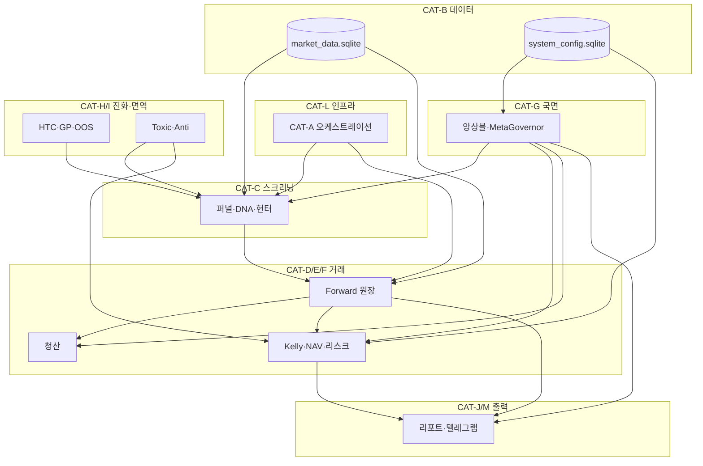

# 한국·미국 퀀트 — 듀얼 AI 카테고리 구성 가이드

> **대상 레포**: `Dual-Screener-Bot` (KR/US 주식 듀얼 스크리너 퀀트 팩토리)  
> **범위**: `bitget/`(코인) **전면 제외** · `tests/`는 참조만(구현 범위 아님)  
> **작성 목적**: Claude Pro(아키텍트·논리 설계)와 Cursor(수석 엔지니어·로컬 구현)가 **서로 꼬이지 않고** 각자 강점을 극대화하도록, 카테고리별 지식·경계·역할을 정의한다.  
> **정확성 우선**: 빠른 탐색용 치트시트가 아니라, **수정·설계·교차검증 시 반드시 참조할 SSOT 맵**이다.  
> **버전**: 2026-07-31 · 로컬 코드베이스 전수 기준  
> **상세 아키텍처 원본**: [`docs/한미_퀀트_전체구조_100%_아키텍처.md`](./한미_퀀트_전체구조_100%_아키텍처.md) (계층별 수학·상수·스케줄 전체)

---

## 0. 이 문서를 어떻게 쓰는가

| 상황 | Claude Pro | Cursor |
|------|-----------|--------|
| 새 기능·수학·국면 논리 설계 | 해당 **카테고리 Knowledge**만 열고 설계 | — |
| 로컬 코드 구현·디버그 | Prompt(설계)만 전달받음 | **카테고리 + 의존성 표** 확인 후 구현 |
| 버그 수정 | 원인 카테고리 식별 → 수정 범위 명시 | **인접 카테고리 SSOT** 건드리지 않도록 diff 최소화 |
| 교차 검증 | 수학·정책 일관성 | 코드·의존성·성능·스키마 정합성 |

**원칙 3가지**

1. **한 번에 한 카테고리** — 설계·구현·리뷰 모두 단일 카테고리 컨텍스트에서 진행. 인접 카테고리는 "인터페이스(함수명·config 키·DB 컬럼)"만 참조.
2. **SSOT 단일 진실원천** — 같은 개념을 두 파일에 중복 정의하지 않는다. 아래 각 카테고리의 SSOT 열을 따른다.
3. **방어 계층(F·G·I·N) 수정은 보수적** — MDD·DEFCON·Kelly·Toxic·Fast Safety 변경은 Claude 설계 → Cursor 구현 → 디렉터 승인 3단계.

---

## 1. 듀얼 AI 역할 분담

```
┌─────────────────────────────────────────────────────────────────┐
│  디렉터 (Owner) — 최종 의사결정, 리스크 승인                        │
└────────────▲───────────────────────────────▲────────────────────┘
             │ Prompt / 검토 요청              │ 구현 브리핑 / 충돌 보고
┌────────────┴────────────┐       ┌───────────┴──────────────────┐
│  Claude Pro (Architect) │       │  Cursor (Lead Engineer)       │
│  · 수학·정책·국면 논리     │       │  · 로컬 코드베이스 정합성       │
│  · 카테고리 간 정책 일관   │       │  · 성능·메모리·SQLite pragmas  │
│  · KR/US 비대칭 설계      │       │  · Targeted diff 구현          │
│  · Prompt 산출           │       │  · 의존성 충돌 시 Adapter 제안  │
└─────────────────────────┘       └───────────────────────────────┘
```

| Claude Pro가 **주도** | Cursor가 **주도** |
|----------------------|------------------|
| Kelly merge chain 수식 변경 | `forward/shared.py` OCC·트랜잭션 |
| 국면 앙상블 가중치·히스테리시스 | `predictive_regime_ensemble.py` 상태 영속 |
| 청산 사다리 우선순위 정책 | `forward/ledger.py` 분기·DB UPDATE |
| HTC GP 변이·OOS 승격 기준 | `incubator_engine.py` AST 화이트리스트 |
| 데스매치 composite 가중치 | `evolution/deathmatch_*.py` 쿼리·성능 |
| 리포트 섹션 의미·순서 | `reports/*` HTML·hydrate 타이밍 |
| — | systemd/cron/deploy 셸·경로 |
| — | 스키마 마이그레이션(`sqlite_schema_guard`) |
| — | 테스트 실행·CI·린트 |

**Cursor → Claude 에스컬레이션 조건** (`.cursorrules` 정합)

- 동일 에러 3회 이상
- SSOT 충돌(예: Gemini 제안 키가 `config_manager` OCC와 불일치)
- 방어 계층 수정이 인접 2개 이상 카테고리에 파급

---

## 2. Claude Pro 프로젝트 구성 (파일 분리 완료)

**업로드 폴더**: [`docs/claude_project/`](./claude_project/)  
**시작 문서**: [`docs/claude_project/00_README_사용법.md`](./claude_project/00_README_사용법.md)

Claude Pro **Project Knowledge**에 `docs/claude_project/` 아래 **전 파일**을 업로드한다.  
대화 시에는 README의 **3-Tier 규칙**대로 `@CAT-X` **1개 + T0(MAP)** 만 멘션 — 토큰 절약.

| Tier | 파일 |
|------|------|
| T0 | `00_CUSTOM_INSTRUCTIONS.txt` → Project Instructions에 붙여넣기 |
| T0 | `CAT-MAP_의존성경계.md` |
| T1 | `CAT-KR-US_비대칭표.md`, `CAT-CONSTANTS_상수레퍼런스.md` |
| T2 | `CAT-A` … `CAT-P` (작업별 1개) |
| T3 | `CAT-HANDOFF_템플릿.md`, `CAT-Q_진단레거시.md` |

**Cursor용** — 레포 루트 `.cursorrules` + 이 문서 §1·§4 + `docs/claude_project/CAT-MAP`.

---

## 3. 카테고리 전체 맵

총 **16개 핵심 + 3개 보조** 카테고리.  
각 항목: **SSOT** · **루트/패키지 파일** · **Claude 관심사** · **Cursor 관심사** · **위험도**.

---

### CAT-A · 오케스트레이션 & 스케줄링

**역할**: 24/7 데몬, cron factory 파이프라인, 락·세션·슬롯, mode→step 매핑.

| 구분 | 파일 |
|------|------|
| **SSOT** | `factory_pipelines.py` (mode→StepSpec), `factory_runtime.py` (락·dispatch) |
| 진입점 | `system_auto_pilot.py`, `factory.sh` |
| 스케줄 | `factory_scan_schedule.py`, `factory_slot_dispatcher.py`, `factory_schedule_guard.py` |
| 세션·중복방지 | `market_session_gate.py`, `session_deduplication_guard.py` |
| 아티팩트·복구 | `factory_artifact_guard.py`, `factory_recovery_grace.py`, `factory_us_health.py` |
| 메타 알림 | `factory_meta_alerts.py` |
| 감시 | `watchdog.py` |
| 배포 연동 | `deploy/entrypoints/run_factory_daemon.sh`, `deploy/systemd/dante-*.service.in` |

**FACTORY_MODES (핵심)**

- 장중: `scan_kr_*`, `scan_us_*` (supernova / nulrim / dante / ema5 / master(KR only) / bowl)
- 일일: `daily_audit_kr`, `daily_audit_us`, `data_refresh`, `smart_money_refresh`, `limit_up_forensics`, `doomsday_radar`
- 주간: `weekly_master`, `monthly_master`

**Claude**: 슬롯 간격(50분), Cycle-2 종가 마진, KR cron vs US ET 디스패처 정책, critical step 실패 시 skip 정책.  
**Cursor**: flock `.factory_runtime.lock`, zombie pipeline guard, `subprocess.Popen` 위성 발사, prelude 체인 wiring.  
**위험도**: 🟡 Medium — 스케줄 변경은 전 파이프라인에 파급.

**인터페이스 (다른 카테고리가 호출)**

- `dispatch_factory_mode(mode)` ← cron/shell
- `system_main_loop()` ← `--daemon`
- 각 `_step_*` → CAT-C/D/J/G 모듈 invoke

---

### CAT-B · 데이터 계층 & 저장소

**역할**: SQLite SSOT, OHLCV 수집, CQRS 스냅샷, 경로·스키마 가드.

| DB / 저장소 | SSOT 모듈 | 용도 |
|-------------|----------|------|
| `market_data.sqlite` | `market_db_paths.py` | OHLCV + `forward_trades` + meta 로그 |
| `market_data_snapshot.sqlite` | `data_updater.create_read_only_snapshot` | CQRS 읽기 복제 |
| `system_config.sqlite` | `config_manager.py` | config_kv 중추신경계 |
| `message_queue.sqlite` | `telegram_message_queue.py` | 텔레그램 영속 큐 |
| `ops_events.sqlite` | `ops_logger.py` | heartbeat·gauge |
| `news_data.sqlite` | `news_data_paths.py` | 감성 |
| `alt_data.sqlite` | `data_miner.py` 등 | 매크로 시계열 |
| `short_data.sqlite` | `blackhole_hunter.py` | 공매도 원장(주식 forward와 **분리**) |
| `synthetic_market.sqlite` | `synthetic_data_generator.py` | HTC 합성 |
| `regime_task_queue.sqlite` | `regime_memory.py` | 주말 국면 큐 |
| JSON 상태 | `meta_governor`, `live_nav_manager`, `predictive_regime_ensemble`, `meta_learner` | 동적 상태 미러 |

| 유틸 | 파일 |
|------|------|
| 경로 SSOT | `factory_data_paths.py` |
| 스키마 가드 | `sqlite_schema_guard.py` |
| OOM pragma | `low_ram_sqlite_pragmas.py` |
| OHLCV 수집 | `data_updater.py`, `market_data_fetcher.py`, `yf_download_flatten.py` |
| 매크로·대체 | `macro_context_snapshot.py`, `macro_matrix_incremental.py`, `dart_fetcher.py`, `fundamentals_fetcher.py`, `short_interest_fetcher.py` |
| 아카이브 | `deep_archive_history.py` |
| 메모리 | `memory_bounds.py` |

**Claude**: CQRS 읽기 정책, 리포트 MAIN 강제 vs 스냅샷, DB 간 데이터 소유권(특히 short vs forward 분리).  
**Cursor**: WAL/backup, `KNOWN_COLUMN_MIGRATIONS`, yfinance 배치·FDR per-ticker, snapshot stale 1800s.  
**위험도**: 🔴 High — 스키마·경로 변경은 전 시스템 붕괴.

---

### CAT-C · 스크리닝 & 시그널 생성

**역할**: 유니버스 → 퍼널 → DNA 매칭 → 가상 진입 후보. 듀얼 암 S1(추세) / S4(눌림).

| 구분 | 파일 |
|------|------|
| **퍼널 SSOT** | `scanner_funnel.py` |
| 시너지·국면 주입 | `scanner_synergy_engine.py`, `scanner_regime_ssot.py`, `scan_resilience.py` |
| 초신성(B암) | `supernova_hunter.py`, `supernova_fluid_capital.py` |
| 블랙홀(BH) | `blackhole_hunter.py` (US, short DB only) |
| 레거시 스캐너 | `legacy_archive/scanners/` — nulrim, ema5, kr/usa bowl, dante, master, us_5ema, us_master |
| 유니버스 | `krx_list_survival.py`, `krx_equity_universe.py`, `us_list_survival.py` |
| 섹터·순환·스필오버 | `sector_taxonomy.py`, `rotation_sector_filter.py`, `sector_rotation_store.py`, `sector_spillover_refresh.py`, `sector_normalize.py`, `sector_rotation_smoothing.py`, `us_kr_theme_bridge.py`, `cross_market_ssot.py`, `spillover_calendar.py`, `spillover_v28_report.py`, `zero_sample_spillover.py` |
| 미너·포렌식 | `underdog_miner.py`, `smart_money_tracker.py`, `limit_up_forensics.py`, `forensics_pioneer.py`, `inverse_etf_sniper.py` |
| 샌드�ox | `offline_rnd_sandbox.py` |
| KR 브릿지 | `kr_bowl_forward_bridge.py`, `kr_flow_factor.py` |

**sig_type·암 분류 SSOT**: `evolution/deathmatch_report.py` (`classify_strategy_arm`)

**Claude**: 3D DNA(cpv/tb/bbe), 컷오프·elastic·synergy 곱셈, SCOUT/TOXIC_TRAP 정책, KR master 슬롯·US 없음.  
**Cursor**: 15스레드 `process_live_ticker`, INCUBATOR_TEMPLATES 로드 순서, `legacy_archive/scanners` import 경로.  
**위험도**: 🟡 Medium.

**→ CAT-D 인터페이스**: `forward/shared.try_add_virtual_position(...)`

---

### CAT-D · Forward 원장 & 거래 생애

**역할**: `forward_trades` 스키마, OPEN→CLOSED 상태머신, 일일 추적, 무결성.

| 파일 | 역할 |
|------|------|
| **`forward/shared.py`** | SSOT: init DB, try_add, Kelly sizing 진입, track_daily |
| `forward/ledger.py` | 일일 청산 평가 orchestration (→ CAT-E) |
| `forward/forward_trade_identity.py` | 종목명·코드 백필 |
| `forward/forward_book_integrity.py` | 고스트·좀비 탐지 |
| `forward/deep_dive.py` | 일일 리포트 오케스트레이션 (→ CAT-J) |
| `forward/dna_autopsy.py` | DNA 부검 slice |
| `forward/deathmatch_report_section.py` | 데스매치 리포트 섹션 |
| `forward/rotation_report_section.py` | 순환매 섹션 |
| `forward_dual_track_queries.py` | LIVE/HIST/CHAMPION dual-track |
| `forward_market_guard.py`, `forward_observe_bridge.py` | 관찰·가드 |
| `forward_flow_tag_deep_dive.py`, `forward_score_bucket_deep_dive.py` | 마이크로 분석 |

**Claude**: `entry_regime` 각인, shadow vs enrolled, status 값 집합, partial exit 필드 의미.  
**Cursor**: ~40 idempotent ALTER, soft close(DELETE 금지), `CLOSED_ZOMBIE` 자가치유.  
**위험도**: 🔴 High.

---

### CAT-E · 청산 엔진

**역할**: P1~P3 exit ladder, fluid scale-out, ratchet RL, ACE 보유연장.

| 파일 | 역할 |
|------|------|
| **`forward/ledger.py`** | 우선순위 사다리 실행 SSOT |
| **`exit_dynamics.py`** | 순수 수학(I/O 없음): fluid F_out, κ, pyramid |
| `exit_ratchet_rl.py` | 주간 κ RL |
| `evolution/ace_exit_bridge.py` | ACE 보유연장 override |
| `elastic_threshold.py` | 진입 컷오프 elastic (스캔과 경계) |
| `fluid_time_anchor.py` | fluid time 앵커 |

**청산 우선순위 (SSOT)**

1. P1 MAE/MFE (fluid partial)
2. P1b RUNNER_TRAIL (convex ratchet)
3. P1c Pyramid add
4. P2 HYBRID/TECH/STAT
5. P3 ZOMBIE_FORCE_CLOSE

**Claude**: κ convexity, breadth<0.97 조임, regime별 F_out, RL reward.  
**Cursor**: `actual_exit_price` 계산, `blend_final_return`, DB UPDATE atomicity.  
**위험도**: 🔴 High.

---

### CAT-F · 자본배분 & 리스크

**역할**: Kelly merge chain, MAB, NAV, 데스매치 배분, try_add 게이트.

| 파일 | 역할 |
|------|------|
| **`forward/shared.py`** | Kelly merge chain 실행 SSOT |
| **`meta_governor_consumer.py`** | `apply_meta_kelly_merge`, weight bounds |
| `live_nav_manager.py` | NAV/HWM/MDD SSOT (`treasury_state.json`) |
| `mab_capital_allocator.py` | Thompson + UCB arm 배분 |
| `template_bandit.py` | per-template Beta bandit |
| `toxic_decay_bandit.py` | toxic 망각 bandit |
| `regime_kelly_failsafe.py`, `regime_kelly_learner.py` | UNKNOWN graceful Kelly |
| `kelly_elasticity_overlay.py` | Kelly elastic overlay |
| `capital_deathmatch.py` | 리포트용 Kelly vs 고정 대결 |
| `portfolio_risk_overlay.py` | 포트폴리오 리스크 |
| `dynamic_hedge_cap.py`, `self_evolution_hedge_engine.py` | 헷지 |
| `catastrophic_day_guard.py` | 일일 catastrophic guard |
| `bear_defense_booster_guard.py` | bear defense |
| `dynamic_order_router.py` | 주문 라우팅(가상) |
| `contextual_linucb.py`, `linucb_apoptosis.py` | LinUCB |
| `strategy_promotion_engine.py` | OBSERVING→LIVE 생애주기 |
| `strategy_registry_store.py`, `strategy_lifecycle_config.py` | 레지스트리 |
| `evolution/deathmatch_*.py` | 배틀로얄·배분·스코어카드 |
| `performance_budget_governor.py` | 성능 예산 |

**Kelly Chain (Claude 설계 SSOT)**

```
base → WEIGHT_S1/S4 → ts_mult → 순환매/스필오버/합성 → meta merge → template mult → cash brake
```

**try_add 게이트 순서 (변경 금지 without review)**: GLOBAL_CIRCUIT_BREAKER → DEFCON≤2 → toxic bbox → KILL_SWITCH → 중복 → OPEN 20 → logic 4/day → sector 2+2 → cash → AUM(KR).

**Claude**: ACTION_BY_REGIME cap, deathmatch composite weights, MAB exploit ratio.  
**Cursor**: `ConfigConcurrencyError`와 Kelly 동시 갱신, US FX 1350.  
**위험度**: 🔴 **Critical**

---

### CAT-G · 국면판별 & 메타 거버넌스

**역할**: 5팩tor 앙상블, 3판별기, MetaGovernor, PRI, analog memory.

| 계층 | 파일 |
|------|------|
| **통합 SSOT** | `predictive_regime_ensemble.py` |
| 판별기① | `regime_meta_analyzer.py` |
| 판별기② | `meta_governor.py` |
| 판별기③ | `system_auto_pilot.run_autonomous_analysis` |
| 동기화 | `meta_state_store.py`, `meta_state_market_db.py` |
| consumer | `meta_governor_consumer.py` |
| PRI | `weekly_proprietary_regime.py`, `proprietary_alpha_consumer.py`, `proprietary_friction_store.py` |
| meta RL | `meta_learner.py` |
| analog·memory | `regime_analog_engine.py`, `regime_memory.py`, `regime_self_heal.py` |
| 매크로 | `macro_sentinel_quant.py`, `macro_doomsday_bot.py`, `doomsday_dampener.py`, `doomsday_bridge.py` |
| shadow | `shadow_macro_validator.py` |
| elastic | `elastic_scout_guard.py` |

**국면 어휘 SSOT**: BULL / BEAR / SIDEWAYS / HIGH_VOL (CHOP→SIDEWAYS)

**Claude**: 5팩tor weight evolve, PRI cap 0.85, macro anchor 0.15, hysteresis 2d, US crisis→KR HIGH_VOL sync.  
**Cursor**: triple-store 15 retry, `meta_governor_state.json` + config_kv + meta_state_log.  
**위험도**: 🔴 **Critical**

---

### CAT-H · 진화 엔진 (HTC — 정신과 시간의 방)

**역할**: 합성→GP→OOS→INCUBATOR 자동 주입. 시장 비종속 R&D.

| 주말 순서 | 파일 |
|----------|------|
| 토 00:00 | `synthetic_data_generator.py` |
| 토 01:00 | `shadow_performance_tracker.py` |
| 토 02:00 | `incubator_engine.py` + `genetic_expr_builder.py` |
| 토 03:00 | `mutant_oos_validator.py` |
| 토 03:10 | `mutant_pending_bridge.py` |
| 토 03:20 | `clustered_immune_vaccine.py` |
| 일 04:00 | `alpha_mining_orchestrator.py` |
| 지속 | `template_evolution.py`, `dna_mutator.py`, `time_machine_backtester.py` |
| ACE 트랙 | `evolution/ace_evolution_*.py`, `champion_genesis.py`, `fluid_evolution_bridge.py` |
| 배틀로얄 | `evolution/deathmatch_battle_royale.py` 등 |
| US upstream | `evolution/us_fluid_upstream_bridge.py` |
| deep deploy | `deep_evolution_deploy.py` |
| digest | `evolution_digest.py`, `tuning_digest_formatter.py` |

**패키지 `evolution/`** (26 modules): ace bridges, deathmatch, schema/store/telegram/synthesizer.

**Claude**: HMM transition, GP gear(panic shift), OOS 승격 wr/excess/n, GP_MUT_MAX_LIVE=24.  
**Cursor**: AST 화이트리스트 `is_safe_expression`, synthetic cube 메모리, auto_merge idempotency.  
**위험도**: 🟡 Medium (격리됨) — live merge만 🔴.

---

### CAT-I · 면역 & Toxic 방어

**역할**: ANTI_PATTERNS, TOXIC_ML, bbox 매칭, graveyard, decay bandit.

| 파일 | 시장 |
|------|------|
| **`toxic_antipattern_core.py`** | SSOT bbox matcher |
| `toxic_graveyard_analyzer.py` | KR → system_config |
| `us_toxic_graveyard_analyzer.py` | US → 격리 JSON |
| `toxic_decay_bandit.py` | 망각 |
| `clustered_immune_vaccine.py` | KMeans/Agglomerative 압축 |
| `immune_evolution.py` | 면역 진화 |

**KR/US Toxic 완전 분리** — US JSON을 KR config에 merge 금지.

**Claude**: bbox cosine 0.85, graveyard -7%/-4% 정의, cap 500→64 centroid.  
**Cursor**: DecisionTree depth 3, TTL 90d, `us_toxic_ml_antipatterns.json` 경로.  
**위험도**: 🔴 High.

---

### CAT-J · 리포팅 & 알림

**역할**: 9단계 일일, 주간 Flow, 텔레그램, executive summary.

| 파일 | 역할 |
|------|------|
| **`forward/deep_dive.py`** | 9단계 일일 SSOT |
| `reports/*` | 컨텍스트·포맷·tier·staleness·collectors |
| `weekly_flow_report.py`, `weekly_flow_pnl.py`, `weekly_flow_rollup.py` | 주간 Flow |
| `weekly_action_plan.py`, `weekend_grand_report.py` | 주간·주말 |
| `report_executive_summary.py`, `report_pipeline_hydrate.py` | executive·hydrate |
| `report_date_utils.py` | 날짜 SSOT |
| `capital_deathmatch.py` | [3/9] Kelly vs 고정 |
| `spillover_v28_report.py` | V28 스필오버 |
| `telegram_env.py`, `telegram_html_delivery.py`, `telegram_message_queue.py` | 텔레그램 |
| `async_telegram_daemon.py` | 비동기 데몬 |
| `daily_dispatch_cache.py` | 일일 dispatch 캐시 |
| `dashboard.py`, `extract_context.py` | 대시보드·컨텍스트 |

**9단계 ([1/9]~[9/9])** — 아키텍처 문서 §9.1 표 참조.

**Claude**: 섹션 narrative, KPI 정의, KR/US 채널 분리 정책.  
**Cursor**: pre-flight hydrate 순서, HTML 400 plain fallback, `report_db_read_path` MAIN 강제.  
**위험도**: 🟢 Low–Medium.

---

### CAT-K · 설정 SSOT (중추신경계)

**역할**: `system_config.sqlite::config_kv` OCC, runtime cache, lifecycle defaults.

| 파일 | 역할 |
|------|------|
| **`config_manager.py`** | get/set/update_config_value SSOT |
| `system_config_atomic.py` | JSON atomic persist (legacy bridge) |
| `strategy_lifecycle_config.py` | KR/US/BG lifecycle defaults |

**Claude**: 새 config 키 naming, default 값, 국면별 bound.  
**Cursor**: `ConfigConcurrencyError`, sensitive key scrub, `load_runtime_system_config(ttl=60)`.  
**위험도**: 🔴 High.

---

### CAT-L · 인프라 & 배포

**역할**: systemd, cron, venv, Ubuntu install, snapshot service.

| 경로 | 내용 |
|------|------|
| `deploy/systemd/` | dante-factory, snapshot, watchdog, backup, dashboard, async |
| `deploy/entrypoints/` | run_factory_daemon, run_snapshot, run_async_daemon |
| `deploy/*.sh`, `deploy_quant_factory.sh` | install, cron, audit |
| `deploy/factory.kr.crontab.example`, `factory.us.crontab.example` | cron 예시 |
| `deploy/generate_factory_crontab.py` | crontab 생성 |
| `network_timeout.py`, `pipeline_error_util.py` | 네트워크·에러 유틸 |
| `scan_resilience.py` | 스캔 복원력 (C와 공유) |

**Claude**: KR KST cron vs US ET dispatcher 2-line cron 정책.  
**Cursor**: LF fix, resource limits, watchdog 100s×3 → restart.  
**위험도**: 🟡 Medium (프로덕션 전용).

---

### CAT-M · LLM & AI 오버시어

**역할**: Gemini pool, 캐시, sentiment, overseer narrative.

| 파일 | 역할 |
|------|------|
| `llm_gemini_core.py` | GeminiKeyPool, cache, sanitize |
| `gemini_report_cache.py` | 리포트 캐시 |
| `sentiment_miner.py` | news→Gemini→news_data.sqlite |
| `ai_overseer.py` | AI overseer |
| `overseer_llm_narrative.py`, `overseer_audit_binder.py` | narrative·audit |
| `satellite_intel_brief.py` | 위성 intel |

**Claude**: 프롬프트 정책, fallback narrative, 감성 score semantics.  
**Cursor**: 429 backoff, `llm_call_cache.sqlite`, prompt leak sanitize.  
**위험도**: 🟢 Low (거래 경로 비침투).

---

### CAT-N · Fast Safety (독립 서브시스템)

**역할**: 정책 admin, shadow runtime, audit queue, supernova safety gate.

| 파일 |
|------|
| `fast_safety_kernel.py` |
| `fast_safety_policy_store.py`, `fast_safety_policy_admin.py`, `fast_safety_policy_admin_cli.py`, `fast_safety_policy_admin_artifacts.py` |
| `fast_safety_runtime_shadow.py`, `fast_safety_shadow_activation.py` |
| `fast_safety_snapshot_builder.py`, `fast_safety_strategy_identity.py` |
| `fast_safety_audit_queue.py`, `fast_safety_audit_runtime.py`, `fast_safety_ops_sink.py` |
| `test_fast_safety_*.py` (루트 — tests/ 외 isolated) |

**CAT-N은 CAT-C/F/G와 shadow로만 연결** — production gate 변경 시 CAT-F/G와 교차 리뷰 필수.

**위험도**: 🔴 **Critical**

---

### CAT-O · Practitioner Intelligence

**역할**: PIL(practitioner) 리포트, LLM penalty, zombie streak.

| 파일 |
|------|
| `practitioner_intelligence.py` |
| `practitioner_llm.py` |
| `practitioner_market_profiles.py` |
| `practitioner_penalty_bridge.py` |
| `practitioner_zombie_streak.py` |
| `reports/practitioner_report_context.py` |

**위험도**: 🟢 Low.

---

### CAT-P · Mega Trend & Re-Evolution (특수 진화 트랙)

**역할**: mega trend kill chain, re-evolution tolerance/strike/redemption.

| Mega Trend | Re-Evolution |
|------------|--------------|
| `mega_trend_ignition.py` | `re_evolution_dynamic_tolerance.py` |
| `mega_trend_climax.py` | `re_evolution_ev_rampup.py` |
| `mega_trend_internal_monitor.py` | `re_evolution_loser_mutation.py` |
| `mega_trend_internal_kill.py` | `re_evolution_redemption_gate.py` |
| `mega_trend_kill_rl.py` | `re_evolution_strike_guard.py` |
| `mega_trend_toxic_kill.py` | `re_evolution_warm_start.py` |
| `mega_trend_trade_filter.py` | `re_evolution_zscore_ev.py` |
| `reports/mega_trend_kill_report_section.py` | |

**Claude**: kill RL reward, redemption gate 수학.  
**Cursor**: supernova wiring, report section hydrate.  
**위험도**: 🟡 Medium.

---

### CAT-Q · 진단 & 운영 스크립트 (보조)

| `scripts/` | 용도 |
|-----------|------|
| `diag_forward_*.py`, `diag_us_scan_pipeline.py` | 원장·스캔 진단 |
| `calculate_historical_nav.py` | NAV 역산 |
| `repair_forward_trades_numeric_corruption.py` | BLOB 손상 수리 |
| `dump_evolution_tuning_md.py` | 진화 튜닝 덤프 |
| `smoke_alpha_mining_evolution.py` | 스모크 |
| `verify_schedule_alignment.sh`, `reset_factory_pipeline.sh` | 스케줄·리셋 |

**Claude**: 진단 해석·임계값. **Cursor**: 실행·수리 스크립트 유지.  
**위험도**: 🟢 Low (read-only diag) / 🟡 repair scripts.

---

### CAT-R · Legacy Archive (보조)

**역할**: 구 스캐너·대시보드·bitget 마이그레이션 흔적. **신규 기능 추가 금지.**

- `legacy_archive/scanners/` — 현재 CAT-C가 runtime import
- `legacy_archive/dashboard.py`, `factory_launcher.py`, `ai_secretary.py` 등

**Cursor**: import 경로 유지만. 리팩터 시 CAT-C로 점진 이전.

---

### CAT-S · Tests (참조)

- `tests/` — pytest 전체 (bitget tests 제외 설계 시)
- 루트 `test_fast_safety_*.py` — CAT-N isolated

**Claude**: 테스트 시나리오 설계. **Cursor**: 테스트 실행·수정.

---

## 4. 카테고리 의존성 & 교차 수정 금지 규칙



### 교차 수정 금지 매트릭스

| 수정 카테고리 | 직접 건드리면 안 되는 SSOT | 허용 인터페이스 |
|--------------|---------------------------|----------------|
| CAT-C | CAT-D try_add 내부, CAT-F Kelly | `try_add_virtual_position` 인자·sig_type |
| CAT-E | CAT-F NAV record 타이밍 | `do_exit` return → ledger UPDATE |
| CAT-G | CAT-C hydrate 구현 | `CURRENT_REGIME_KEY`, `META_REGIME_KEY` |
| CAT-H | CAT-K INCUBATOR 직접 DELETE | `update_config_value("INCUBATOR_TEMPLATES")` |
| CAT-I | CAT-C scanner 본체 | `toxic_antipattern_core.evaluate_*` |
| CAT-N | CAT-F production Kelly | shadow flag, audit queue only |
| CAT-J | CAT-D track/close | read-only queries, hydrate hooks |

### 데이터 소유권 (Single Writer)

| 데이터 | Writer SSOT | Readers |
|--------|------------|---------|
| `forward_trades` | CAT-D (`shared`, `ledger`) | CAT-J, CAT-F, CAT-G, CAT-H |
| `config_kv` | CAT-K | ALL |
| `REGIME_ENSEMBLE` state | CAT-G | CAT-C, CAT-F, CAT-J |
| `INCUBATOR_TEMPLATES` | CAT-H (`mutant_pending_bridge`) | CAT-C |
| `ANTI_PATTERNS` | CAT-I | CAT-C, CAT-F |
| `treasury_state.json` | CAT-F (`live_nav_manager`) | CAT-J |
| `short_forward_trades` | CAT-C (`blackhole_hunter`) | CAT-J (read) |

---

## 5. KR vs US 비대칭 — 카테고리별 분기점

| 카테고리 | KR | US |
|---------|----|----|
| **CAT-A** | KST cron 직접 | ET slot dispatcher (`*/5` polling) |
| **CAT-C** | master 스캐너, bowl shadow-only | blackhole, cross_market publish |
| **CAT-B** | FDR, `KR_######` | yfinance batch, `US_TICKER` |
| **CAT-F** | FX=1, AUM 소형주 브레이크 | FX=1350, MDD -16% |
| **CAT-G** | breadth=None, crisis 수신 | ^VIX p90, crisis 송신 |
| **CAT-H lifecycle** | α half-life 10d, min trades 15 | 30d, 8 |
| **CAT-I** | system_config toxic | `us_toxic_ml_antipatterns.json` |
| **CAT-J** | 18:45 daily_audit, EQUITY_KR_* | 06:45 audit, EQUITY_US_* |

**공유 (분기 없음)**: Kelly chain 구조, 20 OPEN quota, HTC 합성 챔버, GLOBAL_CIRCUIT_BREAKER -5%.

---

## 6. 수정 위험도 등급 (디렉터 승인 기준)

| 등급 | 카테고리 | 승인 |
|------|---------|------|
| 🔴 **Critical** | CAT-F, CAT-G, CAT-N, CAT-B schema | 디렉터 + Claude 수학 검토 + Cursor 충돌 보고 |
| 🔴 **High** | CAT-D, CAT-E, CAT-I, CAT-K | 디렉터 확인 |
| 🟡 **Medium** | CAT-A, CAT-C, CAT-H(live merge), CAT-P, CAT-L | Claude↔Cursor 교차검증 |
| 🟢 **Low** | CAT-J, CAT-M, CAT-O, CAT-Q | Cursor 자율 (테스트 필수) |

---

## 7. Claude Pro ↔ Cursor 작업 Handoff 템플릿

**Claude → Cursor (Prompt)**

```markdown
## CAT-X: [카테고리명]
### 목표
[한 문장]

### SSOT (변경 금지 unless noted)
- 파일:
- config 키:

### 변경 spec
- 함수/정책:
- 수식:
- KR/US 분기:

### 인접 카테고리 영향
- CAT-Y: [읽기만 / 없음]

### 롤백 조건
- 

### Cursor 브리핑 요청
- 기존 구조와 충돌 시 Adapter 제안
```

**Cursor → Claude (충돌 보고)**

```markdown
## CAT-X 구현 중 충돌
### Claude spec 요약
### 로컬 SSOT
### 충돌 지점
### 제안: [Adapter | spec 수정 | 범위 축소]
```

---

## 8. 기존 문서와의 관계

| 문서 | 용도 |
|------|------|
| **이 문서** | 듀얼 AI 카테고리·경계·Project 구성 |
| [`한미_퀀트_전체구조_100%_아키텍처.md`](./한미_퀀트_전체구조_100%_아키텍처.md) | 수학·상수·스케줄·스키마 전체 depth |
| [`QUANT_FACTORY_RUNBOOK.md`](./QUANT_FACTORY_RUNBOOK.md) | 운영 runbook |
| `docs/FLUID_*`, `docs/KR_진화튜닝_*`, `docs/US_진화튜닝_*` | 서브시스템 심층 감사 |
| `.cursorrules` | Cursor 행동 규칙 |

**권장 워크플로**

1. Claude Pro: 이 문서로 **카테고리 선택** → 해당 CAT-* Knowledge + 아키텍처 해당 장 참조 → Prompt 작성  
2. Cursor: CAT-MAP §4 의존성 확인 → targeted diff → CAT-S 테스트  
3. 디렉터: 🔴 Critical 변경만 승인  

---

## 9. 부록 — 루트 Python 모듈 카테고리 색인

> `bitget/` 제외 · 서브패키지(`forward/`, `evolution/`, `reports/`)는 해당 CAT에 기재됨.

| CAT | 루트 `.py` (대표) |
|-----|------------------|
| A | `system_auto_pilot`, `factory_pipelines`, `factory_runtime`, `factory_scan_schedule`, `factory_slot_dispatcher`, `watchdog` |
| B | `config_manager`, `market_db_paths`, `factory_data_paths`, `data_updater`, `sqlite_schema_guard` |
| C | `supernova_hunter`, `scanner_funnel`, `blackhole_hunter`, `sector_*`, `cross_market_ssot` |
| D | `forward_*` (prefix), — |
| E | `exit_dynamics`, `exit_ratchet_rl` |
| F | `live_nav_manager`, `meta_governor*`, `template_bandit`, `mab_capital_allocator`, `strategy_promotion_engine` |
| G | `predictive_regime_ensemble`, `regime_*`, `meta_governor`, `doomsday_*`, `macro_*` |
| H | `incubator_engine`, `synthetic_data_generator`, `mutant_*`, `alpha_mining_orchestrator`, `dna_mutator` |
| I | `toxic_*`, `clustered_immune_vaccine`, `immune_evolution` |
| J | `weekly_flow_*`, `report_*`, `telegram_*`, `weekend_grand_report` |
| K | `system_config_atomic`, `strategy_lifecycle_config` |
| L | (주로 `deploy/`) `network_timeout`, `ops_logger` |
| M | `llm_gemini_core`, `ai_overseer`, `sentiment_miner` |
| N | `fast_safety_*` |
| O | `practitioner_*` |
| P | `mega_trend_*`, `re_evolution_*` |

---

*문서 끝 · bitget(코인) 및 tests 구현 세부는 범위 외. 카테고리·SSOT·경계 변경 시 이 문서를 먼저 갱신한다.*
